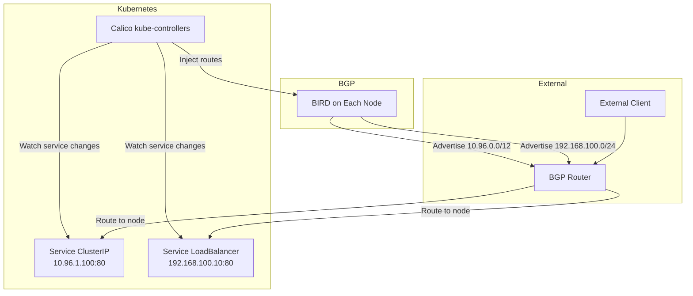

# How to Configure Service IP Advertisement with Calico

Author: [nawazdhandala](https://github.com/nawazdhandala)

Tags: Calico, Kubernetes, BGP, Service Advertisement, Networking

Description: Configure Calico to advertise Kubernetes service ClusterIPs and LoadBalancer IPs via BGP, enabling external clients to reach services without NodePort or cloud load balancers.

---

## Introduction

Calico can advertise Kubernetes service IP addresses — both ClusterIPs and LoadBalancer IPs — via BGP, making them reachable from outside the cluster without NodePort services or external load balancers. This feature is particularly valuable in on-premises or bare-metal environments where cloud load balancers are unavailable and you want cleaner external access to Kubernetes services.

When service advertisement is configured, Calico watches the Kubernetes API for service changes and automatically adds or removes BGP advertisements as services are created, modified, or deleted. The advertisement happens from all nodes that have an established BGP session, providing redundancy and high availability.

## Prerequisites

- Calico v3.10+ with BGP mode
- At least one external BGP peer configured
- Kubernetes services to be advertised

## Enable Service ClusterIP Advertisement

Add the cluster's service CIDR to the BGP configuration for advertisement:

```bash
# Get the service CIDR from kube-apiserver configuration
kubectl cluster-info dump | grep service-cluster-ip-range
# Typical output: --service-cluster-ip-range=10.96.0.0/12
```

Update the BGP configuration to advertise service CIDRs:

```yaml
apiVersion: projectcalico.org/v3
kind: BGPConfiguration
metadata:
  name: default
spec:
  serviceClusterIPs:
  - cidr: 10.96.0.0/12
  serviceExternalIPs:
  - cidr: 192.168.100.0/24
```

```bash
calicoctl apply -f bgp-service-config.yaml
```

## Configure LoadBalancer IP Advertisement

To advertise individual LoadBalancer IPs, annotate services or create an IP pool for LoadBalancer addresses:

```yaml
apiVersion: projectcalico.org/v3
kind: IPPool
metadata:
  name: lb-ip-pool
spec:
  cidr: 192.168.100.0/24
  disabled: false
  nodeSelector: "!all()"  # Don't use for pod IPs
```

Create a service with a LoadBalancer IP from this pool:

```yaml
apiVersion: v1
kind: Service
metadata:
  name: my-service
  annotations:
    projectcalico.org/ipv4pools: '["lb-ip-pool"]'
spec:
  type: LoadBalancer
  selector:
    app: my-app
  ports:
  - port: 80
    targetPort: 8080
```

## Enable Specific Service Advertisement

Configure advertisement of specific service LoadBalancer IPs:

```bash
calicoctl patch bgpconfiguration default --type merge \
  --patch '{"spec":{"serviceLoadBalancerIPs":[{"cidr":"192.168.100.0/24"}]}}'
```

## Service Advertisement Architecture



## Verify Advertisement

After configuration, verify that service IPs are being advertised:

```bash
# Check if service CIDRs appear in BGP advertisements
kubectl exec -n calico-system ${NODE_POD} -- birdcl show route | grep "10.96"

# From external router, verify route presence
ip route | grep "10.96"
```

## Conclusion

Configuring Calico service IP advertisement transforms Kubernetes services into first-class BGP network citizens, reachable directly from your network infrastructure. By advertising both ClusterIP ranges and LoadBalancer IP pools via BGP, you can build external access to Kubernetes services without cloud load balancers or complex NodePort configurations. This approach works particularly well in bare-metal environments with BGP-capable network hardware.
