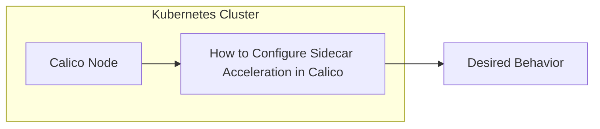

# How to Configure Sidecar Acceleration in Calico

Author: [nawazdhandala](https://github.com/nawazdhandala)

Tags: Calico, Kubernetes, eBPF, Sidecar, Service Mesh

Description: Configure Calico sidecar acceleration to bypass redundant network processing when using service mesh sidecars like Envoy, reducing latency for sidecar-proxied traffic.

---

## Introduction

Calico sidecar acceleration uses eBPF SOCKMAP to optimize traffic flows involving Istio Envoy sidecars. When a service mesh sidecar intercepts pod traffic, packets normally traverse the kernel network stack multiple times - once for the original pod, once for the sidecar, and once for the destination. Calico can accelerate the Envoy sidecar-to-container path by bypassing several layers of kernel networking. This feature is experimental and should be used only in test environments until it is production ready.

## Prerequisites

- Calico installed on Kubernetes
- Calico application layer policy enabled for Istio
- Linux kernel 4.19 or later on Calico nodes
- kubectl and calicoctl configured
- Cluster-admin access

## Configuration

```bash
# Enable sidecar acceleration for Istio-enabled apps

calicoctl patch felixconfiguration default --type merge \
  --patch '{"spec":{"sidecarAccelerationEnabled":true}}'

# Verify sidecar acceleration is enabled
calicoctl get felixconfiguration default -o yaml | grep sidecarAccelerationEnabled
```

## Architecture



## Conclusion

How to Configure Sidecar Acceleration in Calico provides experimental networking acceleration for Istio-enabled test clusters. Follow the steps above and validate your configuration before relying on this behavior in production environments.
