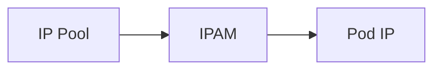

# How to Configure Specific IP Assignment with Calico IPAM

Author: [nawazdhandala](https://github.com/nawazdhandala)

Tags: Calico, Kubernetes, IPAM, Static IP, Networking

Description: Configure Calico IPAM to assign specific IP addresses to pods that require consistent addressing for DNS or firewall rules.

---

## Introduction

Specific IP Assignment with Calico IPAM provides important IP address management capabilities in Calico. This feature allows for fine-grained control over how IP addresses are assigned to pods in your Kubernetes cluster.

## Prerequisites

- Calico v3.20+ installed
- kubectl and calicoctl access
- Cluster configured to use Calico IPAM
- IP pools configured

## Configuration

Specific pod IP assignment with Calico IPAM uses the `cni.projectcalico.org/ipAddrs` pod annotation. The requested address must be in a configured Calico IP pool, must not already be in use, and must be present when the pod is created.

```bash
calicoctl get ippools -o yaml
calicoctl ipam show --ip=10.48.0.10
calicoctl ipam show --show-blocks
```

## Example

```yaml
apiVersion: v1
kind: Pod
metadata:
  name: static-ip-pod
  annotations:
    cni.projectcalico.org/ipAddrs: '["10.48.0.10"]'
spec:
  containers:
    - name: app
      image: nginx:1.25
```

## Verification

```bash
calicoctl ipam check -o ipam-report.json
kubectl get pods -A -o wide
```

## Architecture



## Conclusion

How to Configure Specific IP Assignment with Calico IPAM helps ensure your Calico deployment handles IP addressing correctly for your specific workload requirements.
