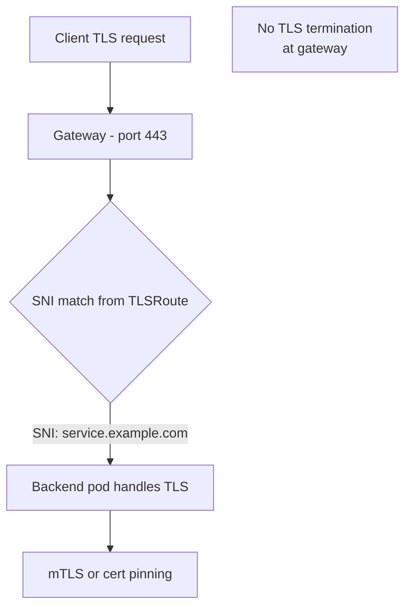

# How to Configure TLS Passthrough in the Cilium Gateway API

Author: [nawazdhandala](https://github.com/nawazdhandala)

Tags: Cilium, Kubernetes, TLS, Gateway API, Passthrough, Security

Description: Configure TLS passthrough in Cilium's Gateway API to forward encrypted TLS traffic directly to backend pods without terminating at the gateway.

---

## Introduction

TLS passthrough allows encrypted traffic to pass through the gateway without decryption, with TLS handled end-to-end between the client and backend pod. This is required when backends need to authenticate clients with mutual TLS (mTLS), when certificate pinning is used, or when regulations require end-to-end encryption.

In TLS passthrough mode, Cilium routes traffic based on the SNI (Server Name Indication) field in the TLS ClientHello message rather than on HTTP headers.

## Prerequisites

- Cilium with Gateway API enabled
- TLSRoute experimental CRD installed
- Backend pods with TLS configured

## Configure TLS Passthrough Gateway

TLS passthrough uses the `Passthrough` TLS mode and the `TLSRoute` resource:

```yaml
apiVersion: gateway.networking.k8s.io/v1
kind: Gateway
metadata:
  name: tls-passthrough-gateway
  namespace: default
spec:
  gatewayClassName: cilium
  listeners:
    - name: tls-passthrough
      protocol: TLS
      port: 443
      tls:
        mode: Passthrough
```

## Architecture



## Create a TLSRoute

```yaml
apiVersion: gateway.networking.k8s.io/v1alpha2
kind: TLSRoute
metadata:
  name: tls-passthrough-route
  namespace: default
spec:
  parentRefs:
    - name: tls-passthrough-gateway
  hostnames:
    - "secure.example.com"
  rules:
    - backendRefs:
        - name: tls-backend
          port: 443
```

## Verify the Backend Handles TLS

```bash
# Test connection - certificate comes from the backend
GATEWAY_IP=$(kubectl get gateway tls-passthrough-gateway \
  -o jsonpath='{.status.addresses[0].value}')

openssl s_client -connect ${GATEWAY_IP}:443 \
  -servername secure.example.com 2>/dev/null | \
  openssl x509 -noout -subject
```

The certificate subject should show the backend's certificate, not a gateway-managed certificate.

## Source IP Visibility with TLS Passthrough

Since TLS is not terminated at the gateway, the backend sees the gateway's cluster IP unless `externalTrafficPolicy: Local` is set:

```bash
kubectl patch svc -n default $(kubectl get svc -n default \
  -l cilium.io/gateway-name=tls-passthrough-gateway -o name) \
  -p '{"spec":{"externalTrafficPolicy":"Local"}}'
```

## Monitor TLS Passthrough Traffic

```bash
hubble observe --to-label app=tls-backend --protocol tcp \
  --port 443 --follow
```

## Tradeoffs vs TLS Termination

| Aspect | TLS Passthrough | TLS Termination |
|--------|-----------------|-----------------|
| Certificate management | Backend team | Platform team |
| HTTP routing capability | No | Yes |
| Source IP visibility | Direct | Depends on policy |
| mTLS support | Yes | Requires re-encrypt |

## Conclusion

TLS passthrough in Cilium's Gateway API forwards encrypted traffic directly to backend pods using SNI-based routing. This is ideal for services requiring end-to-end encryption, mTLS, or certificate pinning, where terminating TLS at the gateway is not acceptable.
