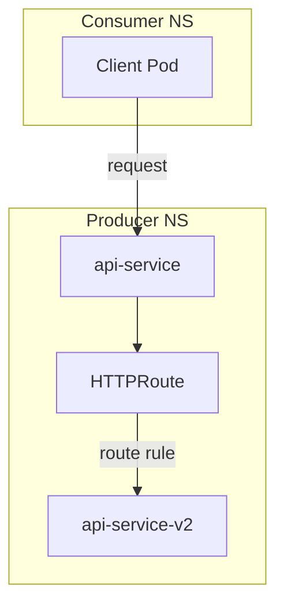

# How to Configure Types of GAMMA Configuration in the Cilium Gateway API

Author: [nawazdhandala](https://github.com/nawazdhandala)

Tags: Cilium, Kubernetes, GAMMA, Gateway API, Service Mesh, Configuration

Description: Explore the different types of GAMMA configuration patterns available in the Cilium Gateway API including consumer, producer, and producer-consumer models.

---

## Introduction

GAMMA (Gateway API for Mesh Management and Administration) defines multiple configuration types depending on whether the routing policy is owned by the service producer, the consumer, or both. Understanding these types is essential for correctly placing HTTPRoutes and avoiding policy conflicts.

Cilium implements GAMMA using the same Gateway API HTTPRoute resource, but the meaning and placement of the route differs by configuration type. Producer routes are applied at the Service level and affect all consumers; consumer routes are applied by the client namespace and only affect that consumer's traffic.

This guide explains each GAMMA configuration type and how to implement them in Cilium.

## Prerequisites

- Cilium with GAMMA enabled
- Gateway API experimental CRDs installed
- Multiple namespaces representing services and consumers

## Producer Configuration

The producer owns the routing rules. The HTTPRoute lives in the Service's namespace:

```yaml
apiVersion: gateway.networking.k8s.io/v1
kind: HTTPRoute
metadata:
  name: producer-route
  namespace: backend-ns
spec:
  parentRefs:
    - group: ""
      kind: Service
      name: api-service
      port: 8080
  rules:
    - backendRefs:
        - name: api-service-v2
          port: 8080
          weight: 100
```

## Architecture



## Consumer Configuration

The consumer controls routing from their own namespace. Requires a `ReferenceGrant` from the target namespace:

```yaml
apiVersion: gateway.networking.k8s.io/v1
kind: HTTPRoute
metadata:
  name: consumer-route
  namespace: consumer-ns
spec:
  parentRefs:
    - group: ""
      kind: Service
      name: api-service
      namespace: backend-ns
      port: 8080
  rules:
    - matches:
        - headers:
            - name: x-consumer
              value: my-app
      backendRefs:
        - name: api-service
          namespace: backend-ns
          port: 8080
```

## ReferenceGrant for Cross-Namespace Routes

```yaml
apiVersion: gateway.networking.k8s.io/v1beta1
kind: ReferenceGrant
metadata:
  name: allow-consumer-route
  namespace: backend-ns
spec:
  from:
    - group: gateway.networking.k8s.io
      kind: HTTPRoute
      namespace: consumer-ns
  to:
    - group: ""
      kind: Service
      name: api-service
```

## Apply and Validate

```bash
kubectl apply -f producer-route.yaml
kubectl get httproute -n backend-ns producer-route
kubectl describe httproute -n backend-ns producer-route | grep -A5 Conditions
```

## Conclusion

Cilium's GAMMA implementation supports producer, consumer, and mixed routing configuration models. Choosing the right model depends on who owns the routing policy and whether cross-namespace routing is required. ReferenceGrant resources enable safe cross-namespace configuration.
