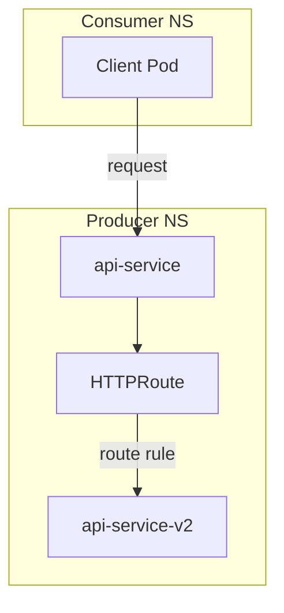

# How to Configure Types of GAMMA Configuration in the Cilium Gateway API

Author: [nawazdhandala](https://github.com/nawazdhandala)

Tags: Cilium, Kubernetes, GAMMA, Gateway API, Service Mesh, Configuration

Description: Explore the different types of GAMMA configuration patterns available in the Cilium Gateway API including consumer, producer, and producer-consumer models.

---

## Introduction

GAMMA (Gateway API for Mesh Management and Administration) defines multiple configuration types depending on whether the routing policy is owned by the service producer, the consumer, or both. Understanding these types is essential for correctly placing HTTPRoutes and avoiding policy conflicts.

Cilium implements GAMMA using the same Gateway API HTTPRoute resource, but currently supports only producer routes. Producer routes are applied at the Service level and affect all consumers.

This guide explains the GAMMA configuration types and which ones can be implemented in Cilium today.

## Prerequisites

- Cilium with Gateway API enabled, `kubeProxyReplacement=true`, and the L7 proxy enabled
- Gateway API CRDs installed
- Multiple namespaces representing services and consumers

## Producer Configuration

The producer owns the routing rules. The HTTPRoute lives in the Service's namespace:

```yaml
apiVersion: gateway.networking.k8s.io/v1
kind: HTTPRoute
metadata:
  name: producer-route
  namespace: backend-ns
spec:
  parentRefs:
    - group: ""
      kind: Service
      name: api-service
      port: 8080
  rules:
    - backendRefs:
        - name: api-service-v2
          port: 8080
          weight: 100
```

## Architecture


```mermaid
flowchart TD
    subgraph "Consumer NS"
        A[Client Pod]
    end
    subgraph "Producer NS"
        B[HTTPRoute]
        C[api-service]
        D[api-service-v2]
    end
    A -->|request| C
    C --> B
    B -->|route rule| D
```

## Consumer Configuration

In Gateway API GAMMA, a consumer route is an HTTPRoute in the consumer namespace that attaches to a Service in another namespace. This model requires mesh implementation support for consumer routes; Cilium currently does not support consumer HTTPRoutes, so the following example is not valid for Cilium today.

```yaml
apiVersion: gateway.networking.k8s.io/v1
kind: HTTPRoute
metadata:
  name: consumer-route
  namespace: consumer-ns
spec:
  parentRefs:
    - group: ""
      kind: Service
      name: api-service
      namespace: backend-ns
      port: 8080
  rules:
    - matches:
        - headers:
            - name: x-consumer
              value: my-app
      backendRefs:
        - name: api-service
          namespace: backend-ns
          port: 8080
```

## ReferenceGrant for Cross-Namespace Routes

ReferenceGrant resources allow cross-namespace backend references. They do not make Cilium accept cross-namespace Service parentRefs for consumer routes.

```yaml
apiVersion: gateway.networking.k8s.io/v1
kind: ReferenceGrant
metadata:
  name: allow-consumer-route
  namespace: backend-ns
spec:
  from:
    - group: gateway.networking.k8s.io
      kind: HTTPRoute
      namespace: consumer-ns
  to:
    - group: ""
      kind: Service
      name: api-service
```

## Apply and Validate

```bash
kubectl apply -f producer-route.yaml
kubectl get httproute -n backend-ns producer-route
kubectl describe httproute -n backend-ns producer-route | grep -A5 Conditions
```

## Conclusion

Cilium's GAMMA implementation currently supports producer routing configuration. Gateway API GAMMA also defines consumer routing, but Cilium does not currently support consumer HTTPRoutes or mixed producer-consumer routing. ReferenceGrant resources enable safe cross-namespace backend references, but they do not add consumer route support to Cilium.
