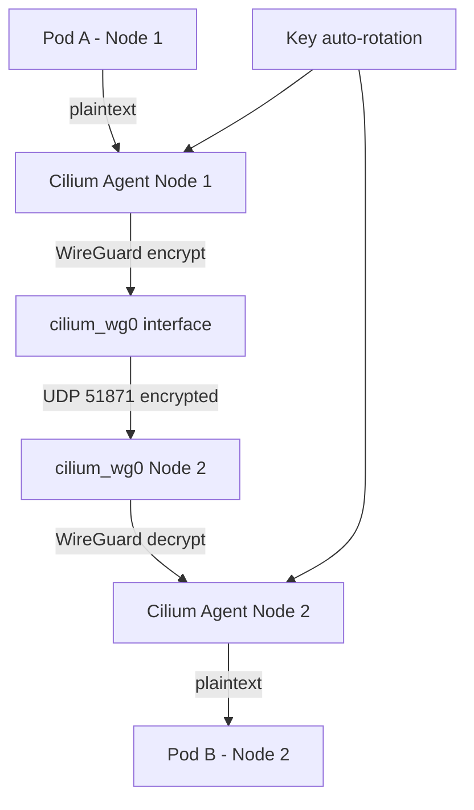

# How to Configure Enable WireGuard in Cilium

Author: [nawazdhandala](https://github.com/nawazdhandala)

Tags: Cilium, Kubernetes, WireGuard, Encryption, Security, EBPF

Description: Enable and configure WireGuard transparent encryption in Cilium for automatic pod-to-pod traffic encryption with minimal overhead.

---

## Introduction

WireGuard is Cilium's recommended transparent encryption mode for most environments. It provides excellent performance, automatic key management, and modern cryptography (ChaCha20-Poly1305). Cilium manages WireGuard configuration automatically, rotating keys and distributing peer configurations without operator intervention.

When WireGuard is enabled, Cilium creates a `cilium_wg0` interface on each node and configures it with keys derived from Kubernetes node identity. All pod-to-pod traffic crossing node boundaries is automatically encrypted through this interface.

## Prerequisites

- Linux kernel 5.6+ (for WireGuard in-kernel support)
- Cilium 1.10+
- `wireguard-tools` installed on nodes (for diagnostics)

## Check Kernel WireGuard Support

```bash
# On each node
modprobe wireguard
lsmod | grep wireguard
```

## Enable WireGuard in Cilium

```bash
helm upgrade cilium cilium/cilium \
  --namespace kube-system \
  --reuse-values \
  --set encryption.enabled=true \
  --set encryption.type=wireguard \
  --set encryption.nodeEncryption=false
```

Set `nodeEncryption=true` to also encrypt node-to-node (non-pod) traffic.

## Architecture



## Verify WireGuard Interface

```bash
# Run on a Kubernetes node
ip link show cilium_wg0
wg show cilium_wg0
```

The `wg show` output lists peer public keys and allowed IPs (pod CIDRs per node).

## Confirm Encryption is Active

```bash
kubectl exec -n kube-system ds/cilium -- cilium-dbg encrypt status
```

Expected output includes `WireGuard` as the encryption type and lists the number of encrypted peers.

## Enable Node-to-Node Encryption

To also encrypt kubelet and system traffic between nodes:

```bash
helm upgrade cilium cilium/cilium \
  --namespace kube-system \
  --reuse-values \
  --set encryption.enabled=true \
  --set encryption.type=wireguard \
  --set encryption.nodeEncryption=true
```

## Monitor WireGuard Performance

```bash
# View WireGuard stats on a node
wg show cilium_wg0 | grep -E "transfer|latest"
```

## Conclusion

Enabling WireGuard in Cilium provides transparent pod-to-pod encryption with automatic key management. The minimal performance overhead compared to IPsec makes WireGuard the preferred choice for most Kubernetes clusters. Verification through `wg show` and `cilium-dbg encrypt status` confirms the encryption is active across all nodes.
