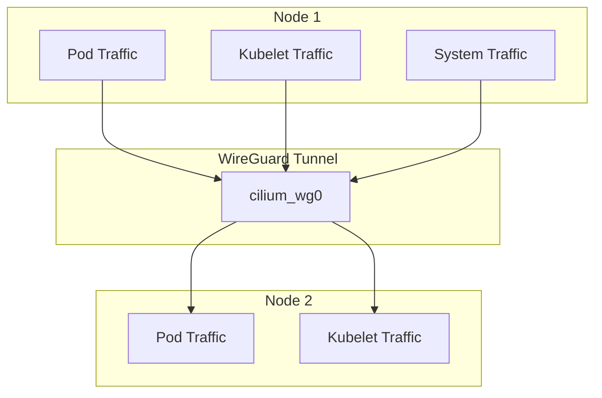

# How to Configure Node-to-Node Encryption with WireGuard in Cilium

Author: [nawazdhandala](https://github.com/nawazdhandala)

Tags: Cilium, Kubernetes, WireGuard, Encryption, Node Security, EBPF

Description: Configure Cilium's WireGuard node-to-node encryption to encrypt all traffic between Kubernetes nodes including system and kubelet communications.

---

## Introduction

Cilium's transparent encryption by default only encrypts traffic between pods crossing node boundaries. Node-to-Node Encryption extends this to include node-level traffic-kubelet health checks, system daemons, and other host-network communications between nodes.

This is particularly important in environments where the underlying network infrastructure cannot be trusted, such as shared hosting environments, multi-tenant data centers, or when regulatory requirements mandate encryption of all inter-node communications.

## Prerequisites

- Linux kernel 5.6+ (WireGuard support)
- Cilium 1.14+
- WireGuard kernel module loaded

## Standard Pod Encryption vs Node-to-Node

```bash
# Standard pod encryption (default)
--set encryption.enabled=true \
--set encryption.type=wireguard

# Extended node-to-node encryption
--set encryption.enabled=true \
--set encryption.type=wireguard \
--set encryption.nodeEncryption=true
```

## Enable Node-to-Node Encryption

```bash
helm upgrade cilium cilium/cilium \
  --namespace kube-system \
  --reuse-values \
  --set encryption.enabled=true \
  --set encryption.type=wireguard \
  --set encryption.nodeEncryption=true
```

## Architecture



## Verify Node-to-Node Encryption

Check that both pod CIDRs AND node IPs are encrypted in the WireGuard configuration:

```bash
# Run on a node
wg show cilium_wg0 | grep "allowed ips"
```

With node-to-node encryption, the allowed IPs should include both pod CIDRs and node IP addresses.

## Check Encryption Status

```bash
kubectl exec -n kube-system ds/cilium -- \
  cilium-dbg encrypt status
```

Expected: Lists both pod-to-pod and node-level encryption as active.

## Verify Kubelet Traffic is Encrypted

Capture traffic from the API server to kubelet port:

```bash
# On a node - should show WireGuard UDP packets, not cleartext kubelet traffic
sudo tcpdump -i <node-interface> -n tcp port 10250
```

If node-to-node encryption is working, kubelet API traffic (port 10250) won't appear as plaintext.

## Performance Considerations

Node-to-node encryption adds CPU overhead for encrypting system-level traffic. Benchmark before and after enabling:

```bash
# CPU usage comparison
kubectl top nodes
```

## Conclusion

WireGuard node-to-node encryption in Cilium extends transport security from pod-level to the entire node communication surface. This provides defense-in-depth for environments where the network fabric cannot be trusted, encrypting both application and system communications between Kubernetes nodes.
