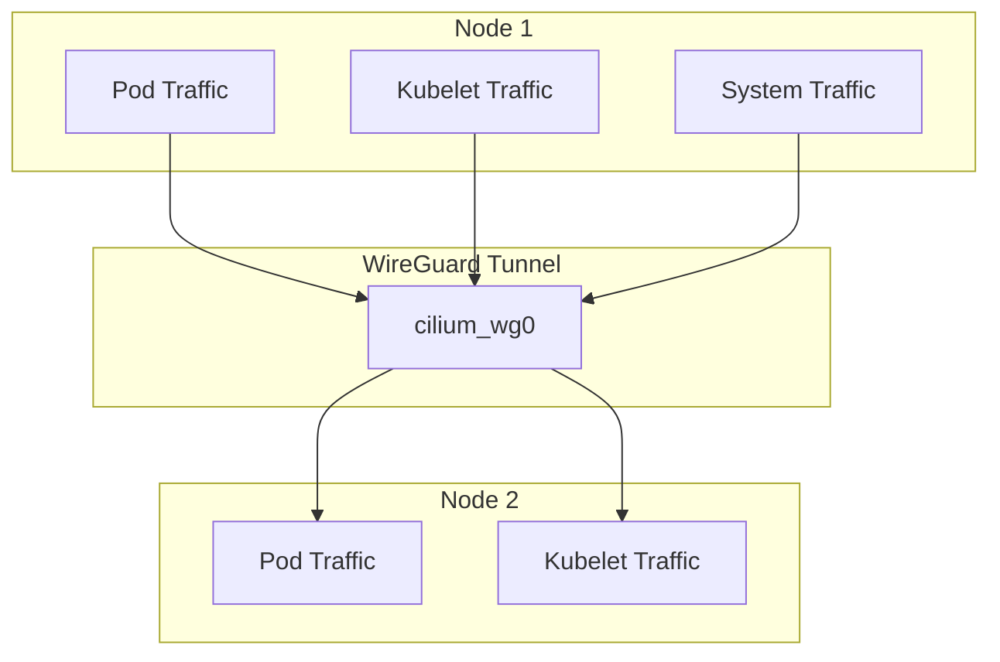

# How to Configure Node-to-Node Encryption with WireGuard in Cilium

Author: [nawazdhandala](https://github.com/nawazdhandala)

Tags: Cilium, Kubernetes, WireGuard, Encryption, Node Security, eBPF

Description: Configure Cilium's WireGuard node-to-node encryption to encrypt all traffic between Kubernetes nodes including system and kubelet communications.

---

## Introduction

When WireGuard transparent encryption is enabled, Cilium's default encryption scope only encrypts traffic between Cilium-managed pods crossing node boundaries. Node-to-Node Encryption extends this to include node-to-node, pod-to-node, and node-to-pod traffic, such as kubelet health checks, system daemons, and other host-network communications between eligible nodes.

This is particularly important in environments where the underlying network infrastructure cannot be trusted, such as shared hosting environments, multi-tenant data centers, or when regulatory requirements mandate encryption of inter-node communications. Cilium's node-to-node WireGuard mode is currently beta, and control-plane nodes opt out by default to avoid locking worker nodes out of the Kubernetes API during WireGuard key updates.

## Prerequisites

- Linux kernel 5.6+ (WireGuard support)
- Cilium 1.14+
- WireGuard kernel module loaded

## Standard Pod Encryption vs Node-to-Node

```bash
# Standard pod encryption (default WireGuard scope)

--set encryption.enabled=true \
--set encryption.type=wireguard

# Extended node-to-node encryption
--set encryption.enabled=true \
--set encryption.type=wireguard \
--set encryption.nodeEncryption=true
```

## Enable Node-to-Node Encryption

```bash
helm upgrade cilium cilium/cilium \
  --namespace kube-system \
  --reuse-values \
  --set encryption.enabled=true \
  --set encryption.type=wireguard \
  --set encryption.nodeEncryption=true
```

## Architecture


```mermaid
flowchart TD
    subgraph "Node 1"
        A[Pod Traffic]
        B[Kubelet Traffic]
        C[System Traffic]
    end
    subgraph "WireGuard Tunnel"
        D[cilium_wg0]
    end
    subgraph "Node 2"
        E[Pod Traffic]
        F[Kubelet Traffic]
    end
    A --> D
    B --> D
    C --> D
    D --> E
    D --> F
```

## Verify Node-to-Node Encryption

Check that pod IPs or pod CIDRs and remote node IP addresses are included in the WireGuard peer configuration:

```bash
# Run on a node
wg show cilium_wg0 | grep "allowed ips"
```

With node-to-node encryption, the allowed IPs should include both pod IPs or pod CIDRs and remote node IP addresses for nodes that have not opted out.

## Check Encryption Status

```bash
kubectl exec -n kube-system ds/cilium -- \
  cilium-dbg status | grep Encryption
```

Expected: Shows WireGuard as the encryption type and reports node encryption as enabled.

## Verify Kubelet Traffic is Encrypted

Capture traffic between worker nodes for kubelet port:

```bash
# On a worker node - should not show cleartext kubelet traffic to another encrypted worker node
sudo tcpdump -i <node-interface> -n tcp port 10250
```

If node-to-node encryption is working between those nodes, kubelet traffic (port 10250) won't appear as plaintext on the underlying node interface. Traffic to or from control-plane nodes is not encrypted by Cilium node-to-node encryption unless you change the default opt-out selector.

## Performance Considerations

Node-to-node encryption adds CPU overhead for encrypting system-level traffic. Benchmark before and after enabling:

```bash
# CPU usage comparison
kubectl top nodes
```

## Conclusion

WireGuard node-to-node encryption in Cilium extends transport security from pod-level traffic to node-to-node, pod-to-node, and node-to-pod traffic for participating nodes. This provides defense-in-depth for environments where the network fabric cannot be trusted, encrypting both application and system communications between Kubernetes nodes while preserving documented exceptions such as the default control-plane opt-out.
