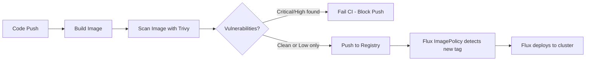

# How to Configure Container Image Scanning in CI for Flux CD

Author: [nawazdhandala](https://github.com/nawazdhandala)

Tags: Flux CD, Container Security, Image Scanning, Trivy, CI/CD, GitOps, DevSecOps

Description: Learn how to integrate container image vulnerability scanning into CI pipelines to gate Flux CD deployments on security quality thresholds.

---

## Introduction

Container image scanning is a critical security gate in any GitOps pipeline. Before Flux CD deploys an image to your cluster, your CI system should validate that the image does not contain known critical or high-severity vulnerabilities. Catching vulnerabilities at the build stage is far cheaper than remediating them in production.

Tools like Trivy, Grype, Snyk, and Docker Scout can scan images for OS package vulnerabilities, application dependencies, and misconfigurations. Integrating these into CI ensures that only scanned and approved images reach the registry that Flux CD monitors via ImageRepository.

This guide shows how to integrate Trivy scanning into GitHub Actions before image push, and how to configure Flux CD to only reconcile images that pass the scan gate.

## Prerequisites

- A Kubernetes cluster with Flux CD bootstrapped with image automation controllers
- GitHub Actions (or any CI system) for the pipeline
- A container registry accessible from CI and the cluster
- Trivy CLI (used in examples, but the pattern works with Grype or Snyk)

## Step 1: Understand the Scan Gate Architecture



The scan runs against the locally built image before it is pushed to the registry. If the scan fails, the push step never runs, so Flux CD never sees the vulnerable image.

## Step 2: Install Trivy in GitHub Actions

```yaml
# .github/workflows/build-scan-push.yml
name: Build, Scan, and Push

on:
  push:
    tags:
      - 'v*'

jobs:
  build-scan-push:
    runs-on: ubuntu-latest
    permissions:
      contents: read
      packages: write
      security-events: write # For uploading SARIF to GitHub Security tab

    steps:
      - name: Checkout
        uses: actions/checkout@v4

      - name: Set up Docker Buildx
        uses: docker/setup-buildx-action@v3

      - name: Build image (no push yet)
        uses: docker/build-push-action@v5
        with:
          context: .
          load: true # Load into local Docker daemon for scanning
          tags: myapp:scan-target
          cache-from: type=gha
          cache-to: type=gha,mode=max

      - name: Run Trivy vulnerability scan
        uses: aquasecurity/trivy-action@master
        with:
          image-ref: 'myapp:scan-target'
          format: 'sarif'
          output: 'trivy-results.sarif'
          severity: 'CRITICAL,HIGH'
          # Fail the job if critical or high vulnerabilities are found
          exit-code: '1'
          ignore-unfixed: true # Ignore vulnerabilities with no fix available

      - name: Upload Trivy SARIF to GitHub Security
        if: always() # Upload even if scan failed for visibility
        uses: github/codeql-action/upload-sarif@v3
        with:
          sarif_file: 'trivy-results.sarif'

      - name: Log in to GHCR (only reached if scan passes)
        uses: docker/login-action@v3
        with:
          registry: ghcr.io
          username: ${{ github.actor }}
          password: ${{ secrets.GITHUB_TOKEN }}

      - name: Push image to registry
        uses: docker/build-push-action@v5
        with:
          context: .
          push: true
          tags: ghcr.io/${{ github.repository }}:${{ github.ref_name }}
          cache-from: type=gha
```

## Step 3: Generate a Scan Report as a Job Artifact

```yaml
      - name: Run Trivy scan for JSON report
        uses: aquasecurity/trivy-action@master
        with:
          image-ref: 'myapp:scan-target'
          format: 'json'
          output: 'trivy-report.json'
          severity: 'CRITICAL,HIGH,MEDIUM'
          exit-code: '0' # Don't fail here; we already enforced exit-code:1 above

      - name: Upload scan report as artifact
        uses: actions/upload-artifact@v4
        with:
          name: trivy-scan-report
          path: trivy-report.json
          retention-days: 30
```

## Step 4: Add Trivy Configuration File for Fine-Grained Control

```yaml
# .trivy.yaml (in the root of the repository)
severity:
  - CRITICAL
  - HIGH

exit-code: 1

# Ignore specific CVEs that have been reviewed and accepted
ignorefile: .trivyignore

vulnerability:
  ignore-unfixed: true

# Scan OS packages and application dependencies
security-checks:
  - vuln
  - config
  - secret
```

```plaintext
# .trivyignore - Document why each CVE is ignored
# CVE-2024-XXXX: No fix available as of 2024-01-01; accepted risk documented in ticket INFRA-1234
CVE-2024-XXXX
```

## Step 5: Configure Flux ImagePolicy to Track Only Scanned Images

Tag scanned images with a `-scanned` suffix or use a separate registry path to signal they passed the gate:

```yaml
# Option: Use a filterTags pattern to only deploy images pushed by CI (not manual pushes)
apiVersion: image.toolkit.fluxcd.io/v1
kind: ImagePolicy
metadata:
  name: myapp
  namespace: flux-system
spec:
  imageRepositoryRef:
    name: myapp
  # Only consider SemVer tags, which are only created by the CI pipeline after scanning
  policy:
    semver:
      range: ">=1.0.0"
```

## Step 6: Scan Images Already in the Registry Periodically

Add a scheduled workflow to scan production images for newly discovered vulnerabilities:

```yaml
# .github/workflows/scheduled-scan.yml
name: Scheduled Image Scan

on:
  schedule:
    - cron: '0 6 * * *' # Daily at 6 AM UTC

jobs:
  scan-production:
    runs-on: ubuntu-latest
    steps:
      - name: Scan production image
        uses: aquasecurity/trivy-action@master
        with:
          image-ref: 'ghcr.io/${{ github.repository }}:latest'
          format: 'table'
          severity: 'CRITICAL,HIGH'
          exit-code: '0' # Don't fail; just report
```

## Best Practices

- Fail on CRITICAL severity unconditionally; treat HIGH vulnerabilities as warnings that require review within a defined SLA.
- Use `ignore-unfixed: true` to avoid failing on vulnerabilities where no upstream fix exists, but document accepted risks.
- Upload SARIF reports to GitHub Advanced Security to give security teams visibility without blocking developers.
- Scan base images separately and track them in a dedicated Dependabot or Renovate configuration.
- Cache Trivy's vulnerability database in CI to avoid redundant downloads and speed up scan times.
- Consider adding Grype or Snyk as a second scanner to reduce false negatives from any single tool's database.

## Conclusion

Integrating container image scanning as a CI gate before the push step ensures that Flux CD only ever deploys images that have passed a security quality threshold. Combined with Flux CD's GitOps reconciliation, this creates an end-to-end pipeline where every deployed image has a verifiable, auditable security scan attached to it.
