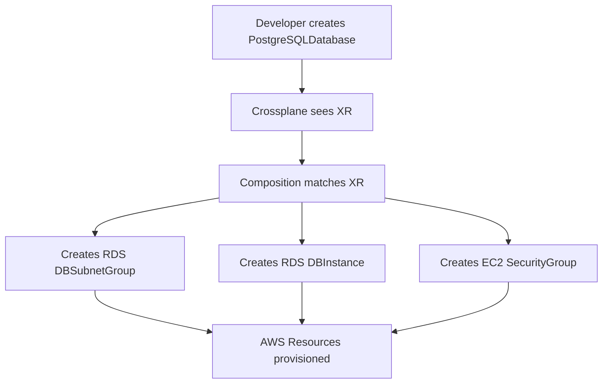

# How to Create Crossplane Compositions with Flux

Author: [nawazdhandala](https://github.com/nawazdhandala)

Tags: Flux CD, Crossplane, Composition, GitOps, Kubernetes, Infrastructure as Code, Platform Engineering

Description: Create and manage Crossplane Compositions using Flux CD to expose opinionated, self-service infrastructure APIs for platform teams.

---

## Introduction

Crossplane Compositions are the mechanism that transforms raw cloud provider resources into higher-level platform abstractions. Instead of requiring developers to understand the details of an RDS instance, a Composition lets you define a single `PostgreSQLDatabase` resource that provisions the database, its security group, its parameter group, and any other dependencies automatically. This is the foundation of an internal developer platform built on Kubernetes.

Managing Compositions through Flux means your platform's infrastructure abstractions are version-controlled and continuously reconciled. When a platform engineer updates a Composition, the change flows through a pull request, is reviewed, and is applied automatically. Developers consuming the platform see updated behavior without manual intervention.

This guide walks through defining a Composition for a PostgreSQL database on AWS, wiring it to a CompositeResourceDefinition (XRD), and managing both with Flux CD.

## Prerequisites

- Crossplane with the AWS provider installed
- Flux CD bootstrapped on the cluster
- Basic understanding of Crossplane XRDs and Compositions
- `kubectl` and `flux` CLIs

## Step 1: Plan the Composition Architecture

Before writing YAML, define what the Composition will expose and what it will create.



## Step 2: Create the CompositeResourceDefinition

The XRD defines the API schema that developers use to request infrastructure.

```yaml
# infrastructure/crossplane/compositions/postgresql/xrd.yaml
apiVersion: apiextensions.crossplane.io/v1
kind: CompositeResourceDefinition
metadata:
  name: xpostgresqlinstances.platform.example.com
spec:
  group: platform.example.com
  names:
    kind: XPostgreSQLInstance
    plural: xpostgresqlinstances
  # Expose a namespaced claim resource for developers
  claimNames:
    kind: PostgreSQLInstance
    plural: postgresqlinstances
  versions:
    - name: v1alpha1
      served: true
      referenceable: true
      schema:
        openAPIV3Schema:
          type: object
          properties:
            spec:
              type: object
              properties:
                parameters:
                  type: object
                  required:
                    - storageGB
                    - dbVersion
                  properties:
                    storageGB:
                      type: integer
                      description: "Storage size in GB (20-1000)"
                      minimum: 20
                      maximum: 1000
                    dbVersion:
                      type: string
                      description: "PostgreSQL version (e.g., 15.4)"
                    instanceClass:
                      type: string
                      description: "RDS instance class"
                      default: "db.t3.medium"
```

## Step 3: Create the Composition

```yaml
# infrastructure/crossplane/compositions/postgresql/composition.yaml
apiVersion: apiextensions.crossplane.io/v1
kind: Composition
metadata:
  name: xpostgresqlinstances.platform.example.com
  labels:
    provider: aws
    db: postgresql
spec:
  compositeTypeRef:
    apiVersion: platform.example.com/v1alpha1
    kind: XPostgreSQLInstance
  resources:
    # Provision the RDS DB Instance
    - name: rdsinstance
      base:
        apiVersion: rds.aws.upbound.io/v1beta1
        kind: Instance
        spec:
          forProvider:
            region: us-east-1
            engine: postgres
            skipFinalSnapshot: true
            publiclyAccessible: false
            autoMinorVersionUpgrade: true
            providerConfigRef:
              name: default
      patches:
        # Patch storage from the composite resource spec
        - type: FromCompositeFieldPath
          fromFieldPath: spec.parameters.storageGB
          toFieldPath: spec.forProvider.allocatedStorage
        # Patch the engine version
        - type: FromCompositeFieldPath
          fromFieldPath: spec.parameters.dbVersion
          toFieldPath: spec.forProvider.engineVersion
        # Patch the instance class
        - type: FromCompositeFieldPath
          fromFieldPath: spec.parameters.instanceClass
          toFieldPath: spec.forProvider.instanceClass
    # Create a subnet group for the RDS instance
    - name: subnetgroup
      base:
        apiVersion: rds.aws.upbound.io/v1beta1
        kind: SubnetGroup
        spec:
          forProvider:
            region: us-east-1
            description: "Managed by Crossplane"
            subnetIds:
              - subnet-abc123
              - subnet-def456
            providerConfigRef:
              name: default
```

## Step 4: Create the Flux Kustomization

```yaml
# clusters/my-cluster/infrastructure/crossplane-compositions.yaml
apiVersion: kustomize.toolkit.fluxcd.io/v1
kind: Kustomization
metadata:
  name: crossplane-compositions
  namespace: flux-system
spec:
  interval: 10m
  path: ./infrastructure/crossplane/compositions
  prune: true
  sourceRef:
    kind: GitRepository
    name: flux-system
  # Compositions depend on the AWS provider being ready
  dependsOn:
    - name: crossplane-providers-aws
```

## Step 5: Test with a Claim

```yaml
# apps/my-app/database.yaml
apiVersion: platform.example.com/v1alpha1
kind: PostgreSQLInstance
metadata:
  name: my-app-db
  namespace: my-app
spec:
  parameters:
    storageGB: 50
    dbVersion: "15.4"
    instanceClass: db.t3.medium
```

## Step 6: Verify the Composition

```bash
# Apply the claim
kubectl apply -f apps/my-app/database.yaml

# Watch the composite resource status
kubectl get xpostgresqlinstances --watch

# Check the composed resources
kubectl get instances.rds.aws.upbound.io

# Get events for debugging
kubectl describe xpostgresqlinstance my-app-db-xxxxx
```

## Best Practices

- Version your Compositions (e.g., `v1alpha1`, `v1beta1`, `v1`) and maintain backward compatibility when updating schemas.
- Use `readinessChecks` in Compositions to define when a composed resource is considered ready, providing accurate status propagation to the claim.
- Keep Compositions focused: one Composition should provision a logically complete unit of infrastructure, not an entire application stack.
- Use `patchSets` to avoid repeating the same patches across multiple resources in the same Composition.
- Store Compositions in a dedicated path (`infrastructure/crossplane/compositions/`) and use a separate Flux Kustomization for them so updates can be applied independently.

## Conclusion

You have defined a reusable Crossplane Composition managed by Flux CD. Developers can now self-serve PostgreSQL databases by applying a simple claim manifest. The platform team controls the implementation through Compositions in Git. Flux continuously reconciles the Composition definitions, so updates propagate automatically without manual deployment steps.
