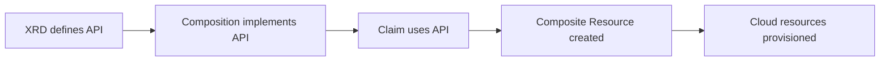

# How to Create Crossplane CompositeResourceDefinitions with Flux

Author: [nawazdhandala](https://github.com/nawazdhandala)

Tags: Flux CD, Crossplane, XRD, CompositeResourceDefinition, GitOps, Kubernetes, Platform Engineering

Description: Define Crossplane CompositeResourceDefinitions (XRDs) using Flux CD to expose custom, self-service infrastructure APIs to development teams.

---

## Introduction

CompositeResourceDefinitions (XRDs) are the schema layer of the Crossplane platform API. They define the structure and validation rules for the infrastructure resources your platform exposes. When a developer claims a `PostgreSQLInstance` or a `MessageQueue`, it is the XRD that describes what fields are allowed, which are required, and what defaults apply.

XRDs are Kubernetes CustomResourceDefinitions under the hood, but authored through Crossplane's opinionated API. This means you get schema validation, versioning, and the ability to expose both cluster-scoped composite resources and namespace-scoped claims from a single definition.

Managing XRDs through Flux makes your platform API version-controlled. Adding a new field, deprecating a version, or updating validation rules becomes a reviewed pull request rather than a manual kubectl apply. This guide walks through designing and deploying a production-quality XRD with Flux CD.

## Prerequisites

- Crossplane installed and running
- Flux CD bootstrapped on the cluster
- Understanding of OpenAPI v3 schema validation
- `kubectl` CLI installed

## Step 1: Plan Your API Design

Design the XRD as you would any Kubernetes API. Think about what platform users need to specify and what defaults the platform should apply.



## Step 2: Create a Simple XRD

Start with a storage bucket abstraction that works across cloud providers.

```yaml
# infrastructure/crossplane/xrds/xstoragebucket.yaml
apiVersion: apiextensions.crossplane.io/v1
kind: CompositeResourceDefinition
metadata:
  name: xstoragebuckets.platform.example.com
  annotations:
    # Document the intended use for platform consumers
    platform.example.com/description: "A cloud storage bucket with versioning and lifecycle support"
spec:
  group: platform.example.com
  names:
    kind: XStorageBucket
    plural: xstoragebuckets
  # Expose namespace-scoped claims so developers can use them per namespace
  claimNames:
    kind: StorageBucket
    plural: storagebuckets
  # Connection secret keys that will be propagated to the claim namespace
  connectionSecretKeys:
    - bucket-name
    - bucket-region
    - endpoint
  versions:
    - name: v1alpha1
      served: true
      referenceable: true
      schema:
        openAPIV3Schema:
          type: object
          properties:
            spec:
              type: object
              required:
                - parameters
              properties:
                parameters:
                  type: object
                  required:
                    - region
                  properties:
                    region:
                      type: string
                      description: "Cloud region where the bucket will be created"
                    versioning:
                      type: boolean
                      description: "Enable object versioning"
                      default: false
                    lifecycleDays:
                      type: integer
                      description: "Days before transitioning objects to cheaper storage"
                      minimum: 1
                      maximum: 3650
                    accessControl:
                      type: string
                      description: "Access control policy for the bucket"
                      enum:
                        - private
                        - public-read
                      default: private
                    tags:
                      type: object
                      description: "Resource tags to apply to the bucket"
                      additionalProperties:
                        type: string
            status:
              type: object
              properties:
                bucketName:
                  type: string
                  description: "The actual name of the provisioned bucket"
```

## Step 3: Create a Multi-Version XRD

As your platform matures, you may need to evolve the API while maintaining backward compatibility.

```yaml
# infrastructure/crossplane/xrds/xdatabase.yaml
apiVersion: apiextensions.crossplane.io/v1
kind: CompositeResourceDefinition
metadata:
  name: xdatabases.platform.example.com
spec:
  group: platform.example.com
  names:
    kind: XDatabase
    plural: xdatabases
  claimNames:
    kind: Database
    plural: databases
  connectionSecretKeys:
    - username
    - password
    - endpoint
    - port
  versions:
    # v1alpha1 is the original version - still served but not referenceable
    - name: v1alpha1
      served: true
      referenceable: false
      schema:
        openAPIV3Schema:
          type: object
          properties:
            spec:
              type: object
              properties:
                parameters:
                  type: object
                  properties:
                    engine:
                      type: string
                      enum: [postgres, mysql]
                    storageGB:
                      type: integer
    # v1beta1 is the current stable version
    - name: v1beta1
      served: true
      referenceable: true
      schema:
        openAPIV3Schema:
          type: object
          properties:
            spec:
              type: object
              required:
                - parameters
              properties:
                parameters:
                  type: object
                  required:
                    - engine
                    - storageGB
                    - tier
                  properties:
                    engine:
                      type: string
                      enum: [postgres, mysql, mariadb]
                    storageGB:
                      type: integer
                      minimum: 20
                      maximum: 16384
                    tier:
                      type: string
                      description: "Performance tier: dev, standard, or premium"
                      enum: [dev, standard, premium]
                    multiAZ:
                      type: boolean
                      default: false
                      description: "Enable multi-AZ deployment for high availability"
```

## Step 4: Organize XRDs with a Kustomization

```yaml
# infrastructure/crossplane/xrds/kustomization.yaml
apiVersion: kustomize.config.k8s.io/v1beta1
kind: Kustomization
resources:
  - xstoragebucket.yaml
  - xdatabase.yaml
```

```yaml
# clusters/my-cluster/infrastructure/crossplane-xrds.yaml
apiVersion: kustomize.toolkit.fluxcd.io/v1
kind: Kustomization
metadata:
  name: crossplane-xrds
  namespace: flux-system
spec:
  interval: 5m
  path: ./infrastructure/crossplane/xrds
  prune: true
  sourceRef:
    kind: GitRepository
    name: flux-system
  # XRDs must be ready before Compositions that reference them
  dependsOn:
    - name: crossplane
```

## Step 5: Verify XRD Status

```bash
# List all XRDs and their readiness
kubectl get xrds

# Check the XRD schema was accepted
kubectl describe xrd xstoragebuckets.platform.example.com

# Verify the claim CRD was created automatically
kubectl get crd storagebuckets.platform.example.com

# Check available API versions
kubectl api-resources | grep platform.example.com
```

## Best Practices

- Design XRDs from the perspective of the platform consumer. Hide cloud-specific details behind opinionated defaults and enumerations.
- Always specify `connectionSecretKeys` for resources that produce connection credentials. This ensures the keys are propagated to the namespace where the claim lives.
- Use `enum` constraints to limit valid values for fields like `region`, `tier`, and `engine`. This prevents misconfiguration and guides consumers toward valid inputs.
- Maintain backward compatibility when adding new fields by making them optional with defaults. Use versioning for breaking changes.
- Apply Flux `dependsOn` to ensure Compositions are applied after the XRDs they reference are established in the cluster.

## Conclusion

You have designed and deployed Crossplane CompositeResourceDefinitions managed by Flux CD. These XRDs form the public API of your internal infrastructure platform. Development teams can now request infrastructure through simple, validated Kubernetes manifests without needing to understand the underlying cloud resources. Flux ensures the XRD schemas are always reconciled to the state defined in Git.
