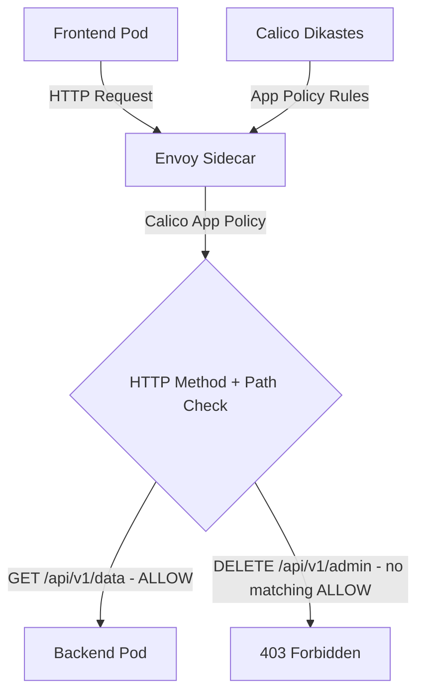

# How to Debug Application-Layer Policy with Calico and Istio

Author: [nawazdhandala](https://github.com/nawazdhandala)

Tags: Calico, Kubernetes, Network Policy, Istio, Application Layer, Security

Description: Debug Calico application-layer network policies using Istio integration for HTTP method and path-based access control.

---

## Introduction

Application-Layer Policy with Calico and Istio combines Calico's network-layer enforcement with Istio's application-layer visibility. This powerful combination lets you write policies that reference HTTP attributes - methods and paths - in addition to network-level properties like IP addresses and ports.

Calico's `projectcalico.org/v3` NetworkPolicy and GlobalNetworkPolicy resources support HTTP match criteria when application layer policy is enabled with Istio integration. These rules are evaluated through Istio's Envoy sidecar proxies and the Calico Dikastes sidecar rather than only at the network layer. This enables fine-grained control like "allow GET requests to /api/health but deny POST requests to /api/admin."

This guide covers debug App-Layer Policy using Calico and Istio together.

## Prerequisites

- Kubernetes cluster with Calico application layer policy enabled and a supported Istio version installed
- Calico-Istio integration configured (Dikastes sidecar)
- `kubectl` and `istioctl` installed
- Workloads with Istio sidecar injection enabled

## Core Configuration

```yaml
apiVersion: projectcalico.org/v3
kind: NetworkPolicy
metadata:
  name: debug-app-layer-policy
  namespace: production
spec:
  order: 100
  selector: app == 'backend-api'
  ingress:
    - action: Allow
      source:
        selector: app == 'frontend'
      http:
        methods:
          - GET
          - POST
        paths:
          - exact: /api/v1/data
          - prefix: /api/v1/public
  types:
    - Ingress
```

## Istio + Calico Setup

```bash
# Verify Calico-Istio integration

kubectl get configmap -n istio-system istio-sidecar-injector -o yaml | grep "dikastes:" -A 5

# Enable sidecar injection for namespace
kubectl label namespace production istio-injection=enabled --overwrite

# Restart workloads so newly created pods receive the Envoy and Dikastes sidecars
kubectl rollout restart deployment -n production
kubectl get pods -n production -l app=backend-api -o jsonpath='{.items[*].spec.containers[*].name}'
```

## Test Application-Layer Policy

```bash
# Test allowed method
kubectl exec -n production frontend-pod -- \
  curl -s -o /dev/null -w "%{http_code}\n" -X GET http://backend-api:8080/api/v1/data

# Test denied method/path
kubectl exec -n production frontend-pod -- \
  curl -s -o /dev/null -w "%{http_code}\n" -X DELETE http://backend-api:8080/api/v1/admin
```

## Architecture



## Conclusion

Application-Layer Policy with Calico and Istio provides fine-grained network security for Kubernetes, combining network-layer enforcement with application-layer policy evaluation. By filtering on HTTP methods and paths, you can implement access controls that are impossible with pure network-layer policies. Ensure your Calico-Istio integration is properly configured and test both allowed and denied request patterns to verify your application-layer policies are working correctly.
