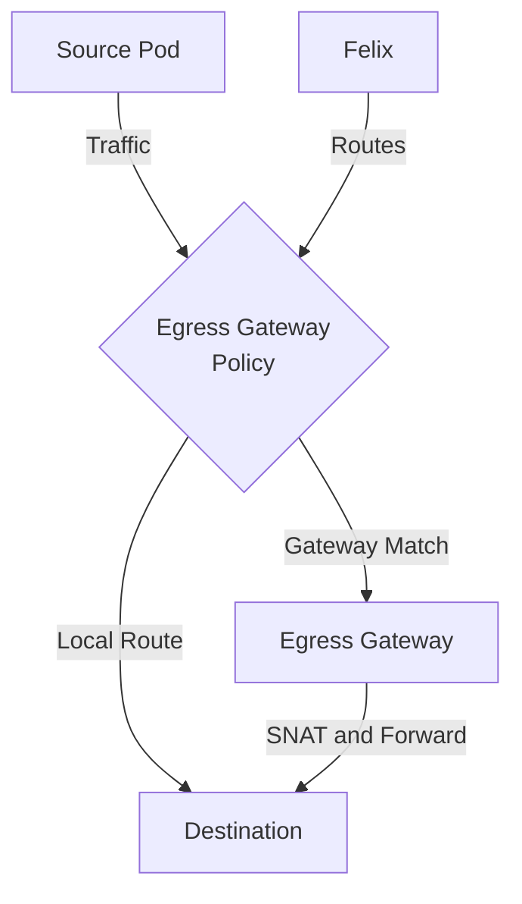

# How to Debug Calico Egress Gateway Policies When Traffic Is Blocked

Author: [nawazdhandala](https://github.com/nawazdhandala)

Tags: Calico, Kubernetes, Network Policy, Egress Gateway, Security

Description: Debug Calico egress gateway policies to control and secure outbound traffic leaving your Kubernetes cluster.

---

## Introduction

Calico Enterprise Egress Gateway Policies provide destination-based egress gateway selection using the `projectcalico.org/v3` API. This guide covers debugging Egress Gateway policy configuration with production-ready checks.

## Prerequisites

- Kubernetes cluster with Calico Enterprise and egress gateway support enabled
- `calicoctl` and `kubectl` installed

## Core Configuration

```yaml
apiVersion: projectcalico.org/v3
kind: EgressGatewayPolicy
metadata:
  name: debug-egress-gateway
spec:
  rules:
    - destination:
        cidr: 10.0.0.0/8
      description: "Local: no gateway"
    - destination:
        cidr: 0.0.0.0/0
      description: "Gateway to internet"
      gateway:
        namespaceSelector: "projectcalico.org/name == 'default'"
        selector: "egress-code == 'red'"
      gatewayPreference: PreferNodeLocal
```

## Implementation

```bash
# Apply policy

calicoctl apply -f debug-egress-gateway.yaml

# Verify policy is active
calicoctl get egressgatewaypolicies -o wide

# Attach the policy to a namespace before testing
kubectl annotate ns test egress.projectcalico.org/egressGatewayPolicy="debug-egress-gateway" --overwrite

# Test connectivity
kubectl exec -n test test-pod -- curl -s --max-time 5 http://target:8080
echo "Result: $?"
```

## Verification

```bash
# Check policy metrics in Prometheus
curl -G -s 'http://localhost:9090/api/v1/query' --data-urlencode 'query=calico_denied_packets'

# Confirm the client has an egress gateway policy annotation
kubectl get ns test -o jsonpath='{.metadata.annotations.egress\.projectcalico\.org/egressGatewayPolicy}{"\n"}'
```

## Architecture



## Conclusion

Debug Egress Gateway in Calico ensures your egress gateway policies are properly configured, tested, and monitored. Follow the patterns in this guide, validate in staging first, and maintain comprehensive logging for security visibility. Regular policy audits help you keep your cluster's security posture aligned with evolving requirements.
