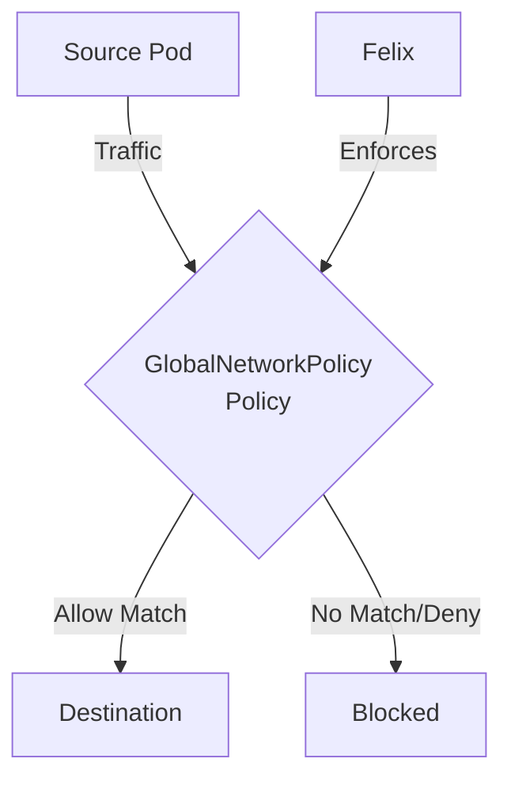

# How to Debug Calico GlobalNetworkPolicy When Traffic Is Blocked

Author: [nawazdhandala](https://github.com/nawazdhandala)

Tags: Calico, Kubernetes, Network Policy, Global Policy, Security

Description: Debug Calico GlobalNetworkPolicy for cluster-wide network traffic control that applies across all namespaces.

---

## Introduction

Calico GlobalNetworkPolicy in Calico provides comprehensive network traffic controls using the `projectcalico.org/v3` API. This guide covers debug GlobalNetworkPolicy with production-ready configurations.

## Prerequisites

- Kubernetes cluster with Calico v3.26+
- `calicoctl` and `kubectl` installed

## Core Configuration

```yaml
apiVersion: projectcalico.org/v3
kind: GlobalNetworkPolicy
metadata:
  name: debug-globalnetworkpolicy
spec:
  order: 100
  selector: all()
  namespaceSelector: has(projectcalico.org/name)
  ingress:
    - action: Allow
      source:
        selector: app == 'authorized'
    - action: Log
  egress:
    - action: Allow
      protocol: UDP
      destination:
        ports: [53]
    - action: Allow
      destination:
        selector: app == 'permitted-destination'
    - action: Log
  types:
    - Ingress
    - Egress
```

## Implementation

```bash
# Apply policy

calicoctl apply -f debug-globalnetworkpolicy.yaml

# Verify policy is active
calicoctl get globalnetworkpolicies -o wide

# Test connectivity
kubectl exec -n test test-pod -- curl -s --max-time 5 http://target:8080
echo "Result: $?"
```

## Verification

```bash
# Check Felix policy metrics
curl -s http://localhost:9091/metrics | grep felix_active_local_policies

# Review Calico policy logs from Log rules on the iptables dataplane
journalctl -k -f | grep calico-packet

# Review Calico policy logs on the eBPF dataplane
kubectl exec -n calico-system ds/calico-node -- bpftool prog tracelog | grep DENIED
```

## Architecture



## Conclusion

Debug GlobalNetworkPolicy in Calico ensures your network policies are properly configured, tested, and monitored. Follow the patterns in this guide, validate in staging first, and maintain comprehensive logging for security visibility. Regular policy audits help you keep your cluster's security posture aligned with evolving requirements.
