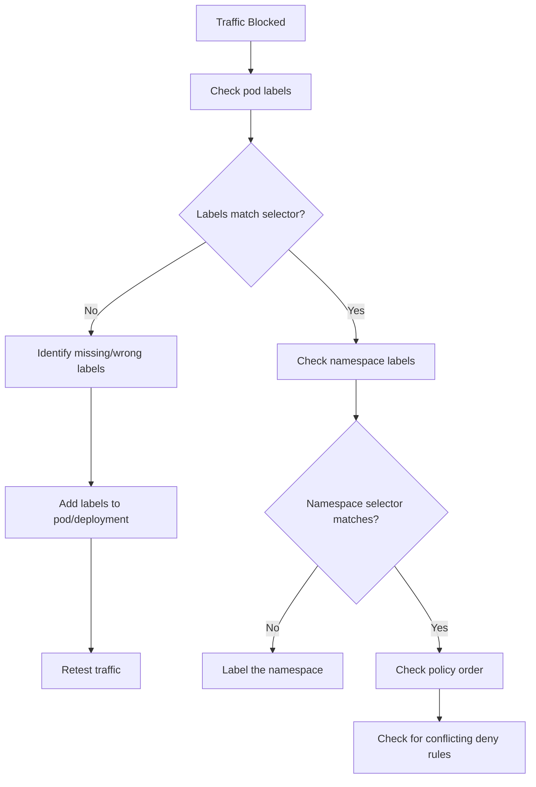

# How to Debug Calico Label-Based Network Policy When Traffic Is Blocked

Author: [nawazdhandala](https://github.com/nawazdhandala)

Tags: Calico, Kubernetes, Network Policy, Labels, Debugging

Description: Diagnose and fix label-related network policy failures in Calico when traffic is unexpectedly blocked due to incorrect selectors or missing labels.

---

## Introduction

Label-related policy failures are among the most subtle bugs in Calico. A pod that should be allowed by a network policy is instead blocked because of a label typo, a missing label on a deployment template, or a namespace selector mismatch. The traffic blocked error gives you no hint that labels are the root cause.

Calico's `projectcalico.org/v3` policy selectors are evaluated against live pod labels, meaning any discrepancy between what the policy expects and what pods actually have will silently prevent the policy from applying. This guide covers systematic diagnosis of label-related policy failures.

When debugging, the key question is always: does the policy selector actually match the pods you intend it to match? Start there and work outward.

## Prerequisites

- Kubernetes cluster with Calico v3.26+
- `calicoctl` and `kubectl` installed
- Access to affected pods and their namespaces

## Step 1: Confirm the Symptom Is Label-Related

```bash
# Check if the pod has the labels the policy expects
kubectl get pod my-pod -n my-namespace --show-labels

# Example output:
# NAME     READY   STATUS    LABELS
# my-pod   1/1     Running   app=myapp,version=v1
# Missing: tier=web (which the policy selector requires)
```

## Step 2: Compare Policy Selector to Pod Labels

```bash
# Get the policy selector
calicoctl get networkpolicy allow-web-traffic -n my-namespace -o yaml | grep selector

# Compare against pod labels
kubectl get pods -n my-namespace --show-labels | grep my-pod
```

## Step 3: Verify Endpoint Is Selected

```bash
# Show which policies apply to a specific endpoint
calicoctl get workloadendpoint my-pod -n my-namespace -o yaml | grep -A 20 "policies"
```

## Step 4: Check for Label Typos

```bash
# Common issue: "tier: web" vs "tier: Web" (case sensitive!)
kubectl get pods -n my-namespace -l "tier=web"   # Correct
kubectl get pods -n my-namespace -l "tier=Web"   # Wrong case

# Check namespace labels too
kubectl get namespace my-namespace --show-labels
```

## Step 5: Test Selector Independently

```bash
# Test if the selector would match any pods
kubectl get pods --all-namespaces -l "tier=web,environment=production"

# If empty, no pods match - check label values
kubectl get pods --all-namespaces -l "app=myapp"
```

## Step 6: Patch Missing Labels

```bash
# Add missing label to a running pod (temporary fix)
kubectl label pod my-pod -n my-namespace tier=web

# Permanent fix - update the Deployment template
kubectl patch deployment my-deployment -n my-namespace --type=merge -p '{
  "spec": {
    "template": {
      "metadata": {
        "labels": {
          "tier": "web"
        }
      }
    }
  }
}'
```

## Debug Flow



## Conclusion

Most label-related Calico policy failures come down to selector/label mismatches — typos, case sensitivity issues, or labels applied to pods but not to the Deployment template (which means new pods won't have them). Always verify labels on running pods AND on the Deployment spec, check namespace labels separately, and use `kubectl get pods -l` to confirm your selectors actually match what you expect.
