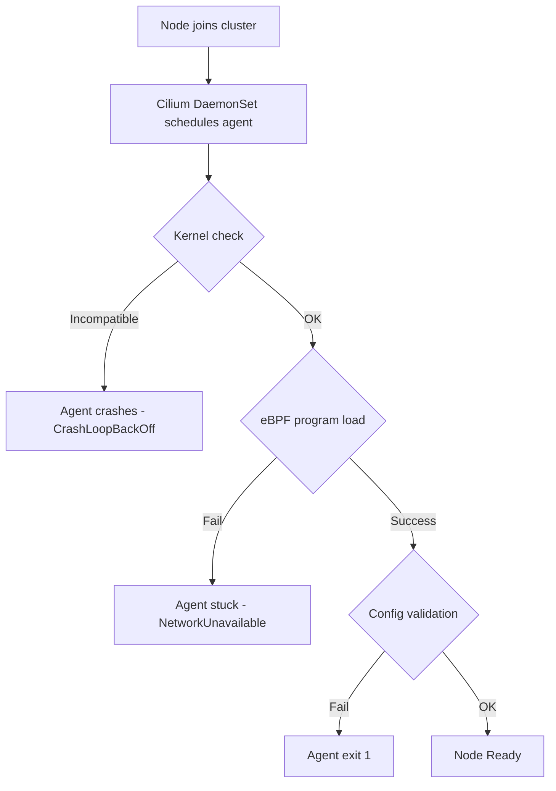

# How to Debug a Cilium Node That Never Becomes Ready

Author: [nawazdhandala](https://github.com/nawazdhandala)

Tags: Cilium, Kubernetes, Troubleshooting, Node Readiness, EBPF, Operations

Description: Debug Kubernetes nodes running Cilium that never enter the Ready state by diagnosing Cilium agent startup failures, eBPF loading errors, and initialization problems.

---

## Introduction

A Cilium node that never becomes Ready prevents pods from scheduling and blocks cluster operations. The Cilium agent is a critical component of the node's networking stack, and failures during agent initialization prevent the node's network from functioning.

Common causes include kernel version incompatibilities, missing kernel modules, low resource limits on the Cilium DaemonSet, initialization race conditions, and certificate or configuration errors. Identifying the root cause requires inspecting both the Cilium agent logs and the Kubernetes node conditions.

## Prerequisites

- Access to Kubernetes node logs
- `kubectl` with kube-system access
- SSH or console access to the affected node (for kernel-level diagnostics)

## Check Node Status

```bash
kubectl get nodes
kubectl describe node <node-name> | grep -A20 "Conditions:"
```

Look for the `NetworkUnavailable` condition which is set by Cilium when it initializes:

```bash
kubectl get node <node-name> \
  -o jsonpath='{.status.conditions[?(@.type=="NetworkUnavailable")]}'
```

## Inspect Cilium Agent Pod on the Affected Node

```bash
kubectl get pod -n kube-system -o wide | grep <node-name> | grep cilium
kubectl logs -n kube-system <cilium-pod-name> --previous 2>/dev/null | tail -50
kubectl logs -n kube-system <cilium-pod-name> | tail -100
```

## Architecture



## Diagnose Kernel Issues

```bash
# Check kernel version on node
kubectl debug node/<node-name> -it --image=busybox -- uname -r

# Check for required kernel modules
kubectl debug node/<node-name> -it --image=busybox -- \
  sh -c 'grep -E "CONFIG_BPF|CONFIG_BPF_SYSCALL" /proc/config.gz 2>/dev/null || true'
```

## Check eBPF Mount

```bash
kubectl exec -n kube-system <cilium-pod-name> -- \
  mount | grep bpf
```

Expected: `/sys/fs/bpf type bpf`

## Check Resource Limits

Cilium may crash if it exceeds memory or CPU limits:

```bash
kubectl describe pod -n kube-system <cilium-pod-name> | grep -A20 "Limits:"
kubectl top pod -n kube-system <cilium-pod-name>
```

## Common Error Patterns in Logs

| Error | Cause |
|-------|-------|
| `failed to load programs` | Kernel version too old |
| `bpf fs not mounted` | Missing `/sys/fs/bpf` mount |
| `failed to obtain node MAC address` | Network interface issue |
| `failed to start health checking` | Port conflict |

## Conclusion

Debugging a Cilium node that never becomes Ready requires a systematic investigation of the agent logs, kernel compatibility, eBPF filesystem mounts, and resource limits. Most failures produce clear error messages in the agent logs that point directly to the root cause.
