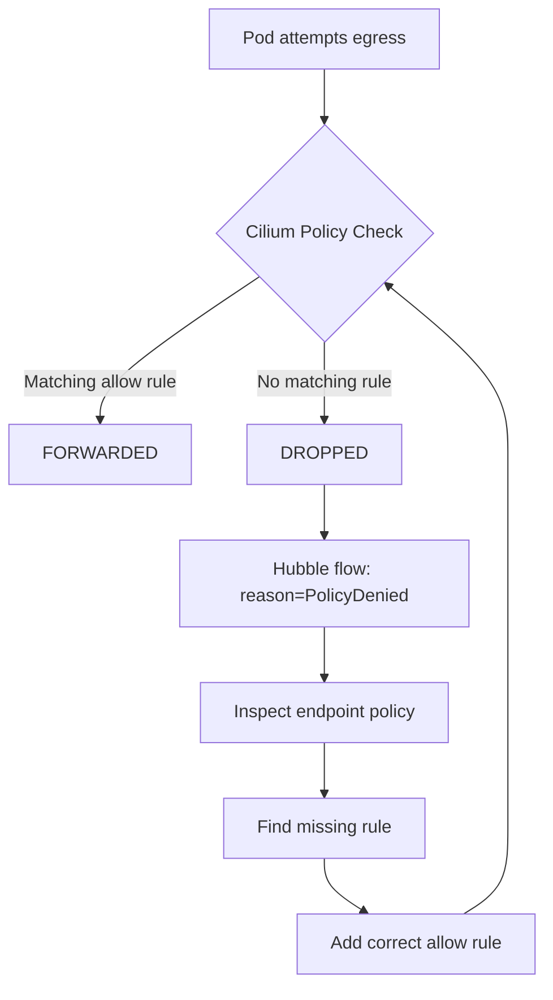

# How to Debug Why a Cilium Policy Does Not Allow Expected Egress Traffic

Author: [nawazdhandala](https://github.com/nawazdhandala)

Tags: Cilium, Kubernetes, Network Policy, Egress, Debugging, eBPF

Description: Debug Cilium egress policies that silently block expected traffic by using Hubble flow data, policy status inspection, and eBPF map analysis.

---

## Introduction

One of the most frustrating problems in Cilium is when a network policy appears to be correct but traffic is still blocked. This occurs because Cilium's policy model is additive and default-deny when any policy applies to an endpoint. A missing allow rule—even for unrelated traffic—can cause unexpected drops.

Debugging these situations requires tracing the path from the policy definition through the compiled eBPF rules to the actual packet drop. Hubble makes this process much faster by showing exactly which policy rule caused the drop.

## Prerequisites

- Cilium with Hubble enabled
- `kubectl`, `hubble`, `cilium-dbg` CLIs
- Access to the failing pod

## Step 1: Identify the Drop with Hubble

Find drops from the affected pod:

```bash
POD_LABEL="app=my-app"
hubble observe --namespace default \
  --from-label $POD_LABEL \
  --verdict DROPPED
```

Note the destination IP, port, and the `drop_reason` field.

## Step 2: Check What Policies Apply to the Pod

```bash
kubectl exec -n kube-system ds/cilium -- \
  cilium-dbg endpoint list | grep <pod-ip>

# Get endpoint ID from above output
kubectl exec -n kube-system ds/cilium -- \
  cilium-dbg endpoint get <endpoint-id> | grep -A30 "policy"
```

## Architecture



## Step 3: View Resolved Policy for Endpoint

```bash
kubectl exec -n kube-system ds/cilium -- \
  cilium-dbg policy get --resolve --from-label "app=my-app" \
  --to-cidr <destination-cidr> --dport <port>
```

## Step 4: Check for Policy Scope Issues

Cilium policies match endpoints by namespace and labels. Verify the `endpointSelector` matches your pod:

```bash
kubectl get cnp,netpol -n default -o yaml | grep -A5 "endpointSelector"
```

## Step 5: Test with a Permissive Rule

Temporarily allow all egress to isolate whether the issue is egress or another layer:

```yaml
spec:
  endpointSelector:
    matchLabels:
      app: my-app
  egress:
    - {}
```

```bash
kubectl apply -f temp-allow-all-egress.yaml
```

If traffic now flows, the issue is in the original egress rules.

## Common Causes

- Missing DNS allow rule (pod cannot resolve FQDN)
- Port number mismatch between policy and actual destination
- Policy applied to wrong namespace
- CIDR range does not cover actual destination IP

## Conclusion

Debugging Cilium egress policy issues requires using Hubble to identify the specific drop reason, inspecting which policies apply to the endpoint, and using `cilium-dbg policy get` to trace the resolved policy. Systematic elimination narrows the problem to the specific missing or incorrect allow rule.
