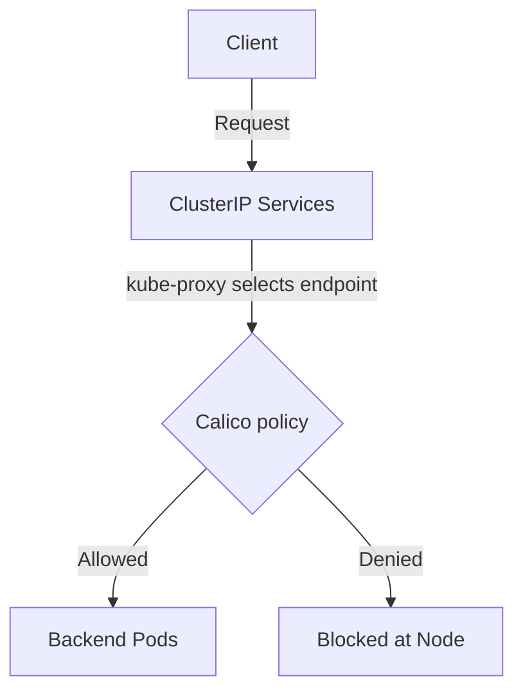

# How to Debug ClusterIP Service Policies in Calico When Traffic Is Blocked

Author: [nawazdhandala](https://github.com/nawazdhandala)

Tags: Calico, Kubernetes, Network Policy, ClusterIP, Security

Description: Debug Calico ClusterIP service policies to secure internal Kubernetes service-to-service communication.

---

## Introduction

Calico network policies give you control over how traffic flows to the pods behind Kubernetes ClusterIP Services. The `projectcalico.org/v3` API provides the tools needed to secure service traffic effectively while maintaining service availability.

Proper service policy configuration is essential for clusters that expose services to external traffic through NodePorts or through ClusterIPs advertised outside the cluster with Calico BGP. Without it, allowed network sources can reach those exposed services, creating significant attack surface.

This guide covers debug ClusterIP Services policies in Calico with practical, production-tested configurations.

## Prerequisites

- Kubernetes cluster with Calico v3.26+
- `calicoctl` and `kubectl` installed
- Understanding of Kubernetes service networking

## Core Configuration

```yaml
apiVersion: projectcalico.org/v3
kind: NetworkPolicy
metadata:
  name: protect-clusterip-service
  namespace: production
spec:
  order: 100
  selector: app == 'backend-service'
  ingress:
    - action: Allow
      protocol: TCP
      source:
        selector: tier == 'frontend'
      destination:
        ports: [8080]
    - action: Allow
      protocol: TCP
      source:
        selector: tier == 'monitoring'
      destination:
        ports: [9090]
    - action: Deny
  egress:
    - action: Allow
      protocol: TCP
      destination:
        selector: app == 'database'
        ports: [5432]
    - action: Allow
      protocol: UDP
      destination:
        ports: [53]
    - action: Deny
  types:
    - Ingress
    - Egress
```


## Verification

```bash
# Apply the policy

calicoctl apply -f debug-clusterip-services.yaml

# Verify traffic behavior
kubectl exec -n production frontend-pod -- curl -s --max-time 5 http://service-name:8080
echo "Result: $?"
```

## Architecture



## Conclusion

Calico network policies provide essential security controls for Kubernetes service traffic. Configure them carefully, test bidirectional traffic flows, and use staged policies to preview impact before enforcement. Regular monitoring of denial rates helps you detect misconfigurations and unauthorized access attempts before they impact service availability.
