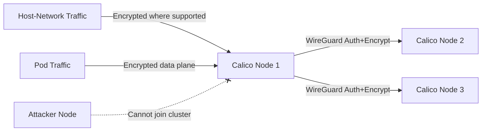

# How to Debug Crypto Authentication for Calico Node Traffic

Author: [nawazdhandala](https://github.com/nawazdhandala)

Tags: Calico, Kubernetes, Network Policy, Encryption, WireGuard, Node Security

Description: Debug WireGuard-based crypto authentication for Calico node traffic to secure inter-node communication.

---

## Introduction

Crypto authentication for Calico node traffic uses WireGuard to authenticate and encrypt traffic between Calico nodes. This protects inter-node pod traffic from interception and spoofing, even on untrusted networks.

Calico's `projectcalico.org/v3` FelixConfiguration resource controls WireGuard settings, enabling you to turn on inter-node encryption with a single configuration change. Node-to-node authentication ensures that only legitimate Calico nodes can establish WireGuard tunnels and forward encrypted pod traffic.

This guide covers debug crypto authentication for Calico node traffic, including data plane encryption and, on supported platforms, host-network encryption checks.

## Prerequisites

- Kubernetes cluster with Calico v3.26+
- Linux kernel 5.6+ on all nodes (for WireGuard)
- EKS or AKS if you plan to encrypt inter-node host-network traffic with `wireguardHostEncryptionEnabled`
- `calicoctl` and `kubectl` installed

## Enable Crypto Authentication

```yaml
apiVersion: projectcalico.org/v3
kind: FelixConfiguration
metadata:
  name: default
spec:
  wireguardEnabled: true
  wireguardMTU: 1440
  wireguardListeningPort: 51820
```

```bash
# Apply configuration

calicoctl apply -f wireguard-config.yaml

# Verify on each node
kubectl get node -o custom-columns='NAME:.metadata.name,WIREGUARD:.metadata.annotations.projectcalico\.org/WireguardPublicKey'
```

## Verify Node Authentication

```bash
# Check WireGuard peers (all Calico nodes should be listed)
kubectl exec -n kube-system calico-node-xxx -c calico-node -- wg show

# Verify peer connections
kubectl exec -n kube-system calico-node-node1 -c calico-node -- wg show wireguard.cali peers

# Check that traffic between nodes is encrypted
kubectl debug node/node1 -it --image=nicolaka/netshoot --profile=netadmin -- tcpdump -i eth0 -n udp port 51820 -c 10
```

## Architecture



## Conclusion

Crypto authentication for Calico node traffic provides mutual authentication and encryption for inter-node pod traffic, with host-network encryption available on supported platforms. Enable WireGuard in FelixConfiguration to protect data plane pod traffic from interception and injection. Monitor WireGuard peer connections and transfer statistics to ensure encryption is active across all nodes and detect any nodes that have lost their crypto authentication.
