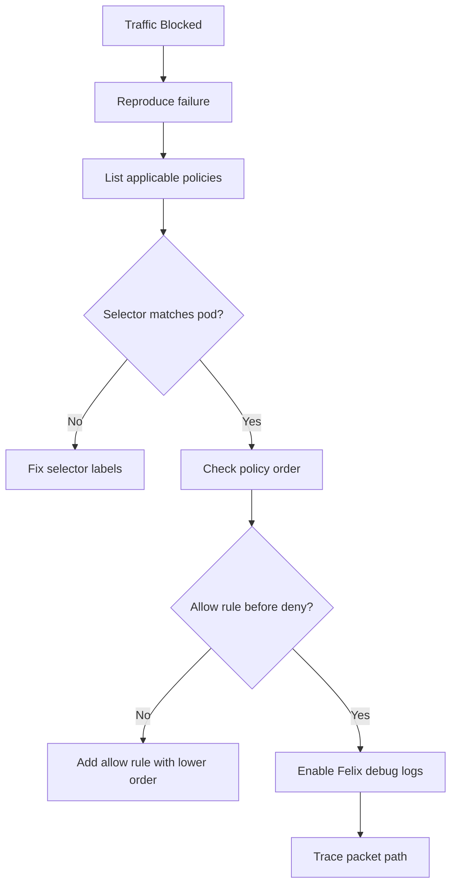

# How to Debug Default Deny Policies in Calico When Traffic Is Blocked

Author: [nawazdhandala](https://github.com/nawazdhandala)

Tags: Calico, Kubernetes, Network Policy, Debugging, Security

Description: A practical guide to diagnosing and resolving unexpected traffic blocks caused by Calico default deny network policies.

---

## Introduction

When Calico default deny policies are active, mysterious connectivity failures are inevitable. A pod that worked yesterday suddenly cannot reach its database, or health checks start failing across the cluster. The challenge is pinpointing which policy rule is responsible when dozens of policies might apply.

Calico provides several debugging tools including `calicoctl`, policy hit counters, and flow logs. Unlike standard Kubernetes `NetworkPolicy` which offers limited visibility, Calico's `projectcalico.org/v3` policies can be configured to log every denied packet, giving you a detailed audit trail.

This guide walks through a systematic debugging methodology: starting from symptoms, examining policy evaluation order, using logs, and resolving blocked traffic without compromising your security posture.

## Prerequisites

- Kubernetes cluster with Calico v3.26+
- `kubectl` and `calicoctl` installed
- Calico flow logging enabled (Felix configuration)
- Access to node-level tools for packet inspection

## Step 1: Identify the Symptom

Start by reproducing the failure:

```bash
# From the affected pod
kubectl exec -n my-namespace my-pod -- curl -v --max-time 5 http://target-service:8080

# Check pod events
kubectl describe pod my-pod -n my-namespace | grep -A 10 Events
```

## Step 2: Check Policy Evaluation Order

List all policies that could apply to the affected pod:

```bash
calicoctl get networkpolicies -n my-namespace -o wide
calicoctl get globalnetworkpolicies -o wide
```

Policies are evaluated by `order` field (lower = higher priority). A deny rule with order 1000 will be overridden by an allow rule with order 100.

## Step 3: Add a Temporary Log Rule

Insert a log action before the deny to capture details:

```yaml
apiVersion: projectcalico.org/v3
kind: GlobalNetworkPolicy
metadata:
  name: log-before-deny
spec:
  order: 999
  selector: all()
  ingress:
    - action: Log
  egress:
    - action: Log
  types:
    - Ingress
    - Egress
```

```bash
calicoctl apply -f log-before-deny.yaml
# Check syslog or Calico flow logs
sudo journalctl -u kubelet | grep calico
```

## Step 4: Use Calico Policy Tracing

Calico Enterprise supports `calicoctl policy trace`, but in open source you can use Felix logs:

```bash
# Enable debug logging on Felix temporarily
kubectl set env daemonset/calico-node -n kube-system FELIX_LOGSEVERITYSCREEN=debug
kubectl logs -n kube-system -l k8s-app=calico-node -f | grep "Policy"
```

## Step 5: Verify Selector Matches

A common bug is a mismatched label selector:

```bash
# Check labels on the target pod
kubectl get pod my-pod -n my-namespace --show-labels

# Verify the policy selector matches
calicoctl get networkpolicy my-policy -n my-namespace -o yaml | grep selector
```

## Debug Flow Diagram



## Conclusion

Debugging blocked traffic in Calico requires a methodical approach: reproduce the issue, list all applicable policies, verify selector accuracy, and use log actions to trace packet decisions. Always restore Felix log levels after debugging to avoid performance overhead. Calico's layered policy model is powerful but requires careful ordering to avoid unintended denials.
