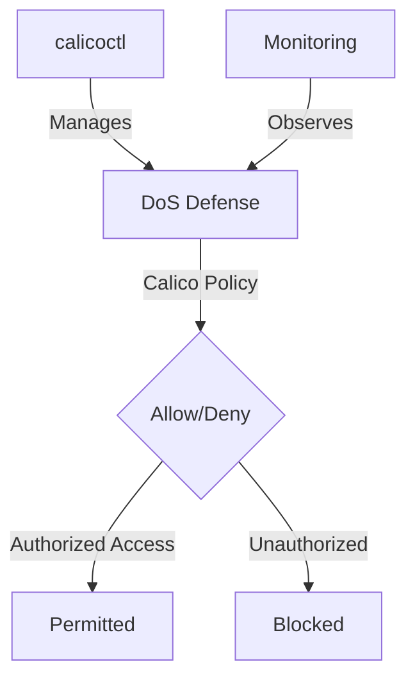

# How to Debug DoS Defense Calico Policies

Author: [nawazdhandala](https://github.com/nawazdhandala)

Tags: Calico, Kubernetes, Network Policy, DoS Defense, Security

Description: Debug Calico network policies for DoS defense to protect cluster workloads from denial of service attacks.

---

## Introduction

DoS Defense with Calico Policies is an important security consideration for production Calico deployments. The `projectcalico.org/v3` API provides the tools needed to debug DoS Defense effectively, combining Calico's network policy with proper access controls and monitoring.

This guide covers debugging DoS Defense in Calico with practical configurations and operational best practices.

## Prerequisites

- Kubernetes cluster with Calico v3.26+
- `calicoctl` and `kubectl` installed
- Understanding of Calico's monitoring and security architecture

## Core Configuration

```yaml
apiVersion: projectcalico.org/v3
kind: HostEndpoint
metadata:
  name: production-host
  labels:
    apply-dos-mitigation: 'true'
spec:
  interfaceName: eth0
  node: worker-1
  expectedIPs: ['10.0.0.10']
---
# Block known bad actors

apiVersion: projectcalico.org/v3
kind: GlobalNetworkSet
metadata:
  name: dos-deny-list
  labels:
    dos-deny-list: 'true'
spec:
  nets:
    - 198.51.100.0/24  # Known attack source
    - 203.0.113.0/24
---
apiVersion: projectcalico.org/v3
kind: GlobalNetworkPolicy
metadata:
  name: dos-mitigation
spec:
  selector: apply-dos-mitigation == 'true'
  doNotTrack: true
  applyOnForward: true
  types:
    - Ingress
  ingress:
    - action: Deny
      source:
        selector: dos-deny-list == 'true'
```

## Implementation

```bash
# Apply DoS defense policies
calicoctl apply -f dos-defense.yaml

# Confirm the deny-list and mitigation policy are present
calicoctl get globalnetworkset dos-deny-list -o yaml
calicoctl get globalnetworkpolicy dos-mitigation -o yaml

# Check Felix metrics for active host endpoints and policies on a node
curl -s http://localhost:9091/metrics | grep -E 'felix_active_local_(endpoints|policies)'
```

For Calico Enterprise policy metrics, denied packet counters are exposed on the policy metrics endpoint:

```bash
# Check denial rates in real-time on a compute node with policy metrics enabled
watch -n1 'curl -s http://localhost:9081/metrics | grep calico_denied_packets'
```

## eBPF Dataplane (Calico with eBPF dataplane)

```bash
# Enable eBPF dataplane with automatic kube-proxy management
kubectl patch installation.operator.tigera.io default --type merge -p '{"spec":{"calicoNetwork":{"linuxDataplane":"BPF","bpfNetworkBootstrap":"Enabled","kubeProxyManagement":"Enabled"}}}'
```

## Architecture



## Conclusion

Debug DoS Defense in Calico requires a combination of proper policy configuration, regular monitoring, and proactive testing. Use the patterns in this guide as a foundation and adapt them to your specific security requirements. Always validate changes in staging before production and maintain comprehensive logging for security visibility.
