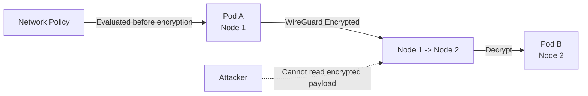

# How to Debug Encrypted Pod Traffic in Calico When Connectivity Fails

Author: [nawazdhandala](https://github.com/nawazdhandala)

Tags: Calico, Kubernetes, Network Policy, Encryption, WireGuard, Security

Description: Debug Calico WireGuard encrypted pod traffic to ensure all inter-pod communication is encrypted in transit.

---

## Introduction

Encrypted Pod Traffic in Calico uses WireGuard to secure inter-node pod traffic on the wire. Calico creates and manages WireGuard tunnels between nodes transparently, without requiring application changes.

Calico's encryption works alongside network policies - traffic is still subject to policy evaluation, but the payload is encrypted in transit. This combination of network-layer policy enforcement and encryption provides defense in depth for sensitive workloads.

This guide covers debug WireGuard Encryption in Calico, including enabling WireGuard encryption and combining it with network policy for a complete zero-trust data plane.

## Prerequisites

- Kubernetes cluster with Calico v3.26+ (WireGuard is included in Linux 5.6+ kernels and is backported to some earlier Linux kernels)
- `calicoctl` and `kubectl` installed
- WireGuard kernel module available on all nodes

## Enable WireGuard Encryption

```bash
# Enable WireGuard encryption cluster-wide

kubectl patch felixconfiguration default --type=merge -p '{
  "spec": {
    "wireguardEnabled": true,
    "wireguardMTU": 1440
  }
}'

# Verify WireGuard is active
kubectl get node -o yaml | grep -i wireguard
kubectl exec -n kube-system calico-node-xxx -- wg show
```

## Combine with Network Policy

```yaml
# Encrypt and restrict
apiVersion: projectcalico.org/v3
kind: NetworkPolicy
metadata:
  name: debug-wireguard-encryption
  namespace: production
spec:
  order: 100
  selector: app == 'payment-service'
  ingress:
    - action: Allow
      source:
        selector: app == 'authorized-client'
      destination:
        ports: [8443]
  egress:
    - action: Allow
      destination:
        selector: app == 'payment-db'
        ports: [5432]
    - action: Allow
      protocol: UDP
      destination:
        ports: [53]
  types:
    - Ingress
    - Egress
```

## Verify Encryption

```bash
# Verify WireGuard tunnel is established between nodes
kubectl exec -n kube-system calico-node-node1 -- wg show all

# Check encryption statistics
kubectl exec -n kube-system calico-node-node1 -- wg show all | grep transfer

# Verify inter-node traffic is encrypted on the wire (packet capture should show WireGuard frames)
kubectl debug node/node1 -it --image=nicolaka/netshoot --profile=netadmin -- tcpdump -i any -n udp port 51820
```

## Architecture



## Conclusion

Encrypted Pod Traffic with Calico provides transparent, high-performance encryption for inter-node pod traffic. WireGuard integration in Calico makes it straightforward to enable encryption across the entire cluster without changing application code. Combine encryption with strict network policies for a complete zero-trust data plane where traffic is both encrypted and access-controlled. Monitor WireGuard statistics regularly to ensure encryption is active and performing well.
