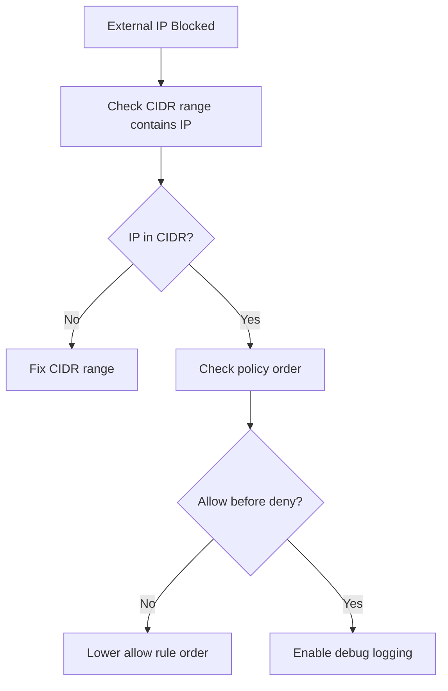

# How to Debug Calico External IP Policies When Traffic Is Blocked

Author: [nawazdhandala](https://github.com/nawazdhandala)

Tags: Calico, Kubernetes, Network Policy, External IP, Debugging

Description: Diagnose and fix Calico external IP policy failures when traffic to or from external IPs is unexpectedly blocked.

---

## Introduction

External IP policy failures in Calico are often caused by CIDR range mismatches, incorrect policy ordering, or missing network configuration for external access. The `projectcalico.org/v3` API's `nets` field specifies IP ranges, and a misconfigured CIDR can silently block legitimate external traffic.

## Prerequisites

- Kubernetes cluster with Calico v3.26+
- `calicoctl` and `kubectl` installed

## Step 1: Identify the Blocked External IP

```bash
# Check which external IP is failing
kubectl exec -n production app-pod -- curl -v --max-time 10 http://external-ip:443
```

## Step 2: Check Applicable External IP Policies

```bash
calicoctl get globalnetworkpolicies -o yaml | grep -A 10 nets
calicoctl get networkpolicies --all-namespaces -o yaml | grep -A 5 ipBlock
```

## Step 3: Verify CIDR Range Includes the External IP

```bash
# Check if 203.0.113.50 is in the allowed range 203.0.113.0/24
python3 -c "import ipaddress; print(ipaddress.ip_address('203.0.113.50') in ipaddress.ip_network('203.0.113.0/24'))"
```

## Step 4: Check Policy Order

```bash
calicoctl get globalnetworkpolicies -o wide | sort -k4 -n
# Ensure allow rule has lower order than deny rule
```

## Step 5: Add Debug Log Rule

```yaml
apiVersion: projectcalico.org/v3
kind: GlobalNetworkPolicy
metadata:
  name: debug-external-ip
spec:
  order: 999
  selector: all()
  egress:
    - action: Log
  types:
    - Egress
```

## Debug Flow



## Conclusion

External IP policy debugging starts with verifying that your CIDR ranges actually contain the IP addresses you intend to match. Use Python's `ipaddress` module to verify CIDR calculations, check policy ordering to ensure allow rules precede deny rules, and use the Log action to trace packet decisions when the cause isn't obvious.
