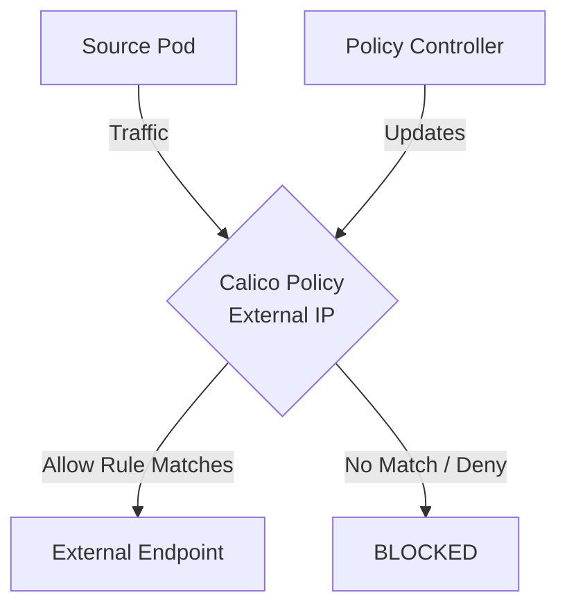

# How to Debug External IP Policies When Traffic Is Blocked in Calico

Author: [nawazdhandala](https://github.com/nawazdhandala)

Tags: Calico, Kubernetes, Network Policy, External IP, Security

Description: Diagnose and fix External IP Policies failures in Calico when traffic is unexpectedly blocked.

---

## Introduction

External IP rules in Calico policies provide fine-grained network security controls using the `projectcalico.org/v3` API. This guide covers how to debug External IP effectively.

Calico's extensible policy model supports external IPs and CIDRs through its `GlobalNetworkPolicy` and `NetworkPolicy` resources, giving you cluster-wide and namespace-scoped control over traffic that matches your external IP criteria.

This guide provides practical techniques for debug External IP in your Kubernetes cluster, following security best practices and production-tested patterns.

## Prerequisites

- Kubernetes cluster with Calico v3.26+
- `calicoctl` and `kubectl` installed
- Basic understanding of Calico network policy concepts

## Step 1: Identify the Blocked Traffic

```bash
EXTERNAL_ENDPOINT=api.example.com
kubectl exec -n my-namespace my-pod -- curl -v --max-time 5 "http://${EXTERNAL_ENDPOINT}:8080"
```

## Step 2: Check Applicable Policies

```bash
calicoctl get networkpolicies -n my-namespace -o wide
calicoctl get globalnetworkpolicies -o wide
```

## Step 3: Add a Temporary Log Rule

```yaml
apiVersion: projectcalico.org/v3
kind: NetworkPolicy
metadata:
  name: debug-log
  namespace: my-namespace
spec:
  order: 100000
  selector: all()
  egress:
    - action: Log
    - action: Allow
  types:
    - Egress
```

## Step 4: Review Logs and Fix

```bash
sudo journalctl -k | grep -i "calico-packet" | tail -30
# Identify the unhandled egress traffic, then fix destination nets, selector, or order

calicoctl delete networkpolicy debug-log -n my-namespace
```

## Architecture



## Conclusion

Debug External IP policies in Calico requires attention to policy ordering, selector accuracy, and bidirectional rule coverage. Follow the patterns in this guide to ensure your External IP policies are correctly configured, tested, and monitored. Always validate in staging before applying to production, and maintain comprehensive logging for visibility into policy decisions.
