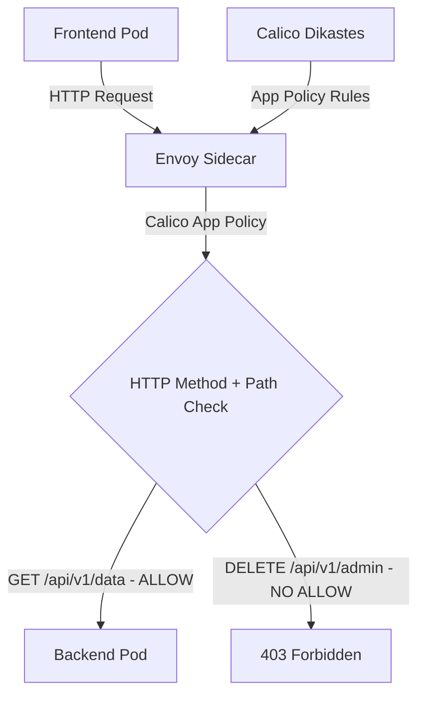

# How to Debug HTTP Method Policies with Calico and Istio

Author: [nawazdhandala](https://github.com/nawazdhandala)

Tags: Calico, Kubernetes, Network Policy, Istio, HTTP Methods, Security

Description: Debug Calico HTTP method-based network policies using Istio to control access by HTTP verb (GET, POST, DELETE, etc.).

---

## Introduction

HTTP Method Policies with Calico and Istio combines Calico's network-layer enforcement with Istio's application-layer visibility. This powerful combination lets you write policies that reference HTTP attributes - methods and paths - in addition to network-level properties like IP addresses and ports.

Calico's `projectcalico.org/v3` NetworkPolicy and GlobalNetworkPolicy HTTP match criteria (available with Istio integration) allow you to write ingress allow rules that are enforced through Istio's Envoy sidecar proxies rather than only at the network layer. This enables fine-grained control like "allow GET requests to /api/health and leave POST requests to /api/admin blocked by the default-deny behavior."

This guide covers debug HTTP Method Policies using Calico and Istio together.

## Prerequisites

- Kubernetes cluster with a Calico version that supports Istio application layer policy and Istio installed
- Calico-Istio integration configured (Dikastes sidecar)
- `calicoctl` and `kubectl` installed
- Workloads with Istio sidecar injection enabled and the Dikastes injection template annotated

## Core Configuration

```yaml
apiVersion: projectcalico.org/v3
kind: NetworkPolicy
metadata:
  name: debug-http-method-policies
  namespace: production
spec:
  order: 100
  selector: app == 'backend-api'
  ingress:
    - action: Allow
      source:
        selector: app == 'frontend'
      http:
        methods:
          - GET
          - POST
        paths:
          - exact: /api/v1/data
          - prefix: /api/v1/public
  types:
    - Ingress
```

## Istio + Calico Setup

```bash
# Verify Calico-Istio integration

kubectl get pods -n istio-system
kubectl get pods -n calico-system -l k8s-app=csi-node-driver
kubectl get configmap -n istio-system istio-sidecar-injector -o jsonpath='{.data.values}' | grep -o "dikastes:" | wc -l

# Enable sidecar injection for namespace
kubectl label namespace production istio-injection=enabled

# Verify Dikastes is injected into the workload pod
kubectl get pod -l app=backend-api -n production -o jsonpath='{.items[0].spec.containers[*].name}'
```

## Test Application-Layer Policy

```bash
# Test allowed method
kubectl exec -n production frontend-pod -- curl -fsS -X GET http://backend-api:8080/api/v1/data
echo "GET /api/v1/data (should pass): $?"

# Test method/path that is not explicitly allowed
kubectl exec -n production frontend-pod -- curl -fsS -X DELETE http://backend-api:8080/api/v1/admin
echo "DELETE /api/v1/admin (should be denied): $?"
```

## Architecture



## Conclusion

HTTP Method Policies with Calico and Istio provide fine-grained network security in Kubernetes, combining network-layer enforcement with application-layer policy evaluation. By filtering on HTTP methods and paths, you can implement access controls that are impossible with pure network-layer policies. Ensure your Calico-Istio integration is properly configured and test both allowed and denied request patterns to verify your application-layer policies are working correctly.
