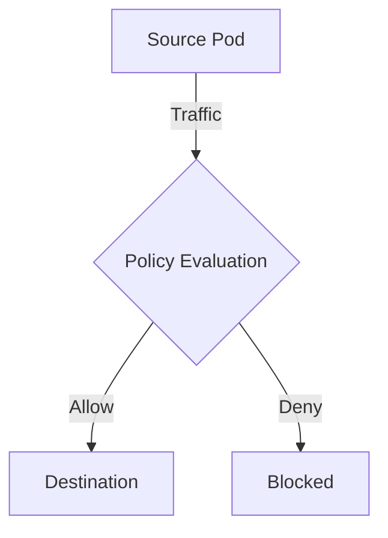

# How to Debug ICMP and Ping Rules in Calico When Traffic Is Blocked

Author: [nawazdhandala](https://github.com/nawazdhandala)

Tags: Calico, Kubernetes, Network Policy, ICMP, Debugging

Description: Diagnose and fix Calico ICMP and ping rule failures when ping or ICMP traffic is blocked.

---

## Introduction

Calico provides fine-grained network traffic control using the `projectcalico.org/v3` API. This guide covers how to debug ICMP and Ping Rules effectively with production-ready configurations.

## Prerequisites

- Kubernetes cluster with Calico v3.26+
- `calicoctl` and `kubectl` installed

## Core Configuration

```yaml
apiVersion: projectcalico.org/v3
kind: NetworkPolicy
metadata:
  name: debug-icmp-and-ping-rules
  namespace: production
spec:
  order: 100
  selector: app == 'target'
  ingress:
    - action: Allow
      protocol: ICMP
      icmp:
        type: 8
        code: 0
      source:
        selector: app == 'authorized'
  types:
    - Ingress
```

## Implementation

```bash
calicoctl apply -f debug-policy.yaml
calicoctl get networkpolicies -n production -o wide
kubectl exec -n production test-pod -- ping -c 3 target
echo "Result: $?"
```

## Architecture



## Conclusion

Debug ICMP and Ping Rules in Calico ensures your network security controls are correctly configured and enforced. Always validate in staging before production and maintain comprehensive logging for visibility.
