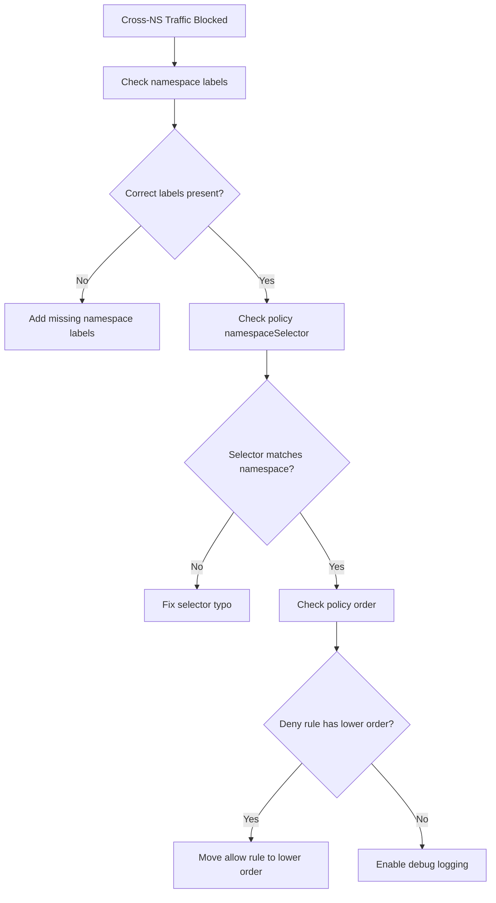

# How to Debug Calico Namespace-Based Policies When Traffic Is Blocked

Author: [nawazdhandala](https://github.com/nawazdhandala)

Tags: Calico, Kubernetes, Network Policy, Namespace, Debugging

Description: Diagnose and fix namespace-based Calico network policy failures when cross-namespace traffic is unexpectedly blocked.

---

## Introduction

Namespace-based policy failures are particularly confusing because the problem can be at three different layers: the namespace label is missing, the policy selector doesn't match, or there's a conflicting deny rule with higher priority. All three produce the same symptom — traffic is blocked — but each requires a different fix.

Calico's `namespaceSelector` in `projectcalico.org/v3` policies matches namespaces by their labels. If the namespace is missing the expected label, or if the label has a typo, the policy will silently not match and traffic will fall through to the default deny rule. This is different from pod label debugging because you're looking at namespace metadata, not pod metadata.

This guide walks through a systematic debugging approach for namespace-based Calico policy failures.

## Prerequisites

- Kubernetes cluster with Calico v3.26+
- `calicoctl` and `kubectl` installed
- Access to both source and destination namespaces

## Step 1: Confirm Namespace Labels

```bash
# Check labels on all namespaces
kubectl get namespaces --show-labels

# Check specific namespace
kubectl describe namespace production | grep Labels -A 5
```

## Step 2: Verify Policy NamespaceSelector

```bash
# Get the policy and check its namespace selector
calicoctl get networkpolicy allow-monitoring -n production -o yaml | grep -A 5 namespaceSelector

# Manually test if namespace matches selector
kubectl get namespace monitoring --show-labels | grep "team=observability"
```

## Step 3: Check Policy Ordering

```bash
# List all policies affecting the namespace, sorted by order
calicoctl get networkpolicies -n production -o wide
calicoctl get globalnetworkpolicies -o wide | sort -t'|' -k3 -n
```

## Step 4: Add a Temporary Log Rule

```yaml
apiVersion: projectcalico.org/v3
kind: NetworkPolicy
metadata:
  name: debug-log-all
  namespace: production
spec:
  order: 999
  selector: all()
  ingress:
    - action: Log
  types:
    - Ingress
```

```bash
calicoctl apply -f debug-log.yaml
# Trigger the failed traffic
# Check logs
sudo journalctl | grep "CALICO" | tail -30
```

## Step 5: Fix Missing Namespace Labels

```bash
# Add missing label to namespace
kubectl label namespace monitoring team=observability

# Verify the policy now matches
kubectl exec -n monitoring test-pod -- wget -qO- --timeout=5 http://$PROD_IP:9090
```

## Debug Decision Tree



## Conclusion

Namespace-based policy debugging follows a clear path: verify namespace labels first, then verify the policy's `namespaceSelector` matches those labels, then check for ordering conflicts. The most common fix is adding a missing label to a namespace. Once labels are correct, the policy evaluation happens automatically — no restart required. Always clean up debug log policies after you're done investigating.
