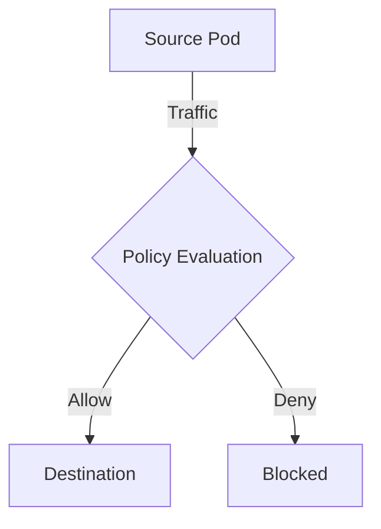

# How to Debug Calico Policy Log Rules When Traffic Is Blocked

Author: [nawazdhandala](https://github.com/nawazdhandala)

Tags: Calico, Kubernetes, Network Policy, Logging, Debugging

Description: Diagnose issues with Calico policy log rules when traffic is blocked or logs are not appearing.

---

## Introduction

Debug Calico Policy Log Rules When Traffic Is Blocked in Calico provides fine-grained network traffic control using the `projectcalico.org/v3` API. This guide covers how to debug Debug Calico Policy Log Rules When Traffic Is Blocked effectively with production-ready configurations.

## Prerequisites

- Kubernetes cluster with Calico v3.26+
- `calicoctl` and `kubectl` installed

## Core Configuration

```yaml
apiVersion: projectcalico.org/v3
kind: NetworkPolicy
metadata:
  name: debug-policy-log-rules
  namespace: production
spec:
  order: 100
  selector: all()
  ingress:
    - action: Allow
      source:
        selector: app == 'authorized'
    - action: Log
    - action: Deny
  egress:
    - action: Allow
      protocol: UDP
      destination:
        ports: [53]
    - action: Log
    - action: Deny
  types:
    - Ingress
    - Egress
```

## Implementation

```bash
calicoctl apply -f debug-policy.yaml
calicoctl get networkpolicy -n production -o wide
kubectl exec -n production test-pod -- curl -s --max-time 5 http://target:8080
echo "Result: $?"
```

## Architecture



## Conclusion

Debug Debug Calico Policy Log Rules When Traffic Is Blocked in Calico ensures your network security controls are correctly configured and enforced. Always validate in staging before production and maintain comprehensive logging for visibility.
