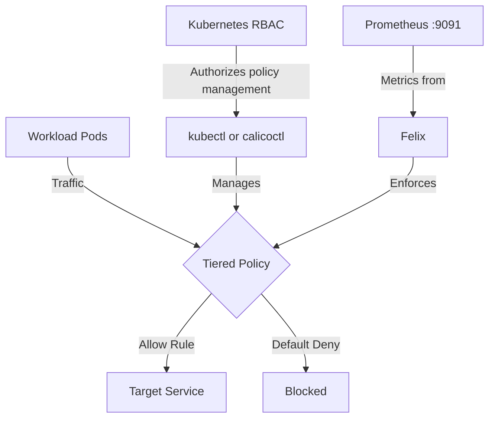

# How to Debug RBAC for Calico Tiered Policies When Access Is Blocked

Author: [nawazdhandala](https://github.com/nawazdhandala)

Tags: Calico, Kubernetes, Network Policy, RBAC, Policy Tiers, Security

Description: Diagnose and fix RBAC for Tiered Policies failures in Calico when traffic is unexpectedly blocked.

---

## Introduction

RBAC for Tiered Policies is an advanced Calico feature that provides fine-grained access control over who can manage policies and tiers using Kubernetes RBAC and the `projectcalico.org/v3` API. This guide covers how to debug RBAC Tiered Policies effectively in your Kubernetes cluster.

Calico's `projectcalico.org/v3` API provides rich support for tiered policies through its `Tier`, `GlobalNetworkPolicy`, `NetworkPolicy`, and related resources. Proper configuration of RBAC for Tiered Policies is essential for maintaining a secure, well-controlled network fabric.

This guide provides production-tested patterns for debug RBAC Tiered Policies, including YAML examples, CLI commands, and troubleshooting techniques.

## Prerequisites

- Kubernetes cluster with Calico v3.26+
- `calicoctl` and `kubectl` installed  
- Basic understanding of Calico network policy concepts
- Calico API server or native v3 CRDs with the Calico admission webhook enabled for tiered policy RBAC enforcement

## Core Configuration

The following YAML demonstrates the key pattern for RBAC Tiered Policies: grant a user access to a tier, grant access to policies in that tier, and place a Calico policy in the same tier.

```yaml
apiVersion: projectcalico.org/v3
kind: Tier
metadata:
  name: security
spec:
  order: 300
---
apiVersion: rbac.authorization.k8s.io/v1
kind: ClusterRole
metadata:
  name: security-tier-reader
rules:
  - apiGroups: ["projectcalico.org"]
    resources: ["tiers"]
    resourceNames: ["security"]
    verbs: ["get"]
---
apiVersion: rbac.authorization.k8s.io/v1
kind: ClusterRole
metadata:
  name: security-tier-policy-manager
rules:
  - apiGroups: ["projectcalico.org"]
    resources: ["tier.networkpolicies"]
    resourceNames: ["security.*"]
    verbs: ["get", "list", "watch", "create", "update", "patch", "delete"]
---
apiVersion: rbac.authorization.k8s.io/v1
kind: ClusterRoleBinding
metadata:
  name: alice-can-read-security-tier
subjects:
  - kind: User
    name: alice
    apiGroup: rbac.authorization.k8s.io
roleRef:
  kind: ClusterRole
  name: security-tier-reader
  apiGroup: rbac.authorization.k8s.io
---
apiVersion: rbac.authorization.k8s.io/v1
kind: RoleBinding
metadata:
  name: alice-can-manage-security-tier-policies
  namespace: production
subjects:
  - kind: User
    name: alice
    apiGroup: rbac.authorization.k8s.io
roleRef:
  kind: ClusterRole
  name: security-tier-policy-manager
  apiGroup: rbac.authorization.k8s.io
---
apiVersion: projectcalico.org/v3
kind: NetworkPolicy
metadata:
  name: debug-rbac-tiered-policies
  namespace: production
spec:
  tier: security
  order: 100
  selector: all()
  ingress:
    - action: Allow
      source:
        selector: app == 'authorized-source'
      destination:
        ports: [8080, 443]
  egress:
    - action: Allow
      protocol: UDP
      destination:
        ports: [53]
    - action: Allow
      destination:
        selector: app == 'authorized-destination'
  types:
    - Ingress
    - Egress
```

## Implementation Steps

```bash
# 1. Apply the policy

kubectl apply -f debug-rbac-tiered-policies.yaml

# 2. Verify it's active
calicoctl get tier security -o yaml
calicoctl get networkpolicy debug-rbac-tiered-policies -n production -o yaml

# 3. Confirm API read access; native v3 CRDs do not enforce tier-specific GET/LIST/WATCH via admission webhook
kubectl get networkpolicy.projectcalico.org debug-rbac-tiered-policies -n production --as=alice -o yaml

# 4. Check Felix metrics exposure if traffic enforcement still needs debugging
curl -s http://localhost:9091/metrics | grep -E 'felix_active_local_policies|felix_cluster_num_tiers'
```

## Operational Commands

```bash
# List all relevant policies
calicoctl get networkpolicies --all-namespaces
calicoctl get globalnetworkpolicies
calicoctl get tiers

# View policy details
calicoctl get networkpolicy debug-rbac-tiered-policies -n production -o yaml

# Delete a policy if needed
calicoctl delete networkpolicy debug-rbac-tiered-policies -n production
```

## Architecture



## Common Issues

1. **Policy not applying**: Verify API version is `projectcalico.org/v3`, verify the referenced `spec.tier` exists, and validate the YAML with `calicoctl get -o yaml` to compare against your intended configuration
2. **RBAC still denied**: Verify the user has `get` access to the `tiers` resource and access to `tier.networkpolicies` or `tier.globalnetworkpolicies` with the correct `<tier>.*` resource name; do not rely on `kubectl auth can-i` for tiered policy RBAC checks
3. **Order conflicts**: Run `calicoctl get globalnetworkpolicies -o wide` and sort by order field
4. **Selector not matching**: Use `kubectl get pods -l app=authorized-source` to verify Kubernetes labels match the Calico selector

## Conclusion

Debug RBAC Tiered Policies in Calico requires careful attention to tier visibility, pseudo-resource names, policy ordering, selector syntax, and bidirectional traffic rules. Use the patterns in this guide as a starting point, adapt them to your specific requirements, and always validate changes in a staging environment before applying to production. Consistent logging and monitoring will help you detect and resolve issues quickly when they occur.
