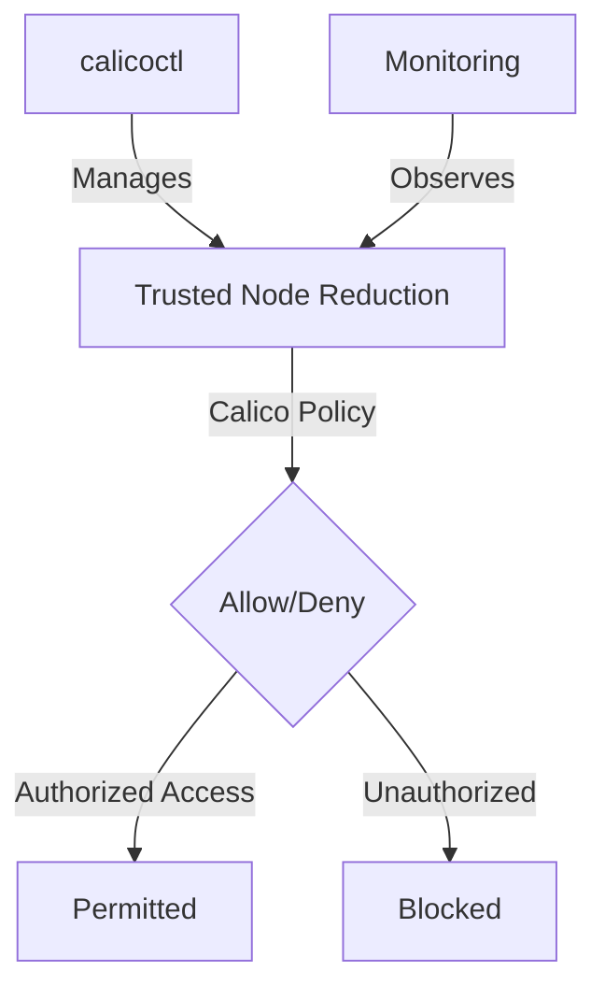

# How to Debug Calico Policies for Reducing Trusted Nodes

Author: [nawazdhandala](https://github.com/nawazdhandala)

Tags: Calico, Kubernetes, Network Policy, Node Security, Zero Trust

Description: Debug Calico policies for reducing the number of trusted nodes to minimize attack surface.

---

## Introduction

Reducing trusted node access with Calico is an important security consideration for production Calico deployments. The `projectcalico.org/v3` API provides the tools needed to debug host endpoint policy effectively, combining Calico's network policy with proper access controls and monitoring.

This guide covers debugging trusted node access reduction in Calico with practical configurations and operational best practices.

## Prerequisites

- Kubernetes cluster with Calico v3.26+
- `calicoctl` and `kubectl` installed
- Automatic Calico host endpoints enabled for Kubernetes nodes
- Understanding of Calico host endpoint policy and security architecture

## Core Configuration

```yaml
# Restrict cross-node trust - only allow specific node-to-node traffic

apiVersion: projectcalico.org/v3
kind: GlobalNetworkPolicy
metadata:
  name: reduce-trusted-nodes
spec:
  order: 100
  selector: has(kubernetes-host)
  ingress:
    - action: Allow
      protocol: TCP
      source:
        selector: trusted-node == 'true'
      destination:
        ports: [2380, 2379]  # etcd
    - action: Allow
      protocol: TCP
      source:
        nets:
          - 10.0.0.0/24  # Management subnet only
      destination:
        ports: [22, 6443]  # SSH and k8s API
    - action: Deny
      protocol: TCP
      destination:
        ports: [22, 2379, 2380, 6443]
  types:
    - Ingress
```

## Implementation

```bash
# Enable automatic host endpoints for node policy
calicoctl patch kubecontrollersconfiguration default --patch='{"spec": {"controllers": {"node": {"hostEndpoint": {"autoCreate": "Enabled"}}}}}'

# Label the nodes selected by the policy
kubectl label nodes --all kubernetes-host=
kubectl label node trusted-node-01 trusted-node=true

# Apply trusted node policy
calicoctl apply -f reduce-trusted-nodes.yaml

# Test that restricted ports are blocked from untrusted IPs
# From an untrusted node:
nc -zv node-ip 2379
echo "etcd access from untrusted node (should fail): $?"

# From a trusted node:
nc -zv node-ip 2379
echo "etcd access from trusted node (should work): $?"
```

## Architecture



## Conclusion

Debug trusted node access reduction in Calico requires a combination of proper host endpoint policy configuration, regular monitoring, and proactive testing. Use the patterns in this guide as a foundation and adapt them to your specific security requirements. Always validate changes in staging before production and maintain comprehensive logging for security visibility.
