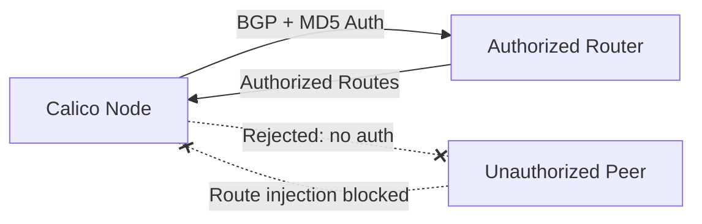

# How to Debug Calico BGP Session Security Issues

Author: [nawazdhandala](https://github.com/nawazdhandala)

Tags: Calico, Kubernetes, BGP, Security, Network Policy

Description: Debug secure BGP sessions in Calico to prevent route injection and unauthorized BGP peering.

---

## Introduction

BGP (Border Gateway Protocol) sessions in Calico are used to distribute pod routes between nodes and to upstream routers. Unsecured BGP sessions are vulnerable to route injection attacks, where a malicious peer could inject false routes and redirect cluster traffic. Securing BGP sessions is an essential part of hardening a production Calico deployment.

Calico supports BGP session authentication using MD5 passwords and can be configured to only peer with authorized BGP peers. The `projectcalico.org/v3` BGPPeer resource lets you configure per-peer authentication settings.

This guide covers debug BGP sessions in Calico to prevent unauthorized route injection and BGP hijacking.

## Prerequisites

- Kubernetes cluster with Calico v3.26+ in BGP mode
- `calicoctl` and `kubectl` installed
- Access to BGP peer configuration on both sides
- The namespace where `calico-node` runs (`kube-system` for manifest installs, or usually `calico-system` for operator installs)

## Secure BGP Configuration

```yaml
apiVersion: rbac.authorization.k8s.io/v1
kind: Role
metadata:
  name: bgp-passwords-reader
  namespace: kube-system
rules:
  - apiGroups: [""]
    resources: ["secrets"]
    resourceNames: ["bgp-peer-secrets"]
    verbs: ["get", "list", "watch"]
---
apiVersion: rbac.authorization.k8s.io/v1
kind: RoleBinding
metadata:
  name: calico-read-bgp-passwords
  namespace: kube-system
roleRef:
  apiGroup: rbac.authorization.k8s.io
  kind: Role
  name: bgp-passwords-reader
subjects:
  - kind: ServiceAccount
    name: calico-node
    namespace: kube-system
---
apiVersion: projectcalico.org/v3
kind: BGPPeer
metadata:
  name: secure-bgp-peer-router01
spec:
  peerIP: 192.168.1.1
  asNumber: 65001
  password:
    secretKeyRef:
      name: bgp-peer-secrets
      key: router01-password
  node: "node01"
```

```bash
# Create or update the BGP password secret in the namespace where calico-node runs

kubectl create secret generic bgp-peer-secrets \
  --from-literal=router01-password="$(openssl rand -base64 32)" \
  -n kube-system \
  --dry-run=client -o yaml | kubectl apply -f -

# Apply RBAC, secret reference, and BGP peer with authentication
kubectl apply -f secure-bgp-peer.yaml

# Verify BGP session
calicoctl node status
```

## Verify BGP Security

```bash
# Check BGP peer status
calicoctl node status | grep Established

# Verify the BGPPeer references the MD5 password secret
calicoctl get bgppeer secure-bgp-peer-router01 -o yaml | grep -A4 password

# Check configured BGP peers
calicoctl get bgppeers -o wide

# Check calico-node logs for rejected or failed BGP sessions
kubectl logs -n kube-system <calico-node-pod> -c calico-node | grep -Ei "BGP|auth|password|rejected"
```

## Architecture



## Conclusion

Securing BGP sessions in Calico with MD5 authentication prevents route injection attacks and unauthorized BGP peering. Configure BGP passwords using Kubernetes Secrets, apply them to each BGPPeer resource, and monitor your BGP session status regularly to detect unauthorized connection attempts. In high-security environments, combine BGP authentication with strict host endpoint policies to restrict which hosts can establish BGP connections with your nodes.
