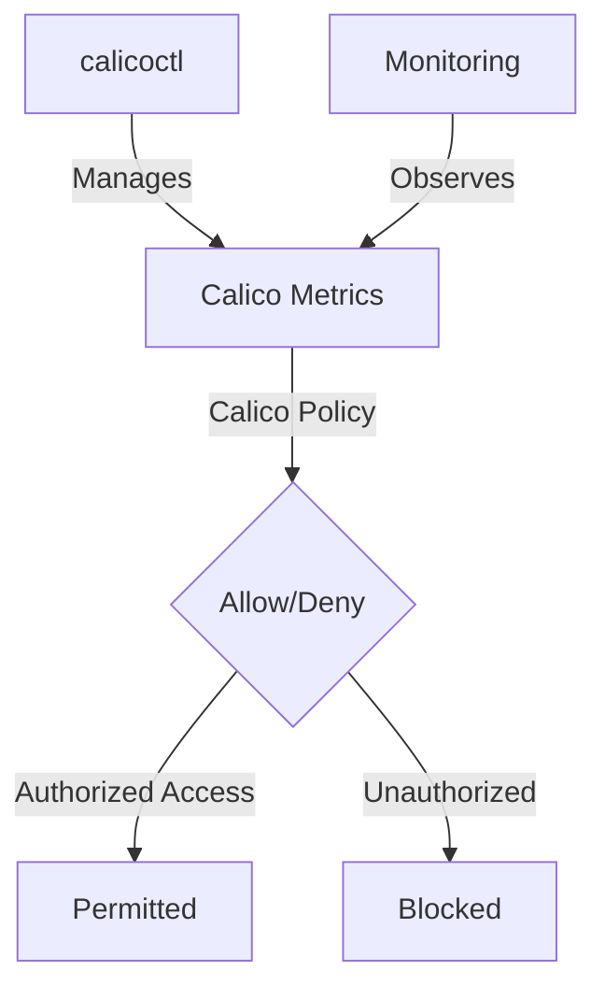

# How to Debug Calico Metrics Endpoint Security Issues

Author: [nawazdhandala](https://github.com/nawazdhandala)

Tags: Calico, Kubernetes, Metric, Security, Prometheus

Description: Debug security for Calico metrics endpoints to restrict access to authorized monitoring systems only.

---

## Introduction

Securing Calico Metrics Endpoints is an important security consideration for production Calico deployments. The `projectcalico.org/v3` API provides the tools needed to debug Calico Metrics effectively, combining Calico's network policy with proper access controls and monitoring.

This guide covers debug Calico Metrics in Calico with practical configurations and operational best practices.

## Prerequisites

- Kubernetes cluster with Calico v3.26+ and Prometheus metrics enabled
- `calicoctl` and `kubectl` installed
- HostEndpoint objects for the Calico nodes, labeled `running-calico: 'true'`, with required host allow policies already in place
- Understanding of Calico's monitoring and security architecture

## Core Configuration

```yaml
# Restrict access to Calico Felix metrics (port 9091)

apiVersion: projectcalico.org/v3
kind: GlobalNetworkPolicy
metadata:
  name: secure-calico-metrics
spec:
  order: 100
  selector: running-calico == 'true'
  ingress:
    - action: Allow
      protocol: TCP
      source:
        selector: calico-prometheus-access == 'true'
      destination:
        ports: [9091]
  types:
    - Ingress
```

## Implementation Steps

```bash
# Apply metrics security policy
calicoctl apply -f secure-calico-metrics.yaml

# Label the Prometheus pod so the Calico policy allows it
kubectl label pod -n monitoring prometheus-pod calico-prometheus-access=true

# Verify only authorized access works
set -o pipefail
kubectl exec -n monitoring prometheus-pod -- curl -sf --max-time 5 http://calico-node-ip:9091/metrics | head -5
echo "Prometheus access (should work): $?"

# Verify unauthorized access is blocked
kubectl exec -n default test-pod -- curl -s --max-time 5 http://calico-node-ip:9091/metrics
echo "Unauthorized access (should timeout): $?"
```

## Verify Metrics Security

```bash
# View recent Calico flow logs in the Whisker console if flow logs are enabled

# Check active global policy for Calico node host endpoints
calicoctl get globalnetworkpolicies | grep metrics
```

## Architecture



## Conclusion

Debug Calico Metrics in Calico requires a combination of proper policy configuration, regular monitoring, and proactive testing. Use the patterns in this guide as a foundation and adapt them to your specific security requirements. Always validate changes in staging before production and maintain comprehensive logging for security visibility.
