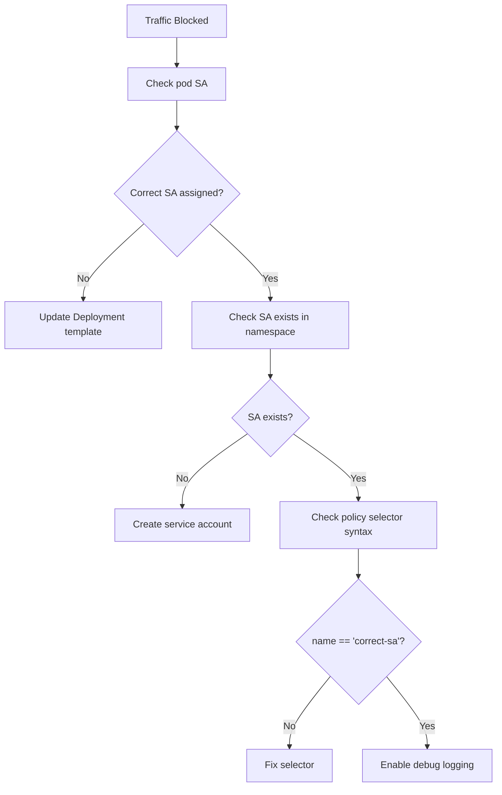

# How to Debug Calico Service Account-Based Policies When Traffic Is Blocked

Author: [nawazdhandala](https://github.com/nawazdhandala)

Tags: Calico, Kubernetes, Network Policy, Service Accounts, Debugging

Description: Diagnose and fix service account-based Calico network policy failures when traffic is blocked due to identity mismatches.

---

## Introduction

Service account policy failures are subtle because the service account identity is not visible in basic `kubectl get pod` output. A pod can look perfectly healthy with all the right labels and still be blocked because it's running with the default service account instead of the dedicated one specified in the policy.

Calico's `serviceAccountSelector` in `projectcalico.org/v3` evaluates the service account name at connection time. If a pod was deployed without the correct service account, the policy will silently deny all its traffic to the protected service.

## Prerequisites

- Kubernetes cluster with Calico v3.26+
- `calicoctl` and `kubectl` installed

## Step 1: Check the Pod's Service Account

```bash
# Most important first step
kubectl get pod my-pod -n production -o jsonpath='{.spec.serviceAccountName}'

# Compare to what the policy expects
calicoctl get networkpolicy allow-backend-to-db -n production -o yaml | grep serviceAccountSelector
```

## Step 2: Verify the Service Account Exists

```bash
# Check if the service account is in the right namespace
kubectl get serviceaccount backend-sa -n production
# If it doesn't exist, create it
kubectl create serviceaccount backend-sa -n production
```

## Step 3: Check Deployment Service Account Configuration

```bash
# Many times the issue is the Deployment template, not the running pod
kubectl get deployment my-deployment -n production -o jsonpath='{.spec.template.spec.serviceAccountName}'
```

## Step 4: Verify Policy Selector Syntax

```bash
# Calico service account selector syntax
calicoctl get networkpolicy allow-backend -n production -o yaml

# Common issue: using labels as SA selectors
# Wrong: serviceAccountSelector: app == 'backend'  (SA doesn't have app label)
# Right: serviceAccountSelector: name == 'backend-sa'  (SA name)
```

## Step 5: Add a Log Rule to Trace Decisions

```yaml
apiVersion: projectcalico.org/v3
kind: NetworkPolicy
metadata:
  name: debug-sa-log
  namespace: production
spec:
  order: 999
  selector: app == 'db'
  ingress:
    - action: Log
  types:
    - Ingress
```

## Debug Decision Tree



## Conclusion

Service account policy debugging starts with a simple check: `kubectl get pod -o jsonpath='{.spec.serviceAccountName}'`. Ninety percent of failures are due to pods running with the default service account instead of the intended one, usually because the Deployment template was not updated. Fix the Deployment spec, trigger a rolling restart, and the policy will start working immediately.
