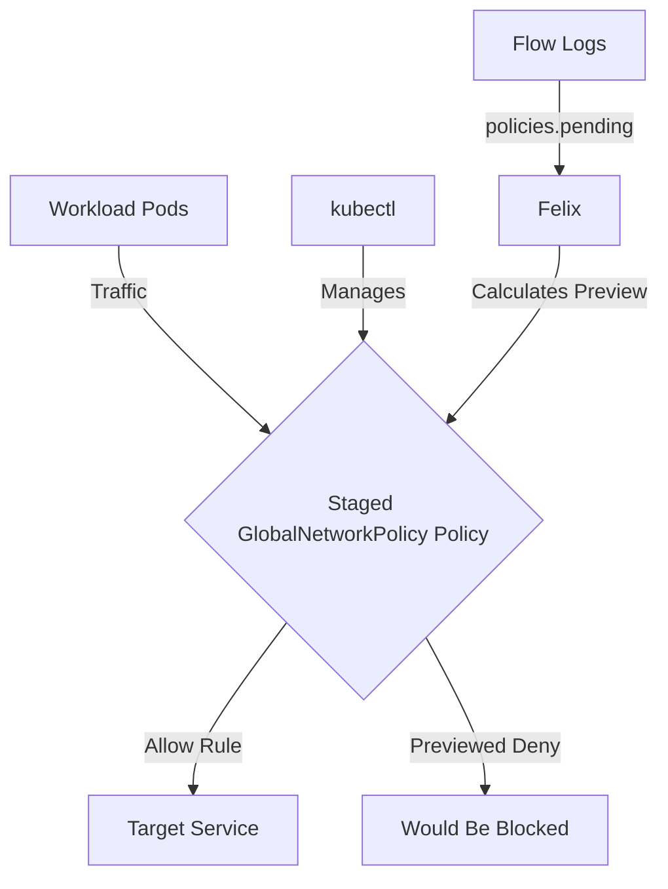

# How to Debug Staged GlobalNetworkPolicy in Calico

Author: [nawazdhandala](https://github.com/nawazdhandala)

Tags: Calico, Kubernetes, Network Policy, Staged Policies, Global Policy

Description: Diagnose and fix Staged GlobalNetworkPolicy failures in Calico when traffic is unexpectedly blocked.

---

## Introduction

Staged GlobalNetworkPolicy is an advanced Calico feature that previews fine-grained network security controls using the `projectcalico.org/v3` API without enforcing them. This guide covers how to debug Staged GlobalNetworkPolicy effectively in your Kubernetes cluster.

Calico's `projectcalico.org/v3` API provides rich support for staged policy through its `StagedGlobalNetworkPolicy`, `StagedNetworkPolicy`, and related resources. Proper configuration of Staged GlobalNetworkPolicy is essential for previewing changes before enforcing them on a secure, well-controlled network fabric.

This guide provides production-tested patterns for debug Staged GlobalNetworkPolicy, including YAML examples, CLI commands, and troubleshooting techniques.

## Prerequisites

- Kubernetes cluster with Calico v3.26+
- `kubectl` installed
- Basic understanding of Calico network policy concepts
- Calico v3.26+ for full Staged GlobalNetworkPolicy feature support

## Core Configuration

The following YAML demonstrates the key pattern for Staged GlobalNetworkPolicy:

```yaml
apiVersion: projectcalico.org/v3
kind: StagedGlobalNetworkPolicy
metadata:
  name: debug-staged-globalnetworkpolicy
spec:
  order: 100
  namespaceSelector: projectcalico.org/name == 'production'
  selector: all()
  ingress:
    - action: Allow
      protocol: TCP
      source:
        selector: app == 'authorized-source'
      destination:
        ports: [8080, 443]
  egress:
    - action: Allow
      protocol: UDP
      destination:
        ports: [53]
    - action: Allow
      protocol: TCP
      destination:
        ports: [53]
    - action: Allow
      destination:
        selector: app == 'authorized-destination'
  types:
    - Ingress
    - Egress
```

## Implementation Steps

```bash
# 1. Apply the policy

kubectl apply -f debug-staged-globalnetworkpolicy.yaml

# 2. Verify it was created
kubectl get stagedglobalnetworkpolicy debug-staged-globalnetworkpolicy -o wide

# 3. Generate traffic to preview policy impact
kubectl exec -n production test-pod -- curl -s --max-time 5 http://target:8080
echo "Exit code: $?"

# 4. Review flow logs for staged-policy decisions
# In Calico flow logs, check the policies.pending field for the previewed verdict.
```

## Operational Commands

```bash
# List all relevant policies
kubectl get stagedglobalnetworkpolicies.projectcalico.org
kubectl get globalnetworkpolicies.projectcalico.org

# View policy details
kubectl get stagedglobalnetworkpolicy debug-staged-globalnetworkpolicy -o yaml

# Delete a policy if needed
kubectl delete stagedglobalnetworkpolicy debug-staged-globalnetworkpolicy
```

## Architecture



## Common Issues

1. **Policy not applying**: Verify API version is `projectcalico.org/v3`, kind is `StagedGlobalNetworkPolicy`, and run `kubectl apply --dry-run=server -f debug-staged-globalnetworkpolicy.yaml` first
2. **Selector not matching**: Use `kubectl get pods -n production -l app=authorized-source` to verify label matches
3. **Order conflicts**: Run `kubectl get stagedglobalnetworkpolicies.projectcalico.org -o wide` and sort by order field
4. **DNS failures after enforcement**: Always ensure egress to UDP and TCP port 53 is allowed when restricting egress

## Conclusion

Debug Staged GlobalNetworkPolicy in Calico requires careful attention to policy ordering, selector syntax, and bidirectional traffic rules. Use the patterns in this guide as a starting point, adapt them to your specific requirements, and always validate the staged impact before creating an equivalent enforced policy for production. Consistent logging and monitoring will help you detect and resolve issues quickly when they occur.
