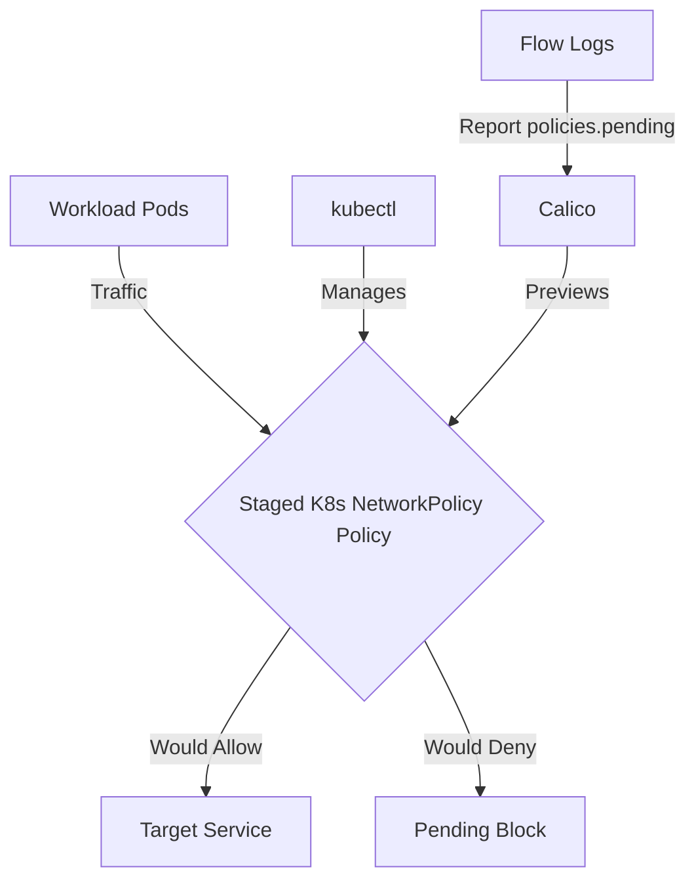

# How to Debug Staged Kubernetes NetworkPolicy in Calico

Author: [nawazdhandala](https://github.com/nawazdhandala)

Tags: Calico, Kubernetes, Network Policy, Staged Policies

Description: Diagnose and fix Staged Kubernetes NetworkPolicy failures in Calico when traffic is unexpectedly blocked.

---

## Introduction

Staged Kubernetes NetworkPolicy is an advanced Calico feature that previews Kubernetes NetworkPolicy behavior using the `projectcalico.org/v3` API without changing actual traffic flow. This guide covers how to debug Staged K8s NetworkPolicy effectively in your Kubernetes cluster.

Calico's `projectcalico.org/v3` API provides rich support for staged policy through its `StagedGlobalNetworkPolicy`, `StagedNetworkPolicy`, `StagedKubernetesNetworkPolicy`, and related resources. Proper configuration of Staged K8s NetworkPolicy is essential for safely previewing changes to a secure, well-controlled network fabric.

This guide provides production-tested patterns for debug Staged K8s NetworkPolicy, including YAML examples, CLI commands, and troubleshooting techniques.

## Prerequisites

- Kubernetes cluster with Calico installed and the `StagedKubernetesNetworkPolicy` CRD available
- `kubectl` installed
- Basic understanding of Calico network policy concepts

## Core Configuration

The following YAML demonstrates the key pattern for Staged K8s NetworkPolicy:

```yaml
apiVersion: projectcalico.org/v3
kind: StagedKubernetesNetworkPolicy
metadata:
  name: debug-staged-k8s-networkpolicy
  namespace: production
spec:
  podSelector: {}
  ingress:
    - from:
        - podSelector:
            matchLabels:
              app: authorized-source
      ports:
        - protocol: TCP
          port: 8080
        - protocol: TCP
          port: 443
  egress:
    - to:
        - namespaceSelector:
            matchLabels:
              kubernetes.io/metadata.name: kube-system
          podSelector:
            matchLabels:
              k8s-app: kube-dns
      ports:
        - protocol: UDP
          port: 53
        - protocol: TCP
          port: 53
    - to:
        - podSelector:
            matchLabels:
              app: authorized-destination
  policyTypes:
    - Ingress
    - Egress
```

## Implementation Steps

```bash
# 1. Apply the policy

kubectl apply -f debug-staged-k8s-networkpolicy.yaml

# 2. Verify it exists
kubectl get stagedkubernetesnetworkpolicy.p -n production

# 3. Test current connectivity; staged policies do not enforce traffic
kubectl exec -n production test-pod -- curl -s --max-time 5 http://target:8080
echo "Exit code: $?"

# 4. Preview staged-policy impact in Calico flow logs, where available
# Look for staged-policy decisions in the policies.pending field.
```

## Operational Commands

```bash
# List all relevant policies
kubectl get stagedkubernetesnetworkpolicy.p --all-namespaces
kubectl get stagednetworkpolicy.p --all-namespaces
kubectl get stagedglobalnetworkpolicy.p

# View policy details
kubectl get stagedkubernetesnetworkpolicy.p debug-staged-k8s-networkpolicy -n production -o yaml

# Delete a policy if needed
kubectl delete stagedkubernetesnetworkpolicy.p debug-staged-k8s-networkpolicy -n production
```

## Architecture



## Common Issues

1. **Policy not applying**: Verify API version is `projectcalico.org/v3`, kind is `StagedKubernetesNetworkPolicy`, and run `kubectl apply --dry-run=server -f debug-staged-k8s-networkpolicy.yaml` first
2. **Selector not matching**: Use `kubectl get pods -l your-selector` to verify label matches
3. **Unexpected preview results**: Compare the staged policy with existing enforced `NetworkPolicy` resources in the namespace
4. **DNS failures after enforcement**: Always ensure egress to both UDP and TCP port 53 is allowed when restricting egress

## Conclusion

Debug Staged K8s NetworkPolicy in Calico requires careful attention to Kubernetes selector syntax, existing enforced policies, and bidirectional traffic rules. Use the patterns in this guide as a starting point, adapt them to your specific requirements, and always validate changes in a staging environment before applying to production. Consistent logging and monitoring will help you detect and resolve issues quickly when they occur.
