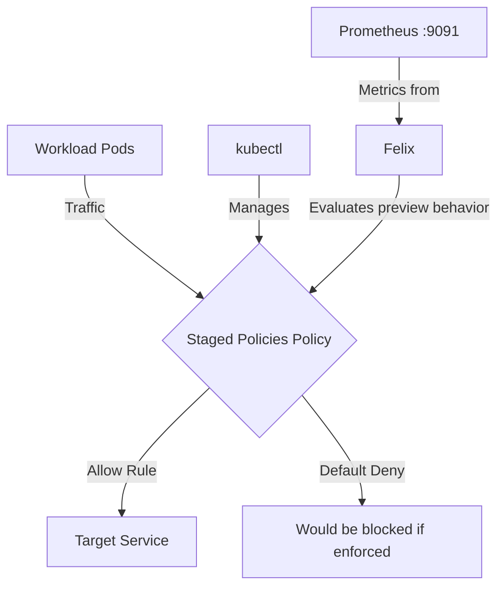

# How to Debug Staged Network Policies in Calico

Author: [nawazdhandala](https://github.com/nawazdhandala)

Tags: Calico, Kubernetes, Network Policy, Staged Policies, Security

Description: Diagnose and fix Staged Network Policies failures in Calico when traffic is unexpectedly blocked.

---

## Introduction

Staged Network Policies is an advanced Calico feature that lets you preview fine-grained network security controls using the `projectcalico.org/v3` API without changing live traffic flow. This guide covers how to debug Staged Policies effectively in your Kubernetes cluster.

Calico's `projectcalico.org/v3` API provides rich support for Staged Policies through its `StagedGlobalNetworkPolicy`, `StagedNetworkPolicy`, `StagedKubernetesNetworkPolicy`, and related resources. Proper configuration of Staged Policies is essential for maintaining a secure, well-controlled network fabric.

This guide provides production-tested patterns for debug Staged Policies, including YAML examples, CLI commands, and troubleshooting techniques.

## Prerequisites

- Kubernetes cluster with Calico Open Source v3.30+ or a Calico Cloud/Enterprise version that includes Staged Policy CRDs
- `kubectl` installed and configured to manage Calico `projectcalico.org/v3` API resources
- Basic understanding of Calico network policy concepts

## Core Configuration

The following YAML demonstrates the key pattern for Staged Policies:

```yaml
apiVersion: projectcalico.org/v3
kind: StagedNetworkPolicy
metadata:
  name: debug-staged-policies
  namespace: production
spec:
  order: 100
  selector: all()
  ingress:
    - action: Allow
      source:
        selector: app == 'authorized-source'
      destination:
        ports: [8080, 443]
  egress:
    - action: Allow
      protocol: UDP
      destination:
        ports: [53]
    - action: Allow
      destination:
        selector: app == 'authorized-destination'
  types:
    - Ingress
    - Egress
```

## Implementation Steps

```bash
# 1. Validate and apply the staged policy

kubectl apply --dry-run=server -f debug-staged-policies.yaml
kubectl apply -f debug-staged-policies.yaml

# 2. Verify the staged policy exists
kubectl get stagednetworkpolicies.projectcalico.org -n production -o wide

# 3. Generate traffic to review in staged policy previews or flow logs
kubectl exec -n production test-pod -- curl -s --max-time 5 http://target:8080
echo "Exit code: $?"

# 4. Confirm Felix metrics are exposed, if enabled
curl -s http://localhost:9091/metrics | head
```

## Operational Commands

```bash
# List all relevant policies
kubectl get stagednetworkpolicies.projectcalico.org --all-namespaces
kubectl get stagedglobalnetworkpolicies.projectcalico.org

# View policy details
kubectl get stagednetworkpolicy.projectcalico.org debug-staged-policies -n production -o yaml

# Delete a policy if needed
kubectl delete stagednetworkpolicy.projectcalico.org debug-staged-policies -n production
```

## Architecture



## Common Issues

1. **Policy not applying**: Verify API version is `projectcalico.org/v3`, the kind is `StagedNetworkPolicy`, and run `kubectl apply --dry-run=server -f debug-staged-policies.yaml` first
2. **Selector not matching**: Use `kubectl get pods -l app=authorized-source` to verify Kubernetes label matches, then check the Calico selector syntax in the policy
3. **Order conflicts**: Run `kubectl get stagedglobalnetworkpolicies.projectcalico.org -o wide` and sort by order field
4. **DNS failures**: Always ensure egress to port 53 is allowed when restricting egress

## Conclusion

Debug Staged Policies in Calico requires careful attention to policy ordering, selector syntax, and bidirectional traffic rules. Use the patterns in this guide as a starting point, adapt them to your specific requirements, and always validate staged behavior before enforcing a policy in production. Consistent logging and monitoring will help you detect and resolve issues quickly when they occur.
