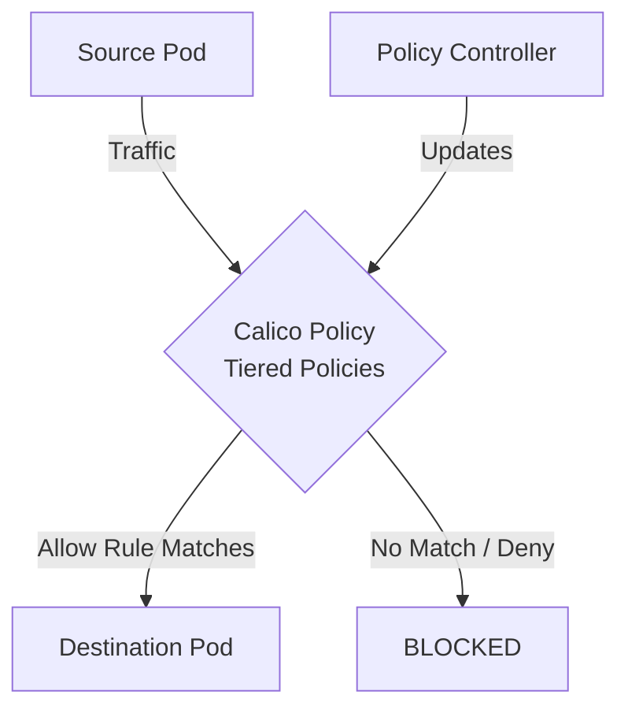

# How to Debug Calico Tiered Policies When Traffic Is Blocked in Calico

Author: [nawazdhandala](https://github.com/nawazdhandala)

Tags: Calico, Kubernetes, Network Policy, Policy Tiers, Security

Description: Diagnose and fix Calico Tiered Policies failures in Calico when traffic is unexpectedly blocked.

---

## Introduction

Calico Tiered Policies in Calico provides fine-grained network security controls using the `projectcalico.org/v3` API. This guide covers how to debug Tiered Policies effectively.

Calico's extensible policy model supports Tiered Policies through its `GlobalNetworkPolicy` and `NetworkPolicy` resources, giving you cluster-wide and namespace-scoped control over traffic that matches your Tiered Policies criteria.

This guide provides practical techniques for debug Tiered Policies in your Kubernetes cluster, following security best practices and production-tested patterns.

## Prerequisites

- Kubernetes cluster with Calico v3.26+
- `calicoctl` and `kubectl` installed
- Basic understanding of Calico network policy concepts

## Step 1: Identify the Blocked Traffic

```bash
kubectl exec -n my-namespace my-pod -- curl -v --max-time 5 http://target-service:8080
```

## Step 2: Check Applicable Policies

```bash
calicoctl get networkpolicies -n my-namespace -o wide
calicoctl get globalnetworkpolicies -o wide
```

## Step 3: Add a Temporary Log Rule

```yaml
apiVersion: projectcalico.org/v3
kind: NetworkPolicy
metadata:
  name: debug-log
  namespace: my-namespace
spec:
  order: 999
  selector: all()
  ingress:
    - action: Log
  types:
    - Ingress
```

## Step 4: Review Logs and Fix

```bash
sudo journalctl | grep "CALICO" | tail -30
# Identify the blocking rule, fix selector or order
calicoctl delete networkpolicy debug-log -n my-namespace
```

## Architecture



## Conclusion

Debug Tiered Policies policies in Calico requires attention to policy ordering, selector accuracy, and bidirectional rule coverage. Follow the patterns in this guide to ensure your Tiered Policies policies are correctly configured, tested, and monitored. Always validate in staging before applying to production, and maintain comprehensive logging for visibility into policy decisions.
