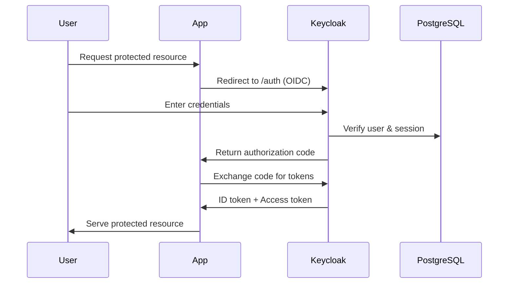

# How to Deploy Keycloak with PostgreSQL Backend with Flux CD

Author: [nawazdhandala](https://github.com/nawazdhandala)

Tags: Flux CD, Kubernetes, GitOps, Keycloak, Identity Management, SSO, PostgreSQL

Description: Deploy Keycloak identity provider with a PostgreSQL database backend using Flux CD for GitOps-managed single sign-on infrastructure.

---

## Introduction

Keycloak is the leading open-source identity and access management solution. It provides single sign-on (SSO), identity brokering, social login, user federation via LDAP/AD, and fine-grained authorization for modern applications. Organizations use Keycloak to centralize authentication across dozens of internal and customer-facing services.

Running Keycloak on Kubernetes with a dedicated PostgreSQL backend-rather than the embedded H2 database-gives you production-grade reliability with proper connection pooling, transactions, and point-in-time recovery. Flux CD manages the entire stack declaratively: a version bump to Keycloak or PostgreSQL is a one-line change in Git that Flux rolls out safely.

This guide deploys Keycloak in production mode using the Bitnami Helm chart, backed by a separate PostgreSQL release, both managed by Flux CD.

## Prerequisites

- Kubernetes cluster (v1.26+) with Flux CD bootstrapped
- An Ingress controller with TLS termination (Keycloak requires HTTPS in production mode)
- `cert-manager` for automatic TLS certificate provisioning (recommended)
- `flux` and `kubectl` CLIs configured

## Step 1: Create Namespace and Secrets

```bash
kubectl create namespace keycloak

# Keycloak admin credentials
kubectl create secret generic keycloak-admin-secret \
  --namespace keycloak \
  --from-literal=admin-password=KeycloakAdmin1!

# PostgreSQL credentials
kubectl create secret generic keycloak-db-secret \
  --namespace keycloak \
  --from-literal=postgres-password=pgadminpass \
  --from-literal=password=keycloakdbpass
```

## Step 2: Add the Bitnami Helm Repository

```yaml
# clusters/my-cluster/keycloak/helm-repository.yaml
apiVersion: source.toolkit.fluxcd.io/v1
kind: HelmRepository
metadata:
  name: bitnami
  namespace: flux-system
spec:
  url: https://charts.bitnami.com/bitnami
  interval: 12h
```

## Step 3: Deploy PostgreSQL

```yaml
# clusters/my-cluster/keycloak/postgresql-release.yaml
apiVersion: helm.toolkit.fluxcd.io/v2
kind: HelmRelease
metadata:
  name: keycloak-postgresql
  namespace: keycloak
spec:
  interval: 10m
  chart:
    spec:
      chart: postgresql
      version: ">=13.0.0 <14.0.0"
      sourceRef:
        kind: HelmRepository
        name: bitnami
        namespace: flux-system
  values:
    auth:
      database: keycloak
      username: keycloak
      existingSecret: keycloak-db-secret
      secretKeys:
        adminPasswordKey: postgres-password
        userPasswordKey: password
    primary:
      persistence:
        size: 20Gi
      # Tune for Keycloak's connection patterns
      extendedConfiguration: |
        max_connections = 200
        shared_buffers = 256MB
```

## Step 4: Deploy Keycloak

```yaml
# clusters/my-cluster/keycloak/keycloak-release.yaml
apiVersion: helm.toolkit.fluxcd.io/v2
kind: HelmRelease
metadata:
  name: keycloak
  namespace: keycloak
spec:
  interval: 10m
  dependsOn:
    - name: keycloak-postgresql
  chart:
    spec:
      chart: keycloak
      version: ">=21.0.0 <22.0.0"
      sourceRef:
        kind: HelmRepository
        name: bitnami
        namespace: flux-system
  values:
    # Production mode requires HTTPS
    production: true
    proxy: edge   # Trust proxy headers from the Ingress controller

    auth:
      adminUser: admin
      existingSecret: keycloak-admin-secret
      passwordSecretKey: admin-password

    # External PostgreSQL connection
    postgresql:
      enabled: false   # Disable bundled PostgreSQL

    externalDatabase:
      host: keycloak-postgresql
      port: 5432
      database: keycloak
      user: keycloak
      existingSecret: keycloak-db-secret
      existingSecretPasswordKey: password

    # Hostname for Keycloak (used in token issuers)
    hostname:
      hostname: auth.example.com
      adminHostname: auth.example.com

    ingress:
      enabled: true
      ingressClassName: nginx
      hostname: auth.example.com
      tls: true
      selfSigned: false
      extraTls:
        - hosts:
            - auth.example.com
          secretName: keycloak-tls
      annotations:
        nginx.ingress.kubernetes.io/proxy-buffer-size: "128k"

    resources:
      requests:
        cpu: 500m
        memory: 1Gi
      limits:
        cpu: "2"
        memory: 2Gi

    # Enable metrics for Prometheus
    metrics:
      enabled: true
      serviceMonitor:
        enabled: false   # Set true if Prometheus Operator installed

    # Cache configuration for multi-replica deployments
    cache:
      enabled: true
      stackName: kubernetes

    replicaCount: 2
```

## Step 5: Create the Kustomization

```yaml
# clusters/my-cluster/keycloak/kustomization.yaml
apiVersion: kustomize.toolkit.fluxcd.io/v1
kind: Kustomization
metadata:
  name: keycloak
  namespace: flux-system
spec:
  interval: 10m
  path: ./clusters/my-cluster/keycloak
  prune: true
  sourceRef:
    kind: GitRepository
    name: fleet-repo
  healthChecks:
    - apiVersion: helm.toolkit.fluxcd.io/v2
      kind: HelmRelease
      name: keycloak
      namespace: keycloak
```

## Step 6: Verify and Configure a Realm

```bash
# Watch Flux reconcile
flux get helmreleases -n keycloak --watch

# Check Keycloak pods (should show 2 running replicas)
kubectl get pods -n keycloak

# Check startup logs
kubectl logs -n keycloak -l app.kubernetes.io/name=keycloak -f
```

Navigate to `https://auth.example.com/admin` and log in as `admin`. Create a new realm for your application and configure clients, identity providers, and user federation as needed.

The flow of token issuance:



## Best Practices

- Always run Keycloak in `production: true` mode to enforce HTTPS and disable development-only features.
- Use Keycloak's built-in theme system to brand the login page to match your organization's design.
- Configure `replicaCount: 2+` and enable the `cache.enabled: true` setting for distributed session management across pods.
- Set up realm-level events logging and forward to your SIEM or log aggregation system.
- Rotate the PostgreSQL password via secret update and let Flux trigger a rolling restart of the Keycloak pods.

## Conclusion

Keycloak with a PostgreSQL backend is now deployed on Kubernetes and managed by Flux CD. Your identity infrastructure is version-controlled, drift-resistant, and upgradeable through pull requests. With two replicas sharing distributed session state, the deployment is resilient to pod restarts, and the PostgreSQL backend provides the durability needed for production identity management.
