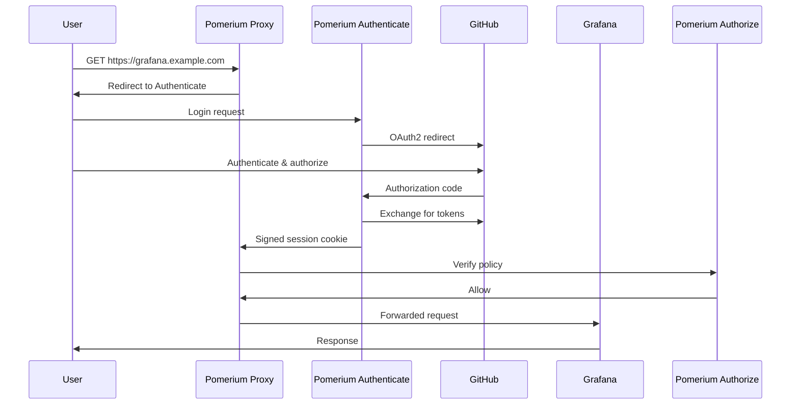

# How to Deploy Pomerium Access Proxy with Flux CD

Author: [nawazdhandala](https://github.com/nawazdhandala)

Tags: Flux CD, Kubernetes, GitOps, Pomerium, Access Proxy, Zero Trust, Security

Description: Deploy Pomerium identity-aware access proxy to Kubernetes using Flux CD for GitOps-managed zero-trust access to internal applications.

---

## Introduction

Pomerium is an open-source, identity-aware access proxy that implements zero-trust network access for internal applications and services. Rather than relying on a VPN or network perimeter, Pomerium evaluates every request against identity provider claims, group memberships, and configurable policies before forwarding it to the upstream service. Users authenticate once and gain seamless access to authorized applications.

Pomerium integrates natively with major identity providers—Google Workspace, Okta, Azure AD, GitHub, GitLab, Keycloak, Dex—and exposes a powerful policy language for fine-grained access control. Combined with Flux CD, your entire access proxy configuration—routes, policies, and identity provider settings—is version-controlled in Git, making access control as auditable as your application code.

This guide deploys Pomerium using the official Helm chart with a GitHub identity provider and multiple protected routes.

## Prerequisites

- Kubernetes cluster (v1.26+) with Flux CD bootstrapped
- An Ingress controller OR Pomerium as a standalone ingress (this guide uses standalone mode)
- A wildcard TLS certificate or cert-manager for `*.example.com`
- A GitHub OAuth App for authentication
- `flux` and `kubectl` CLIs configured

## Step 1: Register a GitHub OAuth App

Go to **GitHub > Settings > Developer Settings > OAuth Apps > New OAuth App**:

- **Homepage URL**: `https://authenticate.example.com`
- **Authorization callback URL**: `https://authenticate.example.com/oauth2/callback`

Note the **Client ID** and generate a **Client Secret**.

## Step 2: Create Namespace and Secrets

```bash
kubectl create namespace pomerium

kubectl create secret generic pomerium-secrets \
  --namespace pomerium \
  --from-literal=cookie-secret=$(openssl rand -base64 32) \
  --from-literal=shared-secret=$(openssl rand -hex 32) \
  --from-literal=signing-key=$(openssl genrsa 2048 | base64 -w 0) \
  --from-literal=idp-client-id=your_github_client_id \
  --from-literal=idp-client-secret=your_github_client_secret
```

## Step 3: Add the Pomerium Helm Repository

```yaml
# clusters/my-cluster/pomerium/helm-repository.yaml
apiVersion: source.toolkit.fluxcd.io/v1
kind: HelmRepository
metadata:
  name: pomerium
  namespace: flux-system
spec:
  url: https://helm.pomerium.io
  interval: 12h
```

## Step 4: Deploy Pomerium via HelmRelease

```yaml
# clusters/my-cluster/pomerium/pomerium-release.yaml
apiVersion: helm.toolkit.fluxcd.io/v2
kind: HelmRelease
metadata:
  name: pomerium
  namespace: pomerium
spec:
  interval: 10m
  chart:
    spec:
      chart: pomerium
      version: ">=45.0.0 <46.0.0"
      sourceRef:
        kind: HelmRepository
        name: pomerium
        namespace: flux-system
  values:
    config:
      # All Pomerium routes are managed in this policy block
      policy:
        # Protect Grafana — only GitHub org members can access
        - from: https://grafana.example.com
          to: http://grafana.monitoring.svc.cluster.local:3000
          policy:
            - allow:
                or:
                  - github_teams:
                      - my-org/platform-team
                      - my-org/devops-team

        # Protect the Kubernetes Dashboard — require 2FA (if IdP supports it)
        - from: https://dashboard.example.com
          to: https://kubernetes-dashboard.kube-system.svc.cluster.local
          policy:
            - allow:
                and:
                  - github_teams:
                      - my-org/admins
          allow_websockets: true
          tls_skip_verify: true   # Dashboard uses self-signed cert

        # Public route with no authentication
        - from: https://status.example.com
          to: http://oneuptime.default.svc.cluster.local:3000
          allow_public_unauthenticated_access: true

    # Identity provider configuration
    authenticate:
      idp:
        provider: github
        clientID: ""         # Loaded from secret via valuesFrom
        clientSecret: ""
        serviceAccount: ""

    # Cookie and shared secret
    existingCASecret: ""
    existingSecret: pomerium-secrets
    cookieSecret: ""         # Loaded from pomerium-secrets
    sharedSecret: ""
    signingKey: ""

    # Pomerium endpoints
    proxy:
      enabled: true
    authorize:
      enabled: true
    databroker:
      enabled: true
      storage:
        type: redis

    redis:
      enabled: true

    # Ingress — Pomerium handles TLS itself
    ingress:
      enabled: true
      secretName: pomerium-tls    # Wildcard cert for *.example.com
      annotations:
        kubernetes.io/ingress.class: nginx

    resources:
      requests:
        cpu: 100m
        memory: 128Mi
      limits:
        cpu: 500m
        memory: 256Mi

  # Load secrets into Helm values from the Kubernetes secret
  valuesFrom:
    - kind: Secret
      name: pomerium-secrets
      valuesKey: cookie-secret
      targetPath: cookieSecret
    - kind: Secret
      name: pomerium-secrets
      valuesKey: shared-secret
      targetPath: sharedSecret
    - kind: Secret
      name: pomerium-secrets
      valuesKey: idp-client-id
      targetPath: authenticate.idp.clientID
    - kind: Secret
      name: pomerium-secrets
      valuesKey: idp-client-secret
      targetPath: authenticate.idp.clientSecret
```

## Step 5: Create the Kustomization

```yaml
# clusters/my-cluster/pomerium/kustomization.yaml
apiVersion: kustomize.toolkit.fluxcd.io/v1
kind: Kustomization
metadata:
  name: pomerium
  namespace: flux-system
spec:
  interval: 10m
  path: ./clusters/my-cluster/pomerium
  prune: true
  sourceRef:
    kind: GitRepository
    name: fleet-repo
  healthChecks:
    - apiVersion: helm.toolkit.fluxcd.io/v2
      kind: HelmRelease
      name: pomerium
      namespace: pomerium
```

## Step 6: Verify and Test Access

```bash
# Watch Flux reconcile
flux get helmreleases -n pomerium --watch

# Check all Pomerium component pods
kubectl get pods -n pomerium
```

Open `https://grafana.example.com` in your browser. Pomerium will redirect you to GitHub for authentication. After login, Pomerium verifies your team membership and forwards the request to Grafana if the policy allows it.

The access flow:



## Best Practices

- Store all policy in Git via the `config.policy` block in Helm values—never apply policy changes manually via the Pomerium console.
- Use `allowed_domains` instead of `github_teams` when you want to restrict access to a company email domain rather than a specific team.
- Enable `pass_identity_headers: true` on routes to forward verified user identity headers (`X-Pomerium-Jwt-Assertion`) to upstream services.
- Use Redis persistence (`databroker.storage.type: redis`) for high-availability session storage across Pomerium pod restarts.
- Regularly audit the Pomerium access logs forwarded to your SIEM for unusual access patterns.

## Conclusion

Pomerium is now deployed on Kubernetes and managed by Flux CD. Your internal applications are protected by identity-aware, zero-trust access policies that are version-controlled in Git. Adding a new protected route or tightening an existing policy is a pull request—making access control as reviewable and auditable as application code changes.
