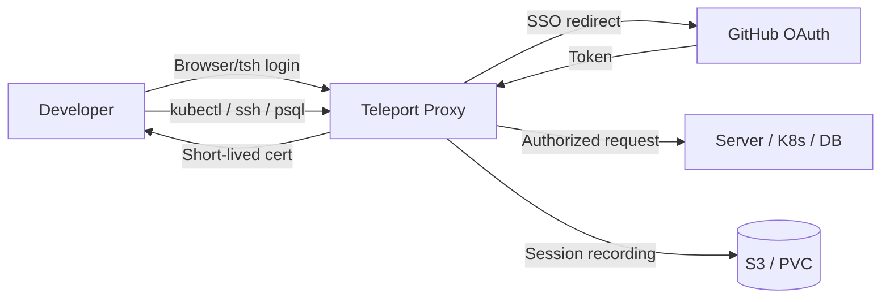

# How to Deploy Teleport Access Platform with Flux CD

Author: [nawazdhandala](https://github.com/nawazdhandala)

Tags: Flux CD, Kubernetes, GitOps, Teleport, Zero Trust, Access Management, SSH, Security

Description: Deploy Teleport zero-trust access platform to Kubernetes using Flux CD for GitOps-managed secure access to servers, databases, and Kubernetes clusters.

---

## Introduction

Teleport is a zero-trust access platform that provides secure, audited access to servers (SSH), Kubernetes clusters, databases (PostgreSQL, MySQL, MongoDB), internal web applications, and Windows desktops-all through a single unified proxy. Every session is recorded, every access decision is logged, and certificates replace long-lived SSH keys, dramatically reducing the attack surface of your infrastructure.

Running Teleport on Kubernetes with Flux CD gives you a declaratively managed access control plane. When your team grows and you need to add a new database resource, update access roles, or integrate a new SSO provider, those changes go through Git pull requests. Flux applies them automatically, keeping your access infrastructure in sync with your declared state.

This guide deploys Teleport Community Edition using the official Helm chart with GitHub SSO and Kubernetes access enabled.

## Prerequisites

- Kubernetes cluster (v1.26+) with Flux CD bootstrapped
- A DNS-resolvable domain with a wildcard or multi-SAN TLS certificate
- A GitHub OAuth App for SSO authentication
- Persistent storage available
- `flux` and `kubectl` CLIs configured

## Step 1: Register a GitHub OAuth App

In GitHub go to **Settings > Developer Settings > OAuth Apps > New OAuth App**:

- **Authorization callback URL**: `https://teleport.example.com/v1/webapi/github/callback`

Note the **Client ID** and generate a **Client Secret**.

## Step 2: Create Namespace and Secrets

```bash
kubectl create namespace teleport

# GitHub OAuth credentials for Teleport SSO
kubectl create secret generic teleport-github-secret \
  --namespace teleport \
  --from-literal=client-id=your_github_client_id \
  --from-literal=client-secret=your_github_client_secret
```

## Step 3: Add the Teleport Helm Repository

```yaml
# clusters/my-cluster/teleport/helm-repository.yaml
apiVersion: source.toolkit.fluxcd.io/v1
kind: HelmRepository
metadata:
  name: teleport
  namespace: flux-system
spec:
  url: https://charts.releases.teleport.dev
  interval: 12h
```

## Step 4: Create the Teleport Custom Values ConfigMap

Teleport's Helm chart accepts a `teleport.yaml` configuration that is too large for inline values. Store it in a ConfigMap.

```yaml
# clusters/my-cluster/teleport/teleport-config.yaml
apiVersion: v1
kind: ConfigMap
metadata:
  name: teleport-cluster-config
  namespace: teleport
data:
  teleport.yaml: |
    teleport:
      log:
        severity: INFO
        format:
          output: json

    auth_service:
      enabled: true
      cluster_name: teleport.example.com
      tokens:
        # Join token for registering agents and nodes
        - "node,kube,db,app:$(TELEPORT_JOIN_TOKEN)"

    proxy_service:
      enabled: true
      public_addr: teleport.example.com:443
      kube_public_addr: kube.teleport.example.com:443

    kubernetes_service:
      enabled: true
      kube_cluster_name: production-cluster
      listen_addr: 0.0.0.0:3027
```

## Step 5: Deploy Teleport Cluster

```yaml
# clusters/my-cluster/teleport/teleport-release.yaml
apiVersion: helm.toolkit.fluxcd.io/v2
kind: HelmRelease
metadata:
  name: teleport-cluster
  namespace: teleport
spec:
  interval: 10m
  chart:
    spec:
      chart: teleport-cluster
      version: ">=15.0.0 <16.0.0"
      sourceRef:
        kind: HelmRepository
        name: teleport
        namespace: flux-system
  values:
    # Cluster domain (must match TLS certificate)
    clusterName: teleport.example.com

    # Authentication settings
    authentication:
      type: github   # Use GitHub as the SSO provider
      localAuth: false   # Disable local auth in production

    # TLS configuration (cert-manager recommended)
    tls:
      existingSecretName: teleport-tls   # TLS secret for teleport.example.com

    # Kubernetes service account for Teleport
    serviceAccount:
      create: true
      name: teleport

    # Persistent storage for audit logs and session recordings
    persistence:
      enabled: true
      size: 50Gi

    # Use S3 for session recordings in production
    # sessionRecording:
    #   uploadTo: s3://my-teleport-sessions/

    # Auth replicas
    auth:
      replicas: 1
      resources:
        requests:
          cpu: 200m
          memory: 256Mi
        limits:
          cpu: "1"
          memory: 1Gi

    # Proxy replicas
    proxy:
      replicas: 2
      resources:
        requests:
          cpu: 100m
          memory: 128Mi
        limits:
          cpu: 500m
          memory: 512Mi

    # Ingress for the web UI
    ingress:
      enabled: true
      spec:
        ingressClassName: nginx
      annotations:
        nginx.ingress.kubernetes.io/backend-protocol: "HTTPS"
        nginx.ingress.kubernetes.io/ssl-passthrough: "true"
```

## Step 6: Create the Kustomization

```yaml
# clusters/my-cluster/teleport/kustomization.yaml
apiVersion: kustomize.toolkit.fluxcd.io/v1
kind: Kustomization
metadata:
  name: teleport
  namespace: flux-system
spec:
  interval: 10m
  path: ./clusters/my-cluster/teleport
  prune: true
  sourceRef:
    kind: GitRepository
    name: fleet-repo
  healthChecks:
    - apiVersion: helm.toolkit.fluxcd.io/v2
      kind: HelmRelease
      name: teleport-cluster
      namespace: teleport
```

## Step 7: Configure GitHub SSO and Create Roles

After Teleport starts, configure the GitHub SSO connector:

```bash
# Port-forward to the auth service
kubectl port-forward -n teleport svc/teleport-auth 3025:3025 &

# Create GitHub connector using tctl
kubectl exec -n teleport $(kubectl get pod -n teleport -l app=teleport,component=auth -o name | head -1) -- \
  tctl create -f << 'EOF'
kind: github
version: v3
metadata:
  name: github
spec:
  client_id: $(kubectl get secret teleport-github-secret -n teleport -o jsonpath='{.data.client-id}' | base64 -d)
  client_secret: $(kubectl get secret teleport-github-secret -n teleport -o jsonpath='{.data.client-secret}' | base64 -d)
  display: GitHub
  redirect_url: https://teleport.example.com/v1/webapi/github/callback
  teams_to_roles:
    - organization: my-github-org
      team: platform-team
      roles:
        - access
        - editor
    - organization: my-github-org
      team: developers
      roles:
        - access
EOF
```

## Step 8: Verify Access

```bash
# Check Flux reconciliation
flux get helmreleases -n teleport --watch

# Verify all Teleport components are running
kubectl get pods -n teleport

# List connected nodes and clusters
kubectl exec -n teleport \
  $(kubectl get pod -n teleport -l app=teleport,component=auth -o name | head -1) \
  -- tctl nodes ls
```

Navigate to `https://teleport.example.com` and sign in with GitHub. You should see the Kubernetes cluster listed under the **Kubernetes** tab.

The zero-trust access flow:



## Best Practices

- Store session recordings in S3-compatible object storage (`sessionRecording.uploadTo`) rather than on a PVC for durability and cost efficiency.
- Use Teleport's `access_request` workflow to implement just-in-time (JIT) privileged access with approval flows for sensitive environments.
- Rotate join tokens regularly and use short-lived ephemeral tokens for registering new agents.
- Enable `enhanced_recording: true` in node configuration to capture BPF-level syscall recordings for SOC compliance.
- Use `tctl acl ls` and `tctl roles ls` regularly to audit access roles and ensure they follow least-privilege principles.

## Conclusion

Teleport is now deployed on Kubernetes and managed by Flux CD. Your team has a zero-trust access platform that replaces VPNs and SSH keys with short-lived certificates, continuous identity verification, and complete session audit trails. Every change to access roles, SSO connectors, and resource registrations flows through Git, making your access control infrastructure as auditable and reproducible as the applications it protects.
