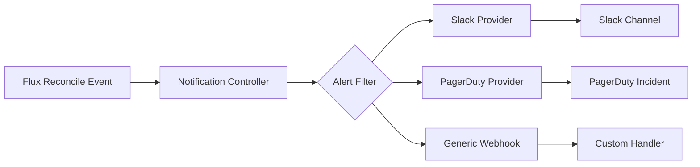

# Deployment Notification in CI/CD with Flux CD

Author: [nawazdhandala](https://github.com/nawazdhandala)

Tags: Flux CD, Notifications, Slack, CI/CD, GitOps, Kubernetes, Alerting

Description: Learn how to configure Flux CD's Notification Controller to send deployment status alerts to Slack, PagerDuty, Microsoft Teams, and other channels.

---

## Introduction

Deployment visibility is critical for operations teams. When Flux CD reconciles a change to the cluster, stakeholders need to know whether it succeeded, failed, or is in progress. Flux CD's Notification Controller provides a flexible event-driven notification system that supports over a dozen providers including Slack, Microsoft Teams, PagerDuty, OpsGenie, Grafana, and generic webhooks.

The notification system is event-driven: Flux components emit events as they reconcile, and the Notification Controller filters and forwards these events to configured providers. You can filter by event severity, resource type, resource name, or message pattern, giving fine-grained control over alert routing.

This guide covers configuring Flux notifications for Slack, PagerDuty, and a generic webhook, with alerting strategies for different environments.

## Prerequisites

- A Kubernetes cluster with Flux CD deployed
- Flux Notification Controller running (included in default installation)
- A Slack workspace with an Incoming Webhook URL
- Optional: PagerDuty integration key or Microsoft Teams webhook URL
- `flux` CLI installed

## Step 1: Understand the Notification Controller Model



Two CRDs manage notifications:

- **Provider**: Configures the destination (Slack, PagerDuty, etc.) and credentials
- **Alert**: Configures which events trigger notifications to a Provider

## Step 2: Configure a Slack Provider

```yaml
# clusters/production/notifications/slack-provider.yaml
apiVersion: notification.toolkit.fluxcd.io/v1
kind: Provider
metadata:
  name: slack-deployments
  namespace: flux-system
spec:
  type: slack
  channel: '#deployments'
  secretRef:
    name: slack-webhook-url
```

Create the secret with the Slack Incoming Webhook URL:

```bash
kubectl create secret generic slack-webhook-url \
  --from-literal=address=https://hooks.slack.com/services/T00000000/B00000000/XXXXXXXX \
  --namespace=flux-system
```

## Step 3: Create Alerts for Successful and Failed Deployments

```yaml
# clusters/production/notifications/deployment-alerts.yaml

# Alert for successful reconciliations
apiVersion: notification.toolkit.fluxcd.io/v1
kind: Alert
metadata:
  name: deployment-success
  namespace: flux-system
spec:
  providerRef:
    name: slack-deployments
  eventSeverity: info
  eventSources:
    # Monitor all Kustomizations and HelmReleases
    - kind: Kustomization
      name: '*'
    - kind: HelmRelease
      name: '*'
  inclusionList:
    - ".*succeeded.*"
    - ".*Reconciliation succeeded.*"
  summary: "Production deployment succeeded"
---
# Alert for failed reconciliations
apiVersion: notification.toolkit.fluxcd.io/v1
kind: Alert
metadata:
  name: deployment-failure
  namespace: flux-system
spec:
  providerRef:
    name: slack-deployments
  eventSeverity: error
  eventSources:
    - kind: Kustomization
      name: '*'
    - kind: HelmRelease
      name: '*'
    - kind: GitRepository
      name: '*'
  inclusionList:
    - ".*failed.*"
    - ".*error.*"
  summary: "Production deployment FAILED"
```

## Step 4: Configure PagerDuty for Critical Failures

```yaml
# clusters/production/notifications/pagerduty-provider.yaml
apiVersion: notification.toolkit.fluxcd.io/v1
kind: Provider
metadata:
  name: pagerduty
  namespace: flux-system
spec:
  type: pagerduty
  secretRef:
    name: pagerduty-integration-key
---
apiVersion: notification.toolkit.fluxcd.io/v1
kind: Alert
metadata:
  name: critical-failure-pagerduty
  namespace: flux-system
spec:
  providerRef:
    name: pagerduty
  # Only fire for error severity events
  eventSeverity: error
  eventSources:
    - kind: Kustomization
      name: 'production-*' # Only production Kustomizations
    - kind: HelmRelease
      name: 'production-*'
  summary: "CRITICAL: Flux CD reconciliation failure in production"
```

Create the PagerDuty secret:

```bash
kubectl create secret generic pagerduty-integration-key \
  --from-literal=token=your-pagerduty-integration-key \
  --namespace=flux-system
```

## Step 5: Configure Microsoft Teams Notification

```yaml
apiVersion: notification.toolkit.fluxcd.io/v1
kind: Provider
metadata:
  name: teams
  namespace: flux-system
spec:
  type: msteams
  secretRef:
    name: teams-webhook-url
---
apiVersion: notification.toolkit.fluxcd.io/v1
kind: Alert
metadata:
  name: teams-deployments
  namespace: flux-system
spec:
  providerRef:
    name: teams
  eventSeverity: info
  eventSources:
    - kind: Kustomization
      name: '*'
  summary: "Flux CD Deployment Status"
```

## Step 6: Configure a Generic Webhook for Custom Integrations

```yaml
apiVersion: notification.toolkit.fluxcd.io/v1
kind: Provider
metadata:
  name: custom-webhook
  namespace: flux-system
spec:
  type: generic
  address: https://your-ops-platform.example.com/webhooks/flux
  secretRef:
    name: webhook-hmac-token
  # Provide a custom CA if your endpoint uses a private certificate
  # certSecretRef:
  #   name: webhook-ca-cert
---
apiVersion: notification.toolkit.fluxcd.io/v1
kind: Alert
metadata:
  name: custom-webhook-alert
  namespace: flux-system
spec:
  providerRef:
    name: custom-webhook
  eventSeverity: info
  eventSources:
    - kind: Kustomization
      name: '*'
    - kind: HelmRelease
      name: '*'
```

## Step 7: Verify Notification Configuration

```bash
# Check Provider status
flux get providers -n flux-system

# Check Alert configuration
flux get alerts -n flux-system

# Manually trigger a reconciliation to test notifications
flux reconcile kustomization myapp -n flux-system

# View Notification Controller logs to debug delivery issues
kubectl logs -n flux-system deployment/notification-controller --tail=50

# Check events on a specific alert
kubectl describe alert deployment-success -n flux-system
```

## Best Practices

- Use separate Providers for different channels (engineering Slack, management Teams, on-call PagerDuty) so alerts reach the right audience.
- Scope Alerts with specific `eventSources.name` patterns rather than `'*'` to reduce notification noise in large environments.
- Create separate Alert objects for success and failure events; this lets you route failure alerts to PagerDuty while success alerts go to Slack.
- Use `eventSeverity: error` for PagerDuty alerts to avoid unnecessary on-call pages for informational events.
- Add a `summary` field to Alerts so the notification message clearly identifies what cluster and application the alert is for.
- Test notification delivery in a non-production environment before relying on it for production incidents.

## Conclusion

Flux CD's Notification Controller provides a powerful, declarative way to integrate deployment events with your existing alerting infrastructure. By routing success events to team channels and failure events to incident management systems, you create a complete deployment observability layer that keeps all stakeholders informed without requiring custom scripting or polling.
