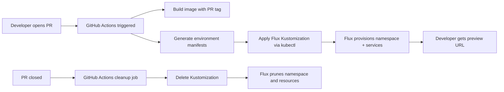

# How to Implement Developer Environment Provisioning with Flux CD

Author: [nawazdhandala](https://github.com/nawazdhandala)

Tags: Flux CD, Kubernetes, GitOps, Platform Engineering, Developer Environments, Ephemeral Environments

Description: Automate developer environment provisioning using Flux CD so developers get fully configured, ephemeral Kubernetes environments on demand for feature development and testing.

---

## Introduction

Every developer needs an environment that closely mirrors production to catch bugs early and test features in context. Traditionally, shared staging environments become bottlenecks: multiple teams clobber each other's changes, debugging is difficult, and environments drift from production configurations over time.

Flux CD enables a different model: ephemeral per-developer environments provisioned automatically from Git. When a developer opens a feature branch or pull request, a dedicated environment spins up with the full application stack. When the PR closes, Flux prunes it. The environment is always fresh, always based on the same manifests as production, and isolated from other developers' work.

This guide shows how to implement PR-based environment provisioning using Flux CD, a lightweight controller for branch detection, and Kustomize overlays for environment customization.

## Prerequisites

- Flux CD v2 bootstrapped in a developer cluster
- A CI/CD system (GitHub Actions, GitLab CI) with access to the Kubernetes cluster
- kubectl and Flux CLI installed in CI
- A platform repository with production manifests as the baseline

## Step 1: Design the Ephemeral Environment Architecture



## Step 2: Create the Base Environment Template

```yaml
# environments/base/kustomization.yaml
apiVersion: kustomize.config.k8s.io/v1beta1
kind: Kustomization
resources:
  - namespace.yaml
  - deployment.yaml
  - service.yaml
  - ingress.yaml
```

```yaml
# environments/base/namespace.yaml
apiVersion: v1
kind: Namespace
metadata:
  name: ENV_NAMESPACE
  labels:
    platform.io/environment-type: ephemeral
    platform.io/pr: PR_NUMBER
  annotations:
    # TTL annotation consumed by a cleanup controller
    platform.io/expires-at: EXPIRES_AT
```

```yaml
# environments/base/ingress.yaml
apiVersion: networking.k8s.io/v1
kind: Ingress
metadata:
  name: app
  namespace: ENV_NAMESPACE
  annotations:
    nginx.ingress.kubernetes.io/rewrite-target: /
spec:
  ingressClassName: nginx
  rules:
    - host: ENV_NAMESPACE.preview.acme.example.com
      http:
        paths:
          - path: /
            pathType: Prefix
            backend:
              service:
                name: app
                port:
                  number: 8080
```

## Step 3: Create a GitHub Actions Workflow for Provisioning

```yaml
# .github/workflows/preview-environment.yml
name: Preview Environment

on:
  pull_request:
    types: [opened, synchronize, reopened, closed]

jobs:
  deploy-preview:
    if: github.event.action != 'closed'
    runs-on: ubuntu-latest
    steps:
      - uses: actions/checkout@v4

      - name: Build and push image
        run: |
          IMAGE=ghcr.io/acme/my-app:pr-${{ github.event.number }}
          docker build -t $IMAGE .
          docker push $IMAGE

      - name: Generate environment manifests
        run: |
          NS=preview-pr-${{ github.event.number }}
          EXPIRES=$(date -d "+3 days" --utc +%Y-%m-%dT%H:%M:%SZ)

          mkdir -p /tmp/env-manifests

          # Write Kustomization for this PR environment
          cat > /tmp/env-manifests/kustomization.yaml <<EOF
          apiVersion: kustomize.toolkit.fluxcd.io/v1
          kind: Kustomization
          metadata:
            name: preview-pr-${{ github.event.number }}
            namespace: flux-system
          spec:
            interval: 2m
            path: ./environments/base
            prune: true
            sourceRef:
              kind: GitRepository
              name: flux-system
            targetNamespace: $NS
            postBuild:
              substitute:
                ENV_NAMESPACE: $NS
                PR_NUMBER: "${{ github.event.number }}"
                APP_IMAGE: ghcr.io/acme/my-app:pr-${{ github.event.number }}
                EXPIRES_AT: $EXPIRES
          EOF

      - name: Apply environment
        run: |
          kubectl apply -f /tmp/env-manifests/kustomization.yaml

      - name: Post preview URL as PR comment
        uses: actions/github-script@v7
        with:
          script: |
            github.rest.issues.createComment({
              issue_number: context.issue.number,
              owner: context.repo.owner,
              repo: context.repo.repo,
              body: '🚀 Preview environment ready: https://preview-pr-${{ github.event.number }}.preview.acme.example.com'
            })

  cleanup-preview:
    if: github.event.action == 'closed'
    runs-on: ubuntu-latest
    steps:
      - name: Delete Flux Kustomization
        run: |
          kubectl delete kustomization preview-pr-${{ github.event.number }} \
            -n flux-system --ignore-not-found
          # Flux prune will delete the namespace and all resources
```

## Step 4: Apply Variable Substitution in Environment Manifests

Flux's `postBuild.substitute` fills in environment-specific values at reconciliation time.

```yaml
# environments/base/deployment.yaml
apiVersion: apps/v1
kind: Deployment
metadata:
  name: app
  namespace: ENV_NAMESPACE   # Substituted by Flux postBuild
spec:
  replicas: 1                 # Single replica for preview environments
  selector:
    matchLabels:
      app: my-app
  template:
    metadata:
      labels:
        app: my-app
    spec:
      containers:
        - name: app
          image: ${APP_IMAGE}  # Substituted by Flux postBuild
          ports:
            - containerPort: 8080
          resources:
            requests:
              cpu: 50m
              memory: 64Mi
            limits:
              cpu: 200m
              memory: 128Mi
          env:
            - name: ENVIRONMENT
              value: preview
            - name: PR_NUMBER
              value: "${PR_NUMBER}"
```

## Step 5: Implement TTL-Based Cleanup

Deploy a simple CronJob that cleans up expired environments.

```yaml
# infrastructure/cleanup/expired-environments.yaml
apiVersion: batch/v1
kind: CronJob
metadata:
  name: cleanup-expired-environments
  namespace: platform-system
spec:
  schedule: "0 * * * *"   # Every hour
  jobTemplate:
    spec:
      template:
        spec:
          serviceAccountName: environment-cleanup
          containers:
            - name: cleanup
              image: bitnami/kubectl:latest
              command:
                - /bin/sh
                - -c
                - |
                  NOW=$(date --utc +%Y-%m-%dT%H:%M:%SZ)
                  kubectl get kustomizations -n flux-system \
                    -l platform.io/environment-type=ephemeral \
                    -o json | jq -r --arg now "$NOW" \
                    '.items[] | select(.metadata.annotations["platform.io/expires-at"] < $now) | .metadata.name' | \
                  xargs -r kubectl delete kustomization -n flux-system
          restartPolicy: OnFailure
```

## Step 6: Configure Resource Limits for Preview Environments

```yaml
# environments/base/limit-range.yaml
apiVersion: v1
kind: LimitRange
metadata:
  name: preview-defaults
  namespace: ENV_NAMESPACE
spec:
  limits:
    - type: Container
      default:
        cpu: 100m
        memory: 128Mi
      defaultRequest:
        cpu: 50m
        memory: 64Mi
      max:
        cpu: "1"
        memory: 512Mi
```

## Best Practices

- Limit preview environments to a single replica of each service to conserve cluster resources
- Set aggressive TTLs (24-72 hours) and clean up expired environments on a schedule
- Use a separate cluster or node pool for preview environments to avoid impacting production
- Cache image builds across PRs using layer caching to keep provisioning under 2 minutes
- Mount read-only database snapshots instead of connecting to production databases in previews
- Send Slack notifications with the preview URL when an environment is ready

## Conclusion

Flux CD makes ephemeral developer environments a first-class feature of your platform. By encoding environment lifecycle in Git and letting Flux manage reconciliation and pruning, you get self-service environments that stay fresh, stay isolated, and clean up automatically. Developers spend time writing code rather than fighting environment drift, and the platform team gets a scalable model that works for teams of any size.
