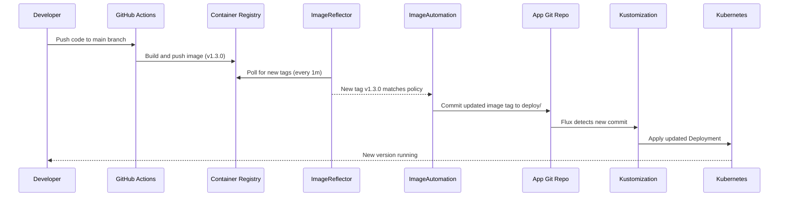

# How to Implement Developer Self-Service Deployments with Flux CD

Author: [nawazdhandala](https://github.com/nawazdhandala)

Tags: Flux CD, Kubernetes, GitOps, Platform Engineering, Developer Experience, Self-Service

Description: Enable developers to deploy their own applications using Flux CD GitOps without requiring platform team involvement for every release.

---

## Introduction

The fastest path to production should not run through an ops team queue. Developer self-service deployments let engineers ship code independently while the platform team maintains governance through policy and automation. Flux CD enables this model by treating Git as the deployment interface: developers push code, CI builds and pushes an image, and Flux detects the update and deploys it.

The key insight is separating concerns between what developers control (their application code and deployment configuration) and what the platform team controls (cluster infrastructure, network policies, resource quotas). Flux's multi-tenancy model, combined with image update automation, creates a deployment pipeline that is both autonomous and auditable.

In this guide you will configure Flux image reflector and automation controllers so developers can ship new versions by simply pushing to their application repository, with no manual intervention from anyone.

## Prerequisites

- Flux CD v2 with image-reflector-controller and image-automation-controller installed
- A container registry (Docker Hub, GHCR, ECR, or GCR)
- A developer application repository with Kubernetes manifests or Helm charts
- CI/CD pipeline that builds and pushes images on commit

## Step 1: Install Flux with Image Automation

Bootstrap Flux with the image automation components enabled.

```bash
flux bootstrap github \
  --owner=acme-org \
  --repository=platform-gitops \
  --branch=main \
  --path=clusters/production \
  --components-extra=image-reflector-controller,image-automation-controller
```

Verify the controllers are running:

```bash
flux check
# ✔ image-reflector-controller: deployment ready
# ✔ image-automation-controller: deployment ready
```

## Step 2: Configure an ImageRepository

Tell Flux to watch the container registry for new image tags.

```yaml
# tenants/overlays/team-alpha/image-repository.yaml
apiVersion: image.toolkit.fluxcd.io/v1beta2
kind: ImageRepository
metadata:
  name: my-service
  namespace: team-alpha
spec:
  image: ghcr.io/acme/my-service
  interval: 1m
  secretRef:
    name: ghcr-credentials   # Registry pull secret
```

## Step 3: Define an ImagePolicy

Specify which image tags are eligible for automatic deployment. Use semantic versioning to control which updates are promoted.

```yaml
# tenants/overlays/team-alpha/image-policy.yaml
apiVersion: image.toolkit.fluxcd.io/v1beta2
kind: ImagePolicy
metadata:
  name: my-service
  namespace: team-alpha
spec:
  imageRepositoryRef:
    name: my-service
  policy:
    semver:
      range: ">=1.0.0 <2.0.0"   # Only 1.x releases auto-deploy
```

For teams using date-based tags from CI:

```yaml
apiVersion: image.toolkit.fluxcd.io/v1beta2
kind: ImagePolicy
metadata:
  name: my-service-latest
  namespace: team-alpha
spec:
  imageRepositoryRef:
    name: my-service
  filterTags:
    pattern: "^main-[a-f0-9]+-(?P<ts>[0-9]+)$"
    extract: "$ts"
  policy:
    numerical:
      order: asc
```

## Step 4: Create an ImageUpdateAutomation

Tell Flux to write image tag updates back to Git automatically.

```yaml
# tenants/overlays/team-alpha/image-update-automation.yaml
apiVersion: image.toolkit.fluxcd.io/v1beta2
kind: ImageUpdateAutomation
metadata:
  name: team-alpha-apps
  namespace: team-alpha
spec:
  interval: 5m
  sourceRef:
    kind: GitRepository
    name: team-alpha-apps
  git:
    checkout:
      ref:
        branch: main
    commit:
      author:
        name: Flux Bot
        email: flux@acme.com
      messageTemplate: |
        chore(auto): update {{range .Updated.Images}}{{.}}{{end}} image tag

        Updated by Flux image automation controller.
    push:
      branch: main
  update:
    strategy: Setters
    path: ./deploy
```

## Step 5: Annotate Manifests for Automated Updates

Add Flux marker comments to the deployment manifests in the developer's application repository so the automation controller knows which field to update.

```yaml
# team-alpha-apps/deploy/my-service/deployment.yaml
apiVersion: apps/v1
kind: Deployment
metadata:
  name: my-service
  namespace: team-alpha
spec:
  template:
    spec:
      containers:
        - name: my-service
          # {"$imagepolicy": "team-alpha:my-service"}
          image: ghcr.io/acme/my-service:v1.2.3
```

When Flux detects a new matching image tag, it replaces the tag in-place and commits to Git, triggering a Kustomization reconciliation.

## Step 6: Set Up the Full Self-Service Pipeline



## Step 7: Allow Developers to Check Deployment Status

Give developers read access to Flux status without kubectl cluster access using the Flux CLI with a scoped kubeconfig.

```bash
# Developer checks the status of their deployment
flux get kustomizations -n team-alpha
# NAME                   READY  MESSAGE
# team-alpha-my-service  True   Applied revision: main/abc1234

# Check image policy status
flux get images policy my-service -n team-alpha
# NAME        LATEST IMAGE
# my-service  ghcr.io/acme/my-service:v1.3.0
```

## Best Practices

- Use semantic versioning for image tags and pin the ImagePolicy range to a major version to prevent accidental breaking deployments
- Protect the `main` branch with required status checks so CI must pass before Flux automation can commit
- Configure separate ImagePolicies for dev (latest), staging (release candidates), and production (stable semver range)
- Alert on ImageUpdateAutomation failures so broken CI pipelines don't silently block deployments
- Keep image automation commits signed using SSH key automation support in Flux

## Conclusion

Flux CD's image automation stack removes every manual step between a code push and a production deployment. Developers get true self-service — they push code, CI builds an image, and Flux handles the rest. The platform team retains governance through ImagePolicy rules and RBAC constraints, and the Git history provides a complete, timestamped audit trail of every deployment decision ever made.
