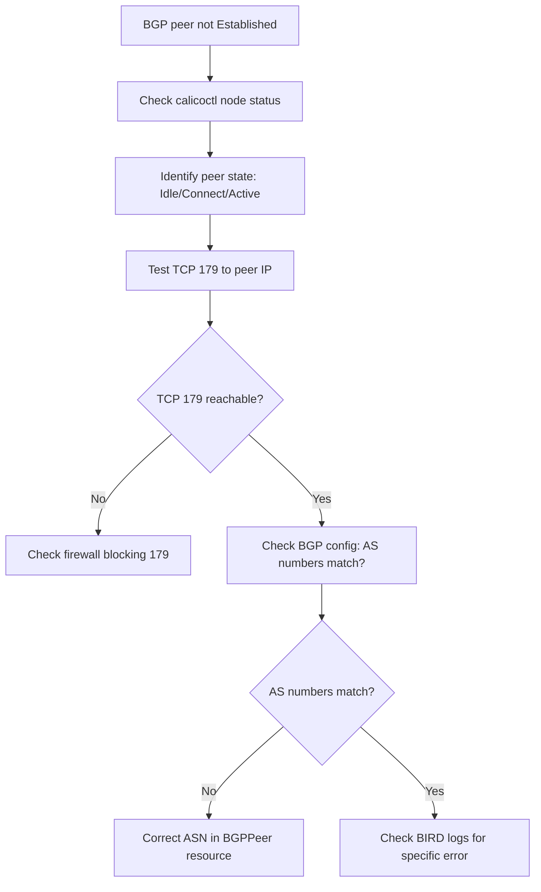

# How to Diagnose BGP Peer Not Established in Calico

Author: [nawazdhandala](https://github.com/nawazdhandala)

Tags: Calico, Kubernetes, Networking, Troubleshooting

Description: Diagnose BGP peer connection failures in Calico by examining BGP peer configuration, TCP port 179 connectivity, AS number mismatches, and BIRD daemon state.

---

## Introduction

BGP peer not established in Calico means that the BIRD BGP daemon on a node cannot form a session with its configured peer. BGP peers are used in Calico to exchange routing information between nodes. When a peer session fails to establish, routes for pod CIDRs are not exchanged between the affected nodes, causing cross-node pod connectivity failures.

The BGP session establishment process requires: TCP connectivity on port 179 between peers, matching BGP configuration (AS numbers, peer IPs), and BIRD being healthy on both ends. Diagnosing which requirement is failing determines the correct fix.

## Symptoms

- `calicoctl node status` shows peers in `Idle`, `Connect`, `Active`, or `OpenSent` state (not `Established`)
- Cross-node pod traffic fails for pods whose routes would be exchanged via the affected peer session
- BGP session flapping (established then drops repeatedly)
- New routes from remote nodes not appearing in `ip route show`

## Root Causes

- BGP peer IP address is wrong or unreachable
- Remote AS number mismatch in BGPPeer resource
- TCP port 179 blocked by firewall (host firewall or cloud security group)
- BIRD daemon not running or crashed on the peer node
- Authentication password configured on one side but not the other
- BGP timer mismatches causing session timeout

## Diagnosis Steps

**Step 1: Check peer state with calicoctl**

```bash
calicoctl node status
# Look for peers not in Established state
```

**Step 2: Get BGP peer configuration**

```bash
calicoctl get bgppeer -o yaml
calicoctl get bgpconfig -o yaml
```

**Step 3: Test TCP connectivity to peer on port 179**

```bash
# From the affected node
ssh <node-name> "nc -zv <peer-ip> 179 2>&1"
# Or: telnet <peer-ip> 179
```

**Step 4: Check iptables for port 179 blocks**

```bash
ssh <node-name> "sudo iptables -L -n | grep 179"
```

**Step 5: Check BIRD log for connection errors**

```bash
NODE_POD=$(kubectl get pods -n kube-system -l k8s-app=calico-node \
  --field-selector spec.nodeName=<node-name> -o name)
kubectl logs $NODE_POD -n kube-system -c calico-node \
  | grep -i "bgp\|bird\|peer\|connect\|error" | tail -30
```

**Step 6: Verify peer IP is reachable**

```bash
ssh <node-name> "ping -c 3 <peer-ip> 2>&1"
```



## Solution

After identifying whether the issue is connectivity, configuration, or BIRD health, apply the matching fix. See the companion Fix post.

## Prevention

- Validate BGP peer configuration (ASN, peer IP) before applying in production
- Ensure TCP 179 is allowed between all Kubernetes nodes in firewall rules
- Monitor BGP peer state continuously and alert on non-Established sessions

## Conclusion

Diagnosing BGP peer not established requires checking peer state via calicoctl, testing TCP 179 connectivity to the peer IP, validating AS number configuration, and examining BIRD logs for specific session errors. TCP connectivity is the most common failure point and should be verified first.
