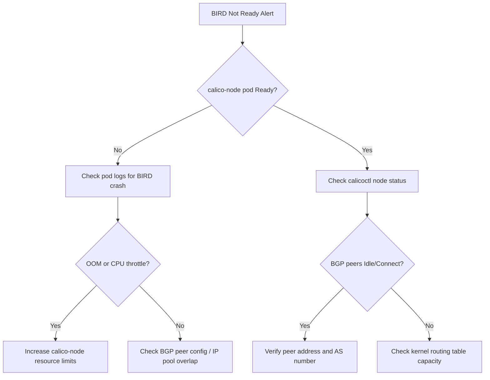

# How to Diagnose BIRD Not Ready Errors in Calico

Author: [nawazdhandala](https://github.com/nawazdhandala)

Tags: Calico, Kubernetes, Networking, Troubleshooting

Description: A step-by-step guide to diagnosing BIRD not ready errors in Calico by examining BGP daemon state, node conditions, and routing tables.

---

## Introduction

BIRD (BIRD Internet Routing Daemon) is the BGP routing engine embedded within each Calico node pod. It is responsible for advertising pod CIDRs to peers and maintaining the routing fabric that allows pods across different nodes to communicate. When BIRD enters a not-ready state, the affected node stops participating in BGP peering, causing pod-to-pod connectivity to degrade silently.

The error surfaces in multiple ways: the calico-node pod may report a not-ready condition in `kubectl get pods`, Felix may log warnings about BIRD being unavailable, or cluster operators may notice route withdrawal events in their BGP monitoring tooling. Because the failure is in a background daemon rather than the workload itself, it is frequently overlooked until application-level timeouts begin.

Understanding how to systematically diagnose BIRD not-ready errors saves significant time during incidents. The diagnosis involves checking the calico-node pod health, inspecting BIRD process logs, verifying IP pool configuration, and confirming BGP peer connectivity.

## Symptoms

- `kubectl get pods -n kube-system` shows calico-node pods with `0/1` ready containers
- Felix logs contain messages like `BIRDv4 is not ready` or `BIRDv6 is not ready`
- Cross-node pod-to-pod traffic drops or becomes intermittent
- `calicoctl node status` shows BGP peers in `Idle` or `Connect` state
- Routes for remote node CIDRs are missing from the node routing table

## Root Causes

- BIRD process crashed due to a misconfigured BGP peer address or invalid AS number
- IP pool CIDR overlaps with the node's host network, causing BIRD to reject route advertisements
- Resource exhaustion (CPU throttling or OOM) on the calico-node container killing the BIRD sub-process
- Calico configuration stored in the `calico-config` ConfigMap is corrupted or references an unreachable etcd/Typha endpoint
- Kernel routing table is full, preventing BIRD from installing new routes
- Node-to-node mesh is disabled but individual BGP peers are not configured

## Diagnosis Steps

**Step 1: Check calico-node pod readiness**

```bash
kubectl get pods -n kube-system -l k8s-app=calico-node -o wide
```

**Step 2: Inspect calico-node logs for BIRD errors**

```bash
NODE_POD=$(kubectl get pods -n kube-system -l k8s-app=calico-node \
  --field-selector spec.nodeName=<node-name> -o name | head -1)

kubectl logs $NODE_POD -n kube-system -c calico-node | grep -i "bird\|BGP\|not ready" | tail -50
```

**Step 3: Check BIRD process state via calicoctl**

```bash
calicoctl node status
```

**Step 4: Examine Felix liveness and readiness probes**

```bash
kubectl describe pod $NODE_POD -n kube-system | grep -A 20 "Liveness\|Readiness\|Conditions"
```

**Step 5: Verify IP pool configuration**

```bash
calicoctl get ippool -o yaml
```

**Step 6: Check node routing table for missing routes**

```bash
# SSH to the affected node
ip route show | grep bird
ip route show table all | grep -v "^default" | head -40
```

**Step 7: Review recent events**

```bash
kubectl get events -n kube-system --sort-by='.lastTimestamp' | grep -i "calico\|bird"
```



## Solution

After diagnosis, apply the appropriate fix identified above (see the companion Fix post for detailed remediation steps). For immediate triage, restarting the calico-node pod on the affected node often recovers BIRD temporarily:

```bash
kubectl delete pod $NODE_POD -n kube-system
```

## Prevention

- Set appropriate resource requests and limits on calico-node to prevent OOM kills
- Validate IP pool CIDRs against node subnets before applying
- Enable Calico's own BGP monitoring and alert on peer state changes

## Conclusion

Diagnosing BIRD not-ready errors in Calico requires a layered approach: start with pod readiness, drill into BIRD-specific logs, validate IP pool and BGP peer configuration, and inspect the host routing table. Systematic diagnosis reduces mean time to resolution and prevents misidentifying the root cause as an application or upstream infrastructure problem.
