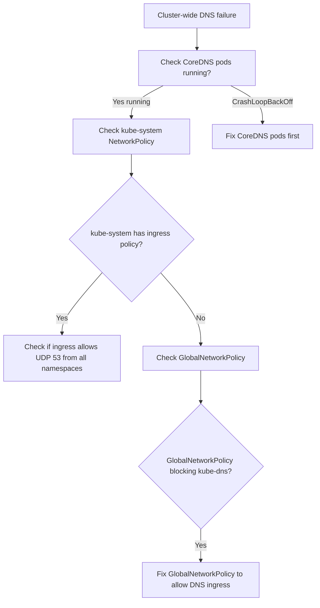

# How to Diagnose Calico Blocking kube-dns

Author: [nawazdhandala](https://github.com/nawazdhandala)

Tags: Calico, Kubernetes, Networking, Troubleshooting

Description: Diagnose why Calico is blocking kube-dns pods specifically by inspecting ingress policies in kube-system and calico-node iptables rules affecting CoreDNS pods.

---

## Introduction

Calico blocking kube-dns differs from Calico blocking DNS egress from pods. In this scenario, the kube-dns (CoreDNS) pods themselves cannot process queries because they have been blocked from receiving traffic. This can happen when a Calico NetworkPolicy or GlobalNetworkPolicy with ingress rules is applied to the kube-system namespace, inadvertently blocking incoming DNS query traffic to CoreDNS pods.

This is a cluster-wide issue that affects all pods simultaneously, making it more severe than namespace-scoped DNS blocking. When CoreDNS cannot receive traffic, no pod in the cluster can resolve names.

## Symptoms

- DNS failures cluster-wide (all namespaces simultaneously)
- `kubectl exec <pod> -- nslookup kubernetes.default` fails from every pod
- CoreDNS pods are running but responding with errors
- `kubectl logs -n kube-system <coredns-pod>` shows incoming connection errors

## Root Causes

- NetworkPolicy in kube-system with ingress default-deny blocking DNS queries to CoreDNS pods
- Calico GlobalNetworkPolicy with ingress restrictions not allowing UDP 53 to kube-dns pods
- calico-node iptables rules inadvertently blocking CoreDNS pod traffic
- Host-level firewall (UFW) blocking UDP 53 at the node level

## Diagnosis Steps

**Step 1: Confirm cluster-wide DNS failure**

```bash
# Test from multiple namespaces
for NS in default production staging; do
  kubectl run test --image=busybox -n $NS --restart=Never --rm -i \
    --timeout=10s -- nslookup kubernetes.default 2>&1 | head -3
done
```

**Step 2: Check CoreDNS pod status**

```bash
kubectl get pods -n kube-system -l k8s-app=kube-dns -o wide
kubectl logs -n kube-system -l k8s-app=kube-dns --tail=20
```

**Step 3: Check NetworkPolicies in kube-system**

```bash
kubectl get networkpolicy -n kube-system -o yaml
```

**Step 4: Check Calico GlobalNetworkPolicies affecting kube-dns**

```bash
calicoctl get globalnetworkpolicy -o yaml | \
  grep -B5 -A20 "kube-dns\|coredns\|kube-system"
```

**Step 5: Test DNS connectivity directly to CoreDNS**

```bash
COREDNS_POD_IP=$(kubectl get pods -n kube-system -l k8s-app=kube-dns \
  -o jsonpath='{.items[0].status.podIP}')
# From another pod:
kubectl run test --image=busybox --restart=Never -- \
  nc -zuv $COREDNS_POD_IP 53
```

**Step 6: Check iptables on node running CoreDNS**

```bash
COREDNS_NODE=$(kubectl get pods -n kube-system -l k8s-app=kube-dns \
  -o jsonpath='{.items[0].spec.nodeName}')
ssh $COREDNS_NODE "sudo iptables -L -n | grep -E 'DROP|REJECT' | head -20"
```



## Solution

Apply the targeted fix depending on whether the block is in a kube-system NetworkPolicy or a GlobalNetworkPolicy. See the companion Fix post for exact steps.

## Prevention

- Never apply default-deny ingress policies to kube-system without DNS allow rules
- Test DNS from all namespaces after any kube-system policy change
- Use the GlobalNetworkPolicy DNS baseline to protect DNS traffic

## Conclusion

Calico blocking kube-dns specifically affects CoreDNS's ability to receive queries. Diagnose by checking kube-system NetworkPolicies and GlobalNetworkPolicies for ingress rules that might block UDP 53 to CoreDNS pods. Cluster-wide simultaneous DNS failure is the key differentiator from namespace-scoped DNS blocking.
