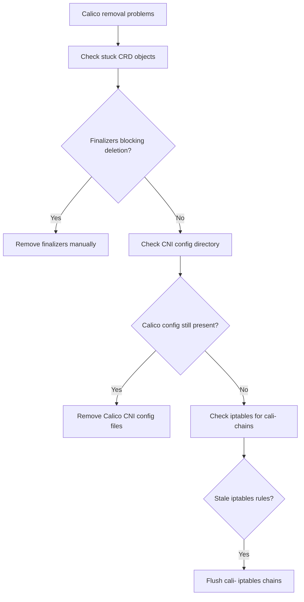

# How to Diagnose Problems During Calico CNI Removal

Author: [nawazdhandala](https://github.com/nawazdhandala)

Tags: Calico, Kubernetes, Networking, Troubleshooting

Description: Diagnose issues encountered during Calico CNI removal including stale CNI config files, leftover iptables rules, and stuck finalizers on Calico CRDs.

---

## Introduction

Removing Calico from a Kubernetes cluster is more complex than deleting its DaemonSet. Calico manages iptables rules, CNI configuration files, IP allocations, and custom resource definitions (CRDs) that are not automatically cleaned up when Calico pods are deleted. Problems during removal typically manifest as stuck resources, leftover iptables rules affecting other CNI plugins, or nodes in a broken network state.

The most common issue during removal is deleting Calico before properly draining pods, which leaves orphaned IP allocations and stale routing entries. Another frequent problem is incomplete CRD cleanup, where Calico CRDs with finalizers block deletion and prevent the cluster from moving to a new CNI plugin.

This guide provides diagnostic steps for all common failure modes during Calico CNI removal.

## Symptoms

- `kubectl delete` hangs on Calico CRD objects with finalizers
- New CNI plugin fails to initialize after Calico removal
- Nodes have stale iptables rules mentioning `cali-*` chains after removal
- Pods stuck in Terminating state after calico-node pods are deleted
- `/etc/cni/net.d/` still contains Calico config after removal

## Root Causes

- Calico IPAMBlocks and IPAMHandles have finalizers preventing deletion
- calico-node DaemonSet deleted without running the cleanup scripts
- RBAC resources for Calico not fully removed, blocking new CNI's ClusterRole
- iptables rules from Calico not flushed, conflicting with new CNI
- CRD objects in Terminating state due to missing webhook or controller

## Diagnosis Steps

**Step 1: Check for stuck Calico resources**

```bash
kubectl get all -n kube-system | grep calico
kubectl api-resources --verbs=list | grep calico | awk '{print $1}' | \
  xargs -I{} kubectl get {} --all-namespaces 2>/dev/null
```

**Step 2: Check for resources with finalizers**

```bash
# List IPAMBlocks with finalizers
kubectl get ipamblocks.crd.projectcalico.org \
  -o jsonpath='{range .items[*]}{.metadata.name}{"\t"}{.metadata.finalizers}{"\n"}{end}'
```

**Step 3: Check CNI config directory**

```bash
# On each node
ls /etc/cni/net.d/
cat /etc/cni/net.d/10-calico.conflist 2>/dev/null
```

**Step 4: Check for remaining iptables rules**

```bash
# On each node
sudo iptables -L | grep "cali-"
sudo iptables -t nat -L | grep "cali-"
```

**Step 5: Check for stuck CRDs**

```bash
kubectl get crd | grep calico
kubectl get crd caliconcalicos.crd.projectcalico.org -o yaml \
  | grep -A5 "finalizers"
```



## Solution

Apply the targeted fixes from the companion Fix post based on which problems were identified during diagnosis.

## Prevention

- Follow the official Calico removal procedure rather than just deleting resources
- Use `calicoctl` to properly clean up IPAM allocations before removing the DaemonSet
- Test the removal procedure in a non-production cluster first

## Conclusion

Diagnosing Calico removal problems requires checking stuck CRD objects with finalizers, verifying CNI config file cleanup, inspecting iptables rules, and confirming IPAM resources are cleared. Systematic checking of each layer reveals which components of the removal are incomplete.
