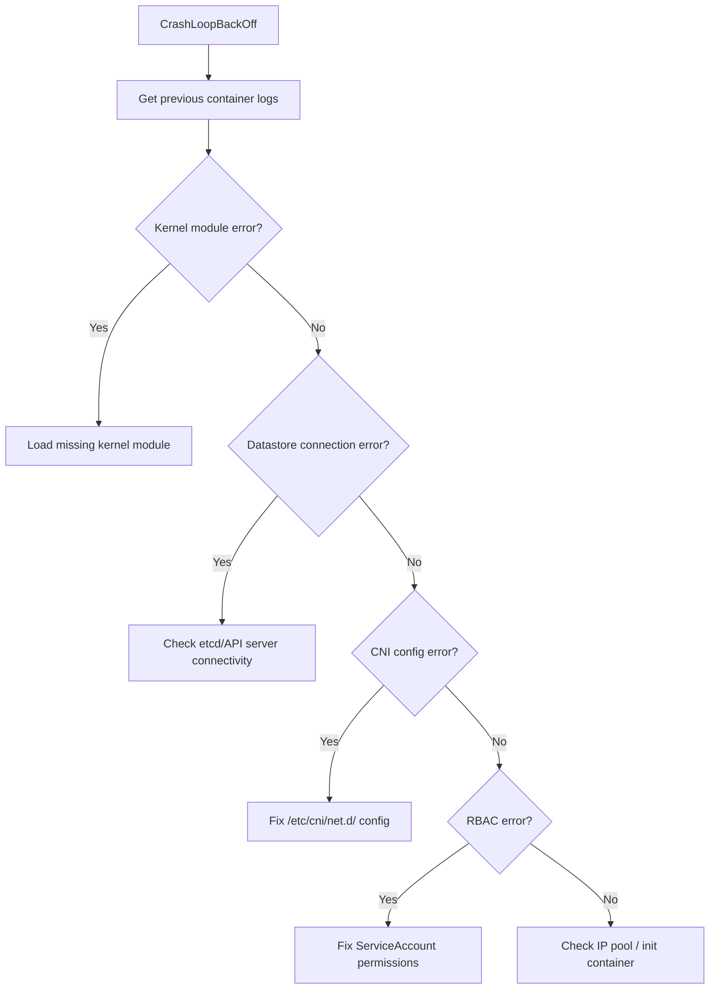

# How to Diagnose Calico Node CrashLoopBackOff

Author: [nawazdhandala](https://github.com/nawazdhandala)

Tags: Calico, Kubernetes, Networking, Troubleshooting

Description: A systematic approach to diagnosing calico-node pods stuck in CrashLoopBackOff by examining crash logs, init container failures, and CNI configuration errors.

---

## Introduction

A calico-node pod in CrashLoopBackOff is one of the most disruptive conditions in a Calico-managed cluster. When the calico-node DaemonSet pod crashes and restarts repeatedly, the affected node loses CNI functionality: new pods cannot be scheduled, existing pods may lose connectivity, and BGP routes are withdrawn and re-advertised in rapid cycles that destabilize the entire cluster routing fabric.

CrashLoopBackOff in calico-node has a wide range of root causes, from simple configuration errors to kernel module incompatibilities. The challenge is that the pod crashes quickly, leaving a narrow window to observe its behavior before Kubernetes backs off and waits before the next restart. Capturing logs from the crashed container and examining init container state are the two most valuable sources of diagnostic information.

This guide provides a structured approach to diagnosing calico-node CrashLoopBackOff. It covers how to retrieve crash logs from the previous container, check init container failures, examine kernel requirements, and validate CNI configuration.

## Symptoms

- `kubectl get pods -n kube-system` shows calico-node pods in `CrashLoopBackOff`
- New pods on affected nodes stay in `ContainerCreating` indefinitely
- `kubectl describe node <node>` shows `NetworkPlugin calico not installed` or similar
- Cluster events show rapid calico-node pod restarts

## Root Causes

- Missing or incompatible kernel modules (e.g., `ipip`, `xt_set`)
- Calico datastore (etcd/Kubernetes API) unreachable during startup
- CNI configuration files corrupted or pointing to wrong network
- IP pool configuration conflicts at startup
- Insufficient permissions (RBAC) for calico-node ServiceAccount
- iptables conflict with another network plugin that was not fully removed

## Diagnosis Steps

**Step 1: Check pod status and restart count**

```bash
kubectl get pods -n kube-system -l k8s-app=calico-node -o wide
```

**Step 2: Get logs from the PREVIOUS crashed container**

```bash
NODE_POD=$(kubectl get pods -n kube-system -l k8s-app=calico-node \
  --field-selector spec.nodeName=<node-name> -o name | head -1)
kubectl logs $NODE_POD -n kube-system --previous -c calico-node | tail -60
```

**Step 3: Check init container state**

```bash
kubectl describe $NODE_POD -n kube-system | grep -A 40 "Init Containers:"
```

**Step 4: Check for kernel module availability**

```bash
# Run on the affected node
lsmod | grep -E "ipip|xt_set|ip_tables|nf_conntrack"
```

**Step 5: Verify CNI config files**

```bash
# On the affected node
ls -la /etc/cni/net.d/
cat /etc/cni/net.d/10-calico.conflist
```

**Step 6: Validate RBAC permissions**

```bash
kubectl auth can-i list pods --as=system:serviceaccount:kube-system:calico-node
kubectl auth can-i get nodes --as=system:serviceaccount:kube-system:calico-node
```

**Step 7: Check Kubernetes events**

```bash
kubectl get events -n kube-system --sort-by='.lastTimestamp' | grep calico | tail -20
```



## Solution

Apply the fix that matches the root cause identified in diagnosis (see companion Fix post). For immediate triage, capture the full previous-container log before any restarts clear the history.

## Prevention

- Validate kernel modules on nodes before installing Calico
- Test CNI configuration in a non-production cluster first
- Use RBAC auditing to catch permission issues before deployment

## Conclusion

Diagnosing calico-node CrashLoopBackOff requires retrieving the previous container log and systematically checking kernel modules, datastore connectivity, CNI configuration, and RBAC. The previous container log is the most valuable artifact - capture it immediately when the alert fires.
