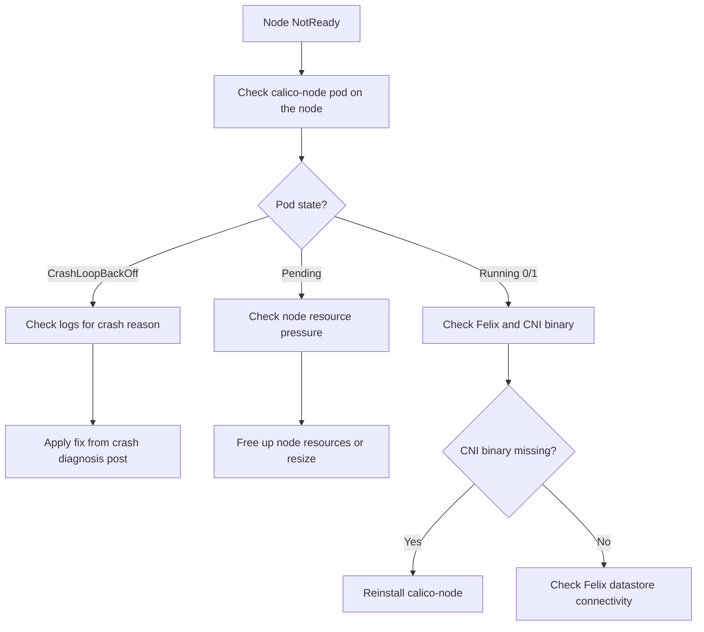

# How to Diagnose Calico Node Not Ready Status

Author: [nawazdhandala](https://github.com/nawazdhandala)

Tags: Calico, Kubernetes, Networking, Troubleshooting

Description: Diagnose why a Kubernetes node shows NotReady status related to Calico by examining the calico-node pod health, Felix status, and node conditions.

---

## Introduction

A Kubernetes node showing NotReady status when Calico is involved usually has one of two root causes: the calico-node pod on that node is not functioning correctly, or the Felix process within calico-node is failing to apply network policy and routing, causing the kubelet to report the node as unfit for scheduling.

The kubelet's NetworkPlugin readiness check is directly tied to whether the CNI plugin (Calico) is reporting itself as ready. When calico-node is not ready, the kubelet marks the node as NetworkPluginNotReady, which rolls up to NotReady node status. Understanding this chain of dependencies is key to efficient diagnosis.

This guide provides a structured approach to diagnosing node NotReady status specifically related to Calico.

## Symptoms

- `kubectl get nodes` shows a node with `NotReady` status
- `kubectl describe node <node>` shows `KubeletNotReady: NetworkPlugin calico not ready`
- calico-node pod on the affected node shows 0/1 Ready
- New pods cannot be scheduled on the affected node

## Root Causes

- calico-node pod CrashLoopBackOff or Pending on the affected node
- Felix failing to initialize due to kernel module missing
- Calico datastore unreachable from the node
- calico-node pod evicted due to node resource pressure
- Node has no CNI binary in `/opt/cni/bin/calico`

## Diagnosis Steps

**Step 1: Identify the affected node and check calico-node pod**

```bash
kubectl get nodes
export NODE=<notready-node>
kubectl get pods -n kube-system -l k8s-app=calico-node \
  --field-selector spec.nodeName=$NODE
```

**Step 2: Describe the node for specific conditions**

```bash
kubectl describe node $NODE | grep -A 20 "Conditions:\|Events:"
```

**Step 3: Get calico-node pod logs**

```bash
NODE_POD=$(kubectl get pods -n kube-system -l k8s-app=calico-node \
  --field-selector spec.nodeName=$NODE -o name)
kubectl logs $NODE_POD -n kube-system -c calico-node --tail=50
kubectl logs $NODE_POD -n kube-system -c calico-node --previous --tail=50 2>/dev/null
```

**Step 4: Check Felix status**

```bash
kubectl exec $NODE_POD -n kube-system -- calico-node -felix-live 2>/dev/null || \
  echo "Felix liveness check failed"
```

**Step 5: Check CNI binary on node**

```bash
ssh $NODE "ls -la /opt/cni/bin/calico 2>/dev/null || echo 'Calico CNI binary missing'"
```

**Step 6: Check kubelet logs on the node**

```bash
ssh $NODE "sudo journalctl -u kubelet --since='1 hour ago' | grep -i 'calico\|cni\|network' | tail -20"
```



## Solution

After identifying the specific issue, apply the targeted fix. For calico-node CrashLoopBackOff, see the CrashLoopBackOff fix post. For missing CNI binary, reinstall calico-node.

## Prevention

- Monitor calico-node pod readiness on all nodes
- Set resource requests to prevent calico-node pod eviction
- Alert on node NotReady conditions immediately

## Conclusion

Node NotReady status related to Calico is traced by examining the calico-node pod on the affected node, checking Felix logs, and verifying CNI binary presence. The calico-node pod health is the primary indicator - its specific failure mode determines the correct fix path.
